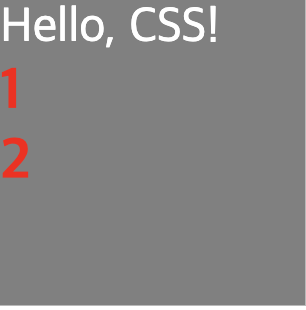
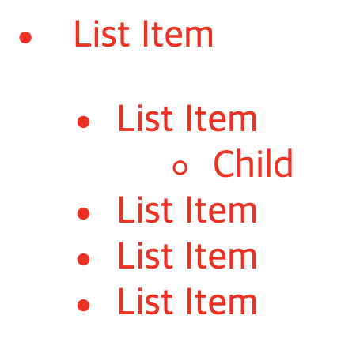
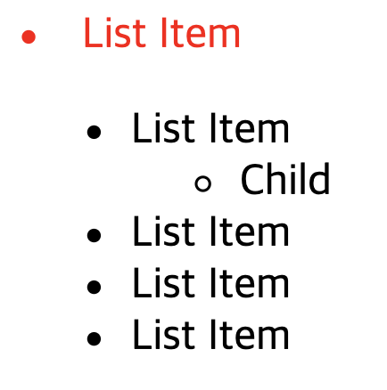
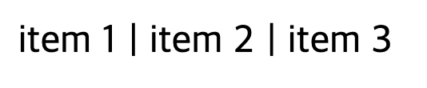
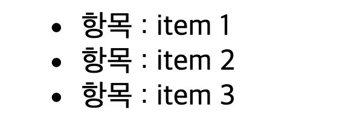
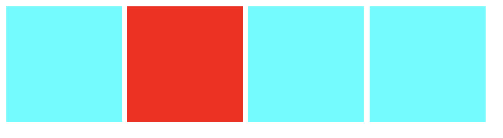

## 1. 간단한 선택자

- 페이지에 있는 전체 요소 `*`
- 해당 태그 전체 `tag`
- id 선택 `#id`
- class 선택 `.class`

```css
* {
  margin: 0;
  padding: 0;
}

h3 {
  color: red;
}

.box {
  width: 100px;
  height: 100px;
  background-color: grey;
}

#text {
  color: white;
}
```

```html
<div class="box">
  <span id="text">Hello, CSS!</span>
  <h3>1</h3>
  <h3>2</h3>
</div>
```



## 2. 자식(자손) 선택자

- 공통으로 사용할 HTML

```html
<div id="container">
  <li>List Item</li>
  <ul>
    <li>List Item</li>
    <ul>
      <li>Child</li>
    </ul>
    <li>List Item</li>
    <li>List Item</li>
    <li>List Item</li>
  </ul>
</div>
```

### 2-1. 모든 자식 선택 `parent child`

```css
#container li {
  color: red;
}
```



### 2-2. 직계 자식 선택 `parent > child`

```css
#container > li {
  color: red;
}
```



## 3. 가상 클래스(pseudo-class)

### 3-1. `target::after`

```html
<div class="box">
  <span>item 1</span>
  <span>item 2</span>
  <span>item 3</span>
</div>
```

```css
.box span::after {
  padding-left: 5px;
  content: '|';
}

.box span:last-child::after {
  content: '';
}
```



### 3-2. `target::before`

```html
<ul class="list">
  <li class="list-item">item 1</li>
  <li class="list-item">item 2</li>
  <li class="list-item">item 3</li>
</ul>
```

```css
.list .list-item::before {
  content: '항목 : ';
}
```



### 3-3. `target:hover`

```html
<div class="box"></div>
<div class="box"></div>
<div class="box"></div>
<div class="box"></div>
```

```css
.box {
  width: 100px;
  height: 100px;
  background-color: cyan;
  display: inline-block;
}

.box:hover {
  background-color: red;
}
```


