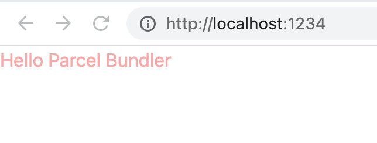

## 📝 description

Parcel을 사용해 React + TypeScript 프로젝트를 세팅하는 방법을 정리하는 글입니다.

제가 좋아하는 Tailwind를 세팅하는 법까지 추가로 정리했습니다.

Parcel에 대한 정보는 아래 링크를 통해 확인하실 수 있습니다.

- [Parcel](https://parceljs.org/)
- [Parcel(한국어)](https://ko.parceljs.org/)

## 🌏 React + TypeScript

### 1. 디렉토리 생성

- 디렉토리 생성

```shell
mkdir parcel-ts-react
```

- 디렉토리 진입

```shell
cd parcel-ts-react
```

- yarn init

```shell
yarn init -y
```

### 2. Parcel Bundler 및 Typescript 설치

```shell
yarn add -D parcel-bundler typescript @types/react @types/react-dom
```

### 3. react, react-dom 설치

```shell
yarn add react react-dom
```

### 4. tsconfig.json 작성

- tsconfig.json

```json
{
  "compilerOptions": {
    "target": "es5",
    "module": "esnext",
    "lib": ["ESNext", "DOM"],
    "jsx": "react",
    "sourceMap": true,
    "strict": true,
    "moduleResolution": "node",
    "baseUrl": "./src",
    "paths": {
      "~/*": ["./*"]
    },
    "typeRoots": ["node_modules/@types"],
    "allowSyntheticDefaultImports": true,
    "esModuleInterop": true
  },
  "include": ["src/**/*"]
}
```

### 5. package.json scripts 작성

- package.json

```json
"scripts": {
  "start": "parcel public/index.html --open",
  "build": "parcel build public/index.html --no-source-maps"
},
```

### 6. public/index.html, src/index.tsx 작성 및 테스트

- public/index.html

```html
<!DOCTYPE html>
<html lang="ko">
  <head>
    <meta charset="utf-8" />
    <meta name="viewport" content="width=device-width, initial-scale=1" />
    <title>Hello Parcel Bundler</title>
  </head>
  <body>
    <noscript>You need to enable Javascript to run this application.</noscript>
    <div id="root">
      <!-- Your react app will be rendered here -->
    </div>
    <script src="../src/index.tsx"></script>
  </body>
</html>
```

- src/index.tsx

```tsx
import React, { StrictMode } from 'react'
import { render } from 'react-dom'

render(
  <StrictMode>
    <h1>Hello Parcel Bundler</h1>
  </StrictMode>,
  document.getElementById('root')
)
```

- terminal

```shell
yarn start
```


---

## 🔎 eslint, prettier 세팅

### 1. eslint, prettier install

```shell
yarn add -D prettier eslint eslint-config-prettier @typescript-eslint/eslint-plugin eslint-plugin-react-hooks
```

### 2. config file 작성

- .prettierrc.js

```js
module.exports = {
  printWidth: 120,
  singleQuote: true,
}
```

- .eslintrc.js

```js
module.exports = {
  env: {
    browser: true,
    es2021: true,
    amd: true,
    node: true,
  },
  extends: [
    'eslint:recommended',
    'plugin:react/recommended',
    'plugin:react-hooks/recommended',
    'plugin:@typescript-eslint/recommended',
    'prettier',
  ],
  parser: '@typescript-eslint/parser',
  parserOptions: {
    ecmaFeatures: {
      jsx: true,
    },
    ecmaVersion: 12,
    sourceType: 'module',
  },
  plugins: ['react', 'react-hooks', '@typescript-eslint'],
  rules: {
    '@typescript-eslint/explicit-function-return-type': 'off',
  },
}
```

---

## 🌸 Tailwind 세팅

### 1. postcss, tailwind, autoprefixer 설치

```shell
yarn add -D tailwindcss@npm:@tailwindcss/postcss7-compat postcss@^7 autoprefixer@^9
```

### 2. config file 작성

- postcss.config.js

```js
module.exports = {
  plugins: {
    tailwindcss: 'tailwind.config.js',
    autoprefixer: {},
  },
}
```

- tailwind.config.js

```js
module.exports = {
  purge: ['./src/**/*.{js,jsx,ts,tsx}', './public/index.html'],
  darkMode: false,
  theme: {
    extend: {},
  },
  variants: {
    extend: {},
  },
  plugins: [],
}
```

### 3. src/index.css 추가

- src/index.css

```css
@tailwind base;
@tailwind components;
@tailwind utilities;
```

### 4. src/index.tsx 작성 및 테스트

- src/index.css

```tsx
import React, { StrictMode } from 'react'
import { render } from 'react-dom'
import './index.css'

render(
  <StrictMode>
    <h1 className="text-red-300">Hello Parcel Bundler</h1>
  </StrictMode>,
  document.getElementById('root')
)
```

- terminal

```shell
yarn start
```


