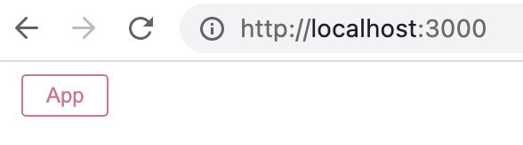
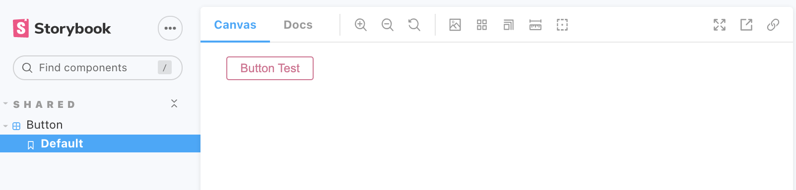

## 📝 description

Webpack을 이용해서 React + Typescript + Styled Components, 그리고 Storybook 세팅하는 방법을 정리한 글입니다.

위에 언급한 라이브러리들이 궁금하시다면 아래 링크를 참고해보시면 좋을거 같습니다!

- [Webpack](https://webpack.js.org/)
- [React](https://ko.reactjs.org/)
- [TypeScript](https://www.typescriptlang.org/)
- [ESlint](https://eslint.org/)
- [Styled Components](https://styled-components.com/)
- [Storybook](https://storybook.js.org/)

이 글에서 사용 된 코드들은 아래 레포를 통해 확인하실 수 있습니다.

- [react-ts-boilerplate](https://github.com/yujo11/react-ts-boilerplate)

## 🌏 React + TypeScript 기본 설정

### 1. 디렉토리 생성

- 디렉토리 생성

```shell
mkdir react-ts-webpack
```

- 디렉토리 진입

```shell
cd react-ts-webpack
```

- yarn init

```shell
yarn init -y
```

### 2. React 설치

```shell
yarn add react react-dom
```

### 3. TypeScript, Definitely Typed 설치

```shell
yarn add -D typescript @types/react @types/react-dom
```

### 4. TypeScript config 작성

- tsc init

```shell
npx tsc --init
```

- tsconfig.json 파일 수정

```json
{
  "compilerOptions": {
    ...

    "jsx": "react-jsx" /* Specify JSX code generation: 'preserve', 'react-native', 'react', 'react-jsx' or 'react-jsxdev'. */,

    ...
  }
}
```

- 참고자료
  - [Introducing the New JSX Transform / React 공식문서](https://reactjs.org/blog/2020/09/22/introducing-the-new-jsx-transform.html)

### 5. Webpack 설치

```shell
yarn add -D webpack webpack-cli webpack-dev-server ts-loader html-webpack-plugin
```

### 6. Webpack config 작성 및 script 추가

- webpack.config.js

```js
const path = require('path')
const HtmlWebpackPlugin = require('html-webpack-plugin')

module.exports = () => {
  const isDevelopment = process.env.NODE_ENV !== 'production'

  return {
    entry: './src/index.tsx',
    output: {
      filename: 'bundle.js',
      path: path.resolve(__dirname, 'dist'),
      clean: true,
    },
    resolve: {
      extensions: ['.ts', '.tsx', '.js', '.jsx'],
    },
    devServer: {
      port: 3000,
      hot: true,
    },
    devtool: isDevelopment ? 'eval-source-map' : 'source-map',
    module: {
      rules: [
        {
          test: /\.(ts|tsx)$/,
          use: {
            loader: 'ts-loader',
            options: {
              configFile: path.resolve(__dirname, 'tsconfig.json'),
            },
          },
          exclude: /node_modules/,
        },
      ],
    },
    plugins: [
      new HtmlWebpackPlugin({
        template: 'public/index.html',
      }),
    ],
  }
}
```

- package.json

```json
"scripts": {
  "prod": "NODE_ENV=production webpack serve",
  "dev": "NODE_ENV=development webpack serve",
  "build": "NODE_ENV=production webpack",
}
```

---

## 🔎 ESlint, Prettier 설정

### 1. ESlint, Prettier + Plugin 설치

- ESlint, Prettier 설치

```shell
yarn add -D prettier eslint
```

- ESlint config, plugin 설치

```shell
yarn add -D eslint-config-prettier eslint-plugin-import eslint-plugin-jsx-a11y eslint-plugin-react eslint-plugin-react-hooks eslint-config-airbnb-typescript @typescript-eslint/eslint-plugin @typescript-eslint/parser
```

### 2. ESlint, Prettier config 파일 작성

- .prettierrc.js
  - [Prettier options](https://prettier.io/docs/en/options.html#docsNav)

```js
module.exports = {
  /* 원하는 옵션을 적으시면 됩니다. */
}
```

- .eslintrc.js

```js
module.exports = {
  env: {
    browser: true,
    es2021: true,
  },
  ignorePatterns: ['*.js'],
  extends: [
    'eslint:recommended',
    'plugin:react/recommended',
    'plugin:react-hooks/recommended',
    'plugin:import/recommended',
    'plugin:jsx-a11y/recommended',
    'plugin:@typescript-eslint/recommended',
    'plugin:@typescript-eslint/recommended-requiring-type-checking',
    'airbnb-typescript',
    'airbnb/hooks',
    'prettier',
  ],
  parser: '@typescript-eslint/parser',
  parserOptions: {
    ecmaFeatures: {
      jsx: true,
    },
    ecmaVersion: 12,
    sourceType: 'module',
    project: './tsconfig.json',
  },
  plugins: ['react', 'react-hooks', 'import', 'jsx-a11y', '@typescript-eslint'],
  rules: {
    'react/jsx-uses-react': 'off',
    'react/react-in-jsx-scope': 'off',
  },
}
```

---

## 🎨 Styled Components + Storybook 설정

### 1. Styled Components 설치

- styled components 설치

```shell
yarn add styled-components
```

- Definitely Typed 설치

```shell
yarn add -D @types/styled-components
```

### 2. Storybook init

```shell
npx sb init
```

---

## 🏃‍♂️ 기본 파일 작성 및 동작 테스트

### 1. 파일 작성

- public/index.html

```html
<!DOCTYPE html>
<html lang="ko">
  <head>
    <meta charset="UTF-8" />
    <meta http-equiv="X-UA-Compatible" content="IE=edge" />
    <meta name="viewport" content="width=device-width, initial-scale=1.0" />
    <title>react typescript boilerplate</title>
  </head>
  <body>
    <div id="root"></div>
  </body>
</html>
```

- src/Button/Button.styles.ts

```ts
import styled from 'styled-components'

const Button = styled.button`
  background: transparent;
  border-radius: 3px;
  border: 2px solid palevioletred;
  color: palevioletred;
  margin: 0 1em;
  padding: 0.25em 1em;
`

export default { Button }
```

- src/Button/Button.tsx

```tsx
import { ButtonHTMLAttributes } from 'react'
import Styled from './Button.styles'

export interface ButtonProps extends ButtonHTMLAttributes<HTMLButtonElement> {
  text: string
}

const Button = ({ text }: ButtonProps): JSX.Element => (
  <Styled.Button>{text}</Styled.Button>
)

export default Button
```

- src/Button/Button.stories.tsx

```tsx
import React from 'react'
import { Story } from '@storybook/react'
import Button, { ButtonProps } from './Button'

export default {
  title: 'shared/Button',
  component: Button,
}

const Template: Story<ButtonProps> = (args: ButtonProps) => <Button {...args} />

export const Default = Template.bind({})
Default.args = {
  text: 'Button Test',
}
```

- src/App.tsx

```tsx
import Button from './Button/Button'

const App = (): JSX.Element => <Button text="App" />

export default App
```

- src/index.tsx

```tsx
import { StrictMode } from 'react'
import ReactDOM from 'react-dom'
import App from './App'

ReactDOM.render(
  <StrictMode>
    <App />
  </StrictMode>,
  document.getElementById('root')
)
```

### 2. 테스트

- dev-server

```shell
yarn dev
```



- storybook

```shell
yarn storybook
```


