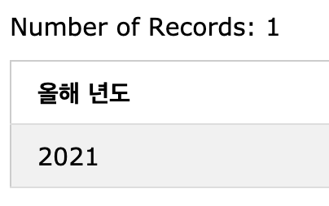

# SQL BASIC

## 실습환경 : [W3Schools try mysql](https://www.w3schools.com/sql/trymysql.asp?filename=trysql_func_mysql_concat)

## 1. 간단한 데이터 조회하기🔎

### 1-1. 모든 데이터 가져오기

```sql
🔎 문법

SELECT * FROM { 테이블 }
```

```sql
📝 예시

-- Customers의 모든 데이터를 가져오기
SELECT * FROM Customers
```

### 1-2. 특정 열 가져오기

```sql
🔎 문법

SELECT { 열 이름 } FROM { 테이블 }
SELECT { 열 이름 } AS { 별칭 } FROM { 테이블 }
```

```sql
📝 예시

-- Employees에서 LastName을 이름으로 BirthDate를 생일로 바꿔서 가져오기
SELECT
    LastName AS '이름',
    BirthDate AS '생일'
FROM
    Employees
```

### 1-3. 검색 조건

```sql
🔎 문법

SELECT * FROM { 테이블 } WHERE { 조건식 }
```

```sql
📝 예시

-- Customers 중 Country가 Germany인 경우
SELECT * FROM Customers WHERE Country = 'Germany'

-- Orders 중 ShipperID가 2가 아닌 경우
SELECT * FROM Orders WHERE ShipperID != 2

-- OrderDetails 중 Quantity 100이 넘는 경우
SELECT * FROM OrderDetails WHERE Quantity > 100

-- Employees 중 FirstName이 O 이후로 시작하는 경우
SELECT * FROM Employees WHERE FirstName >= 'O';

-- Employees 중 BirthDate가 1950-01-01 이전인 경우
SELECT * FROM Employees WHERE BirthDate <= '1950-01-01'
```

### 1-4. 패턴 매칭

```sql
🔎 문법

SELECT * FROM { 테이블 } WHERE { 조건식 } { LIKE, Between, IN} { 필터 }

-- 특정 값으로 시작하는 값 가져오기
SELECT * FROM { 테이블 } WHERE text LIKE '우아한%' -- '우아한 ...'

-- 특정 값으로 끝나는 값 가져오기
SELECT * FROM { 테이블 } WHERE text LIKE '%우아한' -- '... 우아한'

-- 특정 값이 포함되는 값 가져오기
SELECT * FROM { 테이블 } WHERE text LIKE '%우아한%' -- '... 우아한 테크코스 ...'

-- 그 외 조회조건
BETWEEN a AND b -- a와 b사이에 값이 있다.(a, b값 포함)
IN (list) -- list중 어느 값이라도 일치한다
IS NULL -- null값을 갖는다
```

```sql
📝 예시

-- Orders 중 OrderDate가 '1996-07-01' ~ '1996-07-05' 사이인 경우
SELECT * FROM Orders WHERE OrderDate BETWEEN '1996-07-01' AND '1996-07-05'

-- Products 중 CategoryID가 5 혹은 6에 해당하는 경우
SELECT * FROM Products WHERE CategoryID IN (5, 6)

-- Orders 중 OrderDate가 1996년 08월인 경우
SELECT * FROM Orders WHERE OrderDate Like '1996-08%'
```

### 1-5. 정렬

```sql
🔎 문법

SELECT * FROM { 테이블 } ORDER BY { 열 이름 } -- 오름차순
SELECT * FROM { 테이블 } ORDER BY { 열 이름 } DESC -- 내림차순
SELECT * FROM { 테이블 } ORDER BY { 열 이름 } LIMIT { 숫자 } -- 정렬된 데이터에서 숫자만큼만 가져오기
```

```sql
📝 예시

-- Employees 중 가장 어린 5명
SELECT * FROM Employees ORDER BY BirthDate DESC LIMIT 5
```

---

## 2. 데이터 가공하기 📦

### 2-1. 사칙연산

사칙연산은 일반적인 사칙연산 순서와 같음.

#### ROUND

```sql
SELECT 3 / 2 --> 1.50000
```

- `ROUND`를 통해 소수점 몇째 자리까지 보여줄지 정할 수 있음.

```sql
SELECT ROUND(3 / 2) --> 2
SELECT ROUND(3 / 2, 1) --> 1.5
SELECT ROUND(3 / 2, 2) --> 1.50
```

### 2-2. 문자열 연산

#### SUBSTRING

```sql
SELECT SUBSTRING('20210328', 1, 4) AS '올해 년도'
```

- 결과
  

#### 날짜 관련 함수들

```sql
SELECT YEAR('20201117') AS '올해 년도'
SELECT DATE('20201117') AS 'yyyy-mm-dd'
SELECT MONTH('20201117) AS '월'
SELECT DAY('20201117) AS '일'
```

#### 연산 예시

```sql
📝 예시

-- Employee의 생일 중 년도만 조회
SELECT YEAR(BirthDate) FROM Employees
SELECT SUBSTRING(BirthDate, 1, 4) FROM Employees

-- Employees의 LastName과 FirstName을 합쳐 FullName 항목으로 조회
SELECT CONCAT(LastName, ' ', FirstName) as FullName FROM Employees
```

### 2-3. GROUP BY

- `GROUP BY`는 `WHERE`에서 필터링한 데이터를 그룹화한다.
- `HAVING`은 `GROUP BY`에서 집계한 데이터 집합을 다시 조건에 맞게 필터링할 때 사용한다.

```sql
📝 예시

SELECT
    Country, COUNT(*)
FROM Customers
    GROUP BY Country
    HAVING COUNT(Country) = 1;
```

---

## 3. SQL 읽기 📖

노르웨이 국적이 아닌 고객의 국가이름과 고객명을 조회 (국가이름 순 정렬)

```sql
SELECT Country, CustomerName  -- (3)
FROM Customers                -- (1)
    WHERE Country <> 'Norway' -- (2)
        ORDER BY Country      -- (4)
```

1. `FROM`에서 데이터 집합을 만든다.
2. `WHERE`는 `FROM`에서 만든 데이터 집합을 조건에 맞게 걸러낸다.
3. `SELECT`에서는 걸러낸 데이터 중 선택한 열들을 가져온다.
4. 모두 진행한 이후, `ORDER BY`를 통해 데이터 집합을 정렬한다.

---

## 4. SQL 쓰기 ✍️

- 대소문자를 구별하지 않는다.
- 한줄 또는 여러 줄로 작성할 수 있다.
- 명령어를 대문자로 작성하고 나머지를 소문자로 작성한다.
- 예약어는 사용할 수 없다.
- 들여쓰기 규칙
  - `SELECT`절은 들여쓰기 하지 않는다.
  - `UNION`절은 그 다음 `SELECT`와 함께 작성한다.
  - 칼럼은 한 줄마다 작성한다.
  - `FROM`절의 테이블 목록, `WHERE`절의 검색 조건 목록은 한 줄씩 작성한다.
  - 서브쿼리의 괄호는 각각 한 줄로 작성한다.
