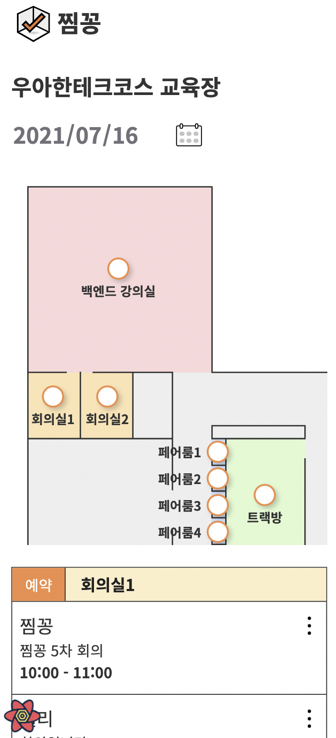
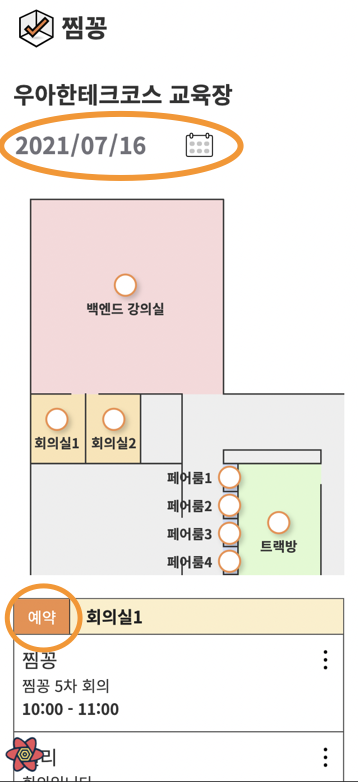
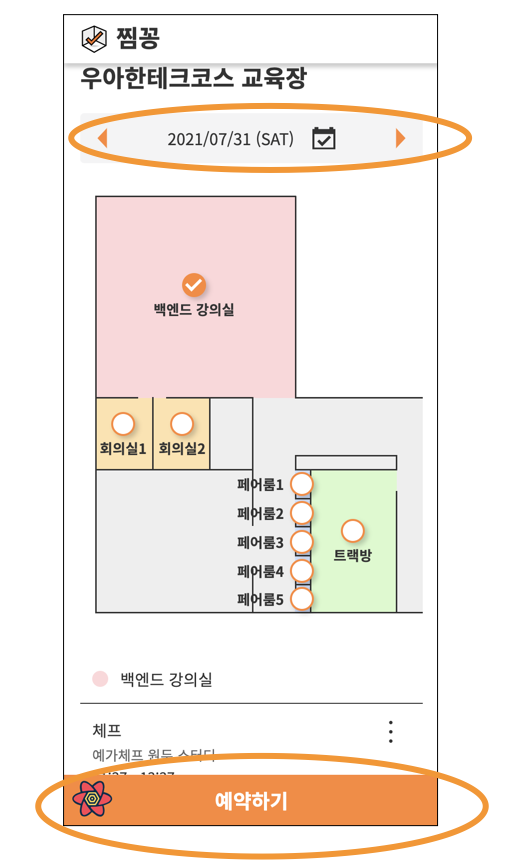

## 1. UT가 뭔가요?

UT(Usability Test)는 사용성 테스트라고도 부릅니다.

UT는 잠재 사용자들에게 테스트를 진행하여 제품을 평가하는 방법 중 하나입니다. 웹이나 앱이 사용하기에 충분한지, 개발자의 의도대로 사용되는지 확인하면서 제품의 사용성을 테스트 해볼 수 있습니다.

## 2. UT가 필요한 이유

애플리케이션을 개발하다보면 해당 앱에 매몰되어 문제점을 스스로 발견하지 못 하는 경우가 많습니다.

개발자는 매일 애플리케이션을 보면서 개발을 하고 어떤 기능을 사용하기 위해 어떻게 해야하는지 모두 알고 있는 상태입니다. 그렇기 때문에 사용자들이 직접 사용하는 경우와는 다르게 일종의 전지적(?) 시점을 가지고 자신의 애플리케아션을 바라보게 됩니다.

아무리 좋은 서비스를 만들었다고 하더라도 해당 서비스를 직접 사용하는 사용자에게 좋은 사용성을 제공하지 못 한다면 사랑받을 수 없습니다. 그렇기 때문에 UT를 적절히 진행하여 잠재적 사용자들이 느끼는 제품의 사용성을 확인하고, 개선해나가는 작업이 필요합니다.

## 3. UT는 어떻게 진행하나요?

UT를 하기 위해서는 3개의 역할이 필요합니다.

1. 사용자: Task 요청에 따라 서비스를 직접 사용한다.
2. 진행자: 사용자에게 Task를 부여하고 UT 혹은 인터뷰를 진행한다.
3. 관찰자: 사용자 행동을 관찰하며 이슈들을 메모하고 진행자에게 알려준다.

진행자는 사용자에게 Task를 부여하고, 관찰자는 사용자의 행동을 관찰하고, 이슈들을 메모하고 진행자에게 알려줍니다. 이 내용들을 바탕으로 문제를 찾아 UI/UX를 개선할 수 있게 됩니다.

UT를 진행할 때 주의해야 할 점들도 존재합니다.

1. UT는 사용자를 테스트 하는게 아니라 제품을 테스트 하는 것이다.
2. 고객(사용자)에게 주는 영향을 최소화하고 중립을 지켜야 한다.
3. 고객이 불편함을 느끼지 않도록 주의해야 한다.

## 4. UT를 위한 Task 작성하기

그러면 이제 실제로 찜꽁 프로젝트를 진행하면서 UT를 진행하고 문제점을 발견하여 개선한 과정을 예시로 얘기해보겠습니다.

찜꽁 프로젝트의 핵심 기능 중 하나였던 예약 기능을 테스트 해보기 위해 UT를 진행하기 전 작성했던 Task들입니다.

위 페이지에 대한 Task를 아래와 같이 먼저 작성하였습니다.

#### Task1 : 화면에 대한 소개 부탁하기

- (설명하는 것을 어려워하면) 친구에게 이 화면을 소개하듯이 말씀해주시겠어요?
- (어딜 눌러보려고 하는 경우) 잠시만요. 요청사항을 다시 말씀드릴게요. 지금은 뭔가 눌러보려는 것이 아니라 지금 보고 있는 화면이 어떻게 이해되는지 저에게 설명을 해주시면 됩니다.
- (사용자가 설명한 내용에 대한 추가 질문) 무엇을 보고 그렇게 생각하신거에요? 그렇게 생각하시는 이유는 무엇 때문인 것 같으세요?
  > 사용자가 지나쳤거나, 잘못 알고 있는 부분에 대해서 절대 정정하지 마시고 그대로 진행

#### Task2 : 2021년 00월 00일 원하는 시간에 프론트엔드 강의실2에 2시간짜리 회의를 예약해주세요.

- (언급하지 않은 영역이 있으면) 지금 살펴보시는 동안 (가리키면서) 이 부분 언급은 안하셨는데, 제가 가리키는 이 부분을 보셨었나요? 언제 처음 보신거에요? 제가 가리키기 전에도 보셨던 부분일까요?

  > 해당 레이블은 읽어주지 마세요.

- (사용자가 보지 못한 경우) 보지 못했던 이유는 무엇 때문이에요?
- (사용자가 봤지만 언급하지 않은 경우) 따로 말씀은 안하셨는데, 이유는 무엇 때문이에요?
- (이해도 재확인) 제가 가리키는 부분을 이해하신대로 설명해주세요.
- (예측/실행) 예상하신 것과 일치하는지 한번 확인해보시겠어요?
- (살펴본 후) 예상하신 것과 일치한 부분은 무엇이고, 예상과 다른 부분은 무엇이었어요?

#### Task3: 전체적인 소감 묻기

- 다음에 이 서비스를 다시 이용하고 싶은 의사를 5점 만점 점수로 주신다면 몇 점을 주시겠어요?
- 점수를 주신 이유에 대해 자세히 말씀해주세요.

#### Task4: 정리 및 마무리

- 오늘 준비한 내용은 모두 확인을 마쳤습니다. 오늘 말씀 잘해주셔서 도움이 많이 되었어요. 혹시 오늘 진행한 내용에 대해 궁금하신 점 있으셨어요?
  > UT에서 말한 내용 중, 사용자가 잘못 알고 있는 내용은 설명해주세요.

## 5. UT를 통해 받은 피드백을 통해 UI/UX 개선하기

위에서 작성한 Task들로 UT를 진행했고 다음과 같은 피드백들을 받을 수 있었습니다.

1. 날짜가 변경 가능한지 인지하기 힘들다.
2. 예약 버튼을 찾기 힘들다.

이 두가지 모두 개발을 진행하면서 전혀 인지하지 못 했던 부분이었기 때문에 UT를 마친 후 해당 부분의 UI/UX를 다음과 같이 개선하였습니다.

## 6. UT를 진행하면서 느낀 점

기존 팀 멤버들 역시 개발을 하면서 자주 어플리케이션을 이용 하고 있었습니다. 그러나 매일 사용하는 입장에서는 당연히 사용하는 방법을 꿰고 있을 수 밖에 없었고 예약 버튼을 찾기 힘든지, 날짜 변경이 가능하다는 사실을 인지하기 힘든지 알 수가 없었습니다.

UT를 통해 실제 사용자의 시선으로 개발하던 앱을 바라볼 수 있었고 문제점들을 찾고 개선할 수 있었습니다. 개발 일정이 촉박했기 때문에 UT를 진행할지 여부에 대한 고민이 있었지마 UT를 진행하고 나니 시간을 들여 UT를 진행한 것이 좋은 선택이라는 생각이 들었습니다.

이 글을 보고 계신 분 중에 애플리케이션을 개발하고 계신 분이 있다면 UT를 진행해보는 것을 강력히 추천드리고 싶습니다.
