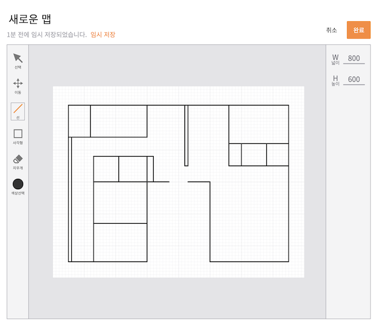
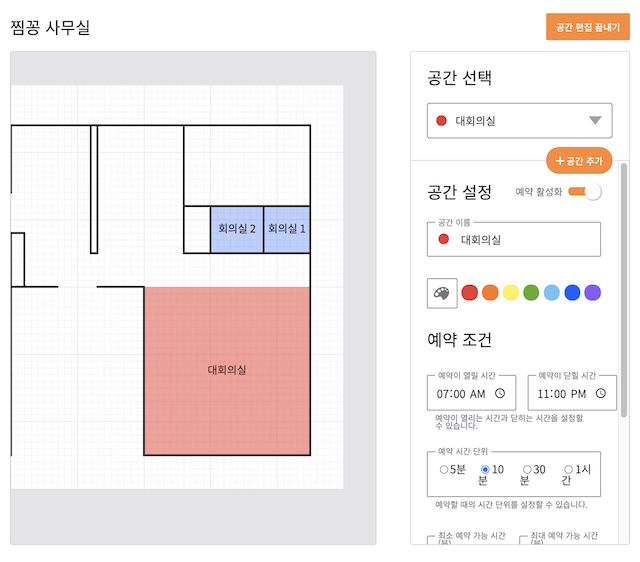
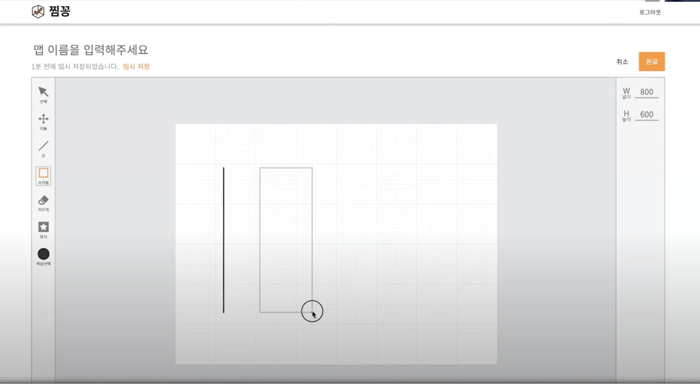
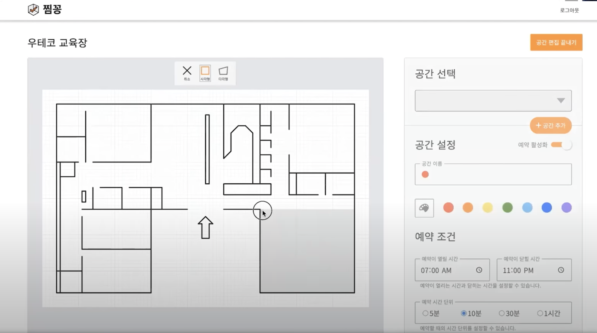

## 0. 프로젝트 정보

- 서비스 링크 : https://zzimkkong.com/
- 저장소 링크: https://github.com/woowacourse-teams/2021-zzimkkong

## 1. 서론

찜꽁 프로젝트를 진행하면서 가장 핵심적으로 생각했던 부분은 에디터 기능이었습니다.

프로젝트에 들어가는 여러 기능들 중 에디터 기능은 기존에 해보지 않았던 미지의 영역이었기 때문에 설렘과 두려움이 공존했습니다.

에디터를 개발하면서 프론트엔드 팀원인 [체프](https://github.com/puterism), [썬](https://github.com/SunYoungKwon)은 물론 백엔드 팀원들과도 많은 논의와 시행착오를 거쳤습니다.

그 과정에서 고민했던 부분들과 개발했던 과정을 기록으로 남기기 위해 개발기를 작성하게 됐습니다.

## 2. 에디터가 어떤 기능을 수행해야 하는가(전체 기능 목록 정의하기)

에디터의 기능을 정의하는 부분부터 난항을 겪었습니다. 팀원들이 각자 생각하는 에디터의 이상적인 모습이 달랐기 때문에 서로의 의견을 공유하고 공통된 목표를 설정하는데 집중 했습니다.

이 과정에서 다른 [Boxy editor](https://boxy-svg.com/), [FloorPlanner](https://floorplanner.com/demo) 등의 에디터들을 참고하여 에디터의 기능을 정의하였습니다.

저희는 에디터를 통해 사용자에게 제공할 목표에 집중 했습니다. "공간"을 직접 만들고 생성한 공간을 하나의 사이트를 통해 다른 사용자에게 제공해 해당 공간을 "예약" 할 수 있게 하는게 저희의 핵심 목표였습니다.

이에 맞게 저희는 에디터를 2가지로 나눴습니다. 사용할 공간 전체의 평면도를 그릴수 있는 "맵 에디터", 그리고 그렇게 그린 맵 위에서 예약할 공간을 지정할 수 있는 "공간 에디터"입니다.

맵 에디터에서 평면도를 그리고 공간 에디터에서 해당 평면도의 영역들을 지정하여 다양한 예약 조건들을 설정할 수 있도록 하는걸 핵심 기능으로 정의했습니다.

- 맵 에디터

- 공간 에디터

## 3. 에디터를 어떻게 개발해야 하는가(기술 스택 정하기)

에디터의 핵심 기능들을 정의했으나 "어떻게" 에디터를 만들건지에 대한 논의가 남아있었습니다.

시중에 존재하는 다양한 에디터들을 참고하면서 Canvas, SVG 등 어떤 요소와 속성들을 활용해 에디터를 만들지 고민과 논의가 꽤 오랜 시간동안 이뤄졌습니다.

그러던 중 팀원인 [체프](https://github.com/puterism)가 자신이 만든 [에디터 프로토타입](https://codesandbox.io/s/svg-drawing-editor-3wx34?file=/src/App.js)을 보여줬습니다. 해당 에디터 프로토타입은 SVG를 기반으로 선 그리기, 사각형 그리기 등의 기능을 담고 있었습니다.

SVG는 2차원 벡터 그래픽을 만들 수 있는 XML 기반의 마크업 언어입니다. 코드로 삽입이 가능하고, 삽입된 요소에 이벤트 리스너를 등록하고 사용할 수 있습니다. 이러한 특성상 요소를 새롭게 추가하고, 해당 요소를 제거하거나 속성을 바꿀 수 있도록 하기 위해 SVG를 사용하는 것이 적절하다고 판단 했습니다.

체프의 에디터 프로토타입 역시 SVG를 기반으로 구현되었기 떄문에 프로토타입을 바탕으로 기능들을 붙이고 발전시킨다면 팀에서 목표로 하는 에디터의 구현에 빠르게 다가갈 수 있겠다고 생각 했습니다.

SVG를 통해 에디터를 개발하는 방향으로 팀의 합의가 이뤄졌고 에디터 개발을 시작하게 됐습니다.

## 4. 에디터를 어떤 순서로 만들 것인가(MVP 정하기)

1. 에디터가 어떤 기능을 가지고 있어야 할지
2. 어떻게 개발할지

위 두 가지에 대한 논의는 마쳤으나 아직 정해야 하는게 하나 더 남아 있었습니다. "에디터 개발"이라는 한 문장에는 "에디터"라는 이름 아래에 구현해야 할 수많은 기능들이 내포되어 있었습니다.

일정상 배포까지 생각했던 모든 기능들을 구현할 수는 없었기 떄문에 이 중 어떤 기능들을 먼저 개발할지에 대한 논의가 필요했습니다.

전체적인 에디터 개발 순서는 다음과 같이 진행하도록 정해졌습니다.

- 맵 에디터

  1. 맵을 그릴 배경(바탕) 만들기
  2. 배경(바탕) 크기 조절 기능
  3. 배경(바탕) 이동 기능
  4. 선 그리기 기능
  5. 요소 삭제 기능
  6. 사각형 그리기 기능

- 공간 에디터
  1. 맵 에디터에서 생성한 맵 불러오기
  2. 공간을 사각형으로 지정하는 기능
  3. 공간의 예약정보를 설정하는 기능
  4. 지정한 공간을 삭제하는 기능

논의를 거쳐 MVP를 산정했으나, 개발 과정에서 MVP에 정의했던 기능들 중 제외되는 기능(장식 요소 추가, 다각선 그리기)들과 새롭게 추가되는 기능(사각형 그리기)들이 생겨났습니다.

또한 개발 기간 중 진행한 두 번의 UT(Usability Test)를 거치면서 UI가 전체적으로 수정되는 등 여러 이슈를 겪기도 했습니다.

여러가지 우여곡절을 겪었지만 팀원들 모두 합심하여 열심히 개발한 덕분에 첫 릴리즈 이전에 MVP를 완성해 배포할 수 있었습니다.

> 릴리즈 전 4차 데모 발표 영상 중 캡쳐

- 맵 에디터

- 공간 에디터

## 5. 마치며

다음 편에서는 이제 본격적으로 SVG를 사용해 사각형(Rect), 다각형(Polygon) 그리기 기능을 구현한 코드들을 첨부하면서 어떤 고민을 했었는지 적어보도록 하겠습니다.
