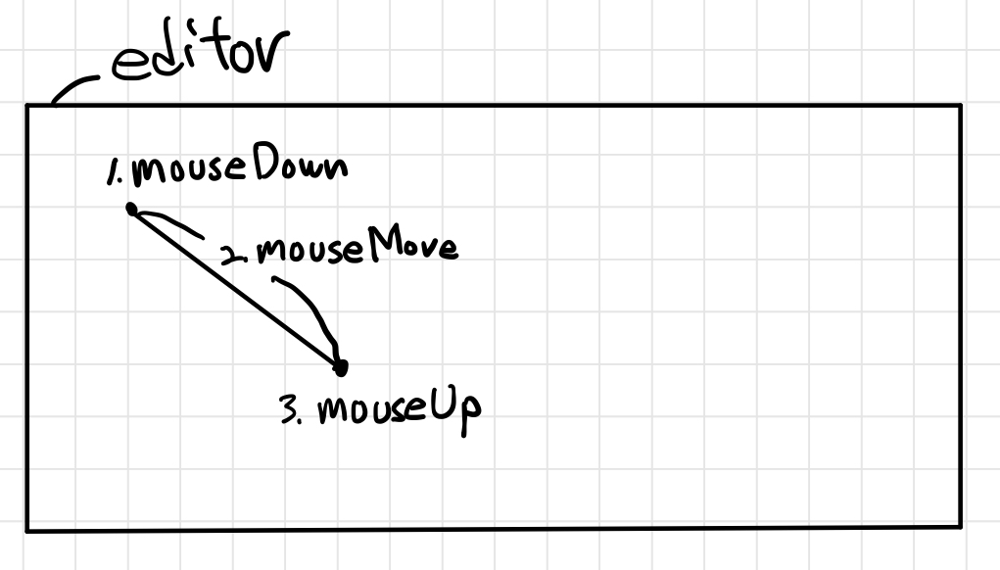

## 0. 프로젝트 정보

- 서비스 링크 : https://zzimkkong.com/
- 저장소 링크: https://github.com/woowacourse-teams/2021-zzimkkong

## 1. 에디터의 뼈대


에디터를 작성하기 위해 먼저 에디터의 모양을 생각해야 했습니다. 논의 끝에 저희는 양쪽 끝에 여러 도구들을 사용할 수 있는 Toolbar들을 두고 가운데 영역을 도구들을 사용해 그릴 영역으로 지정하였습니다.

그릴 영역은 사용자가 그리기 편하도록 모눈종이 모양을 채택했습니다. 이를 구현하기 위해 `<defs>`, `<pattern>`,`<g>`, `<rect>` 등을 이용했습니다.

> - SVG 간단 설명
>   - `<defs>`: 나중에 사용할 SVG 객체를 미리 정의 해 놓을 수 있다.
>   - `<pattern>`: 영역을 덮기 위해 반복되는 좌표들을 저장할 수 있다.
>   - `<g>`: SVG 요소들을 그룹화 하기 위해 사용
>   - `<rect>`: 사각형을 그리기 위해 사용한다.

코드로 간단하게 나타내면 아래와 같은 형태로 작성하였습니다.(svg의 속성들까지 모두 작성하면 코드가 너무 길어져 간단하게만 작성하였습니다.)

```jsx
<svg>
  <defs>
    <pattern id="pattern">
     <rect />
    </pattern>
  </defs>

  <g>
    <use fill="url(#pattern)">
  </g>
</svg>
```

이렇게 하여 다음과 같은 에디터를 그릴 수 있는 뼈대를 완성할 수 있었습니다.


## 2. 선 그리기 기능

뼈대를 완성한 후 이제는 Toolbar에 들어갈 기능들을 하나 씩 만들기 시작했습니다.

먼저, 가장 기본적인 형태의 선을 그릴 수 있는 기능을 만들었습니다. 선은 추후 확장성을 생각하여 `<line>` 태그가 아닌 `<polyline>` 태그를 사용하였습니다.

선을 그릴 때 사용자가 모눈 에서 위치를 제대로 잡을 수 있도록 하기 위해 마우스 포인터의 움직임을 트래킹하여 점 모양으로 현재의 마우스 포인터 위치를 표시해 주었습니다.

해당 포인터는 현재 마우스의 좌표를 받아서 사용했는대 다음과 같은 식을 통해 간단하게 현재 마우스 포인터의 위치를 잡을 수 있었습니다.

```jsx
// coordinate = 마우스의 좌표

const stickyDotCoordinate: Coordinate = {
  x: Math.round(coordinate.x / EDITOR.GRID_SIZE) * EDITOR.GRID_SIZE,
  y: Math.round(coordinate.y / EDITOR.GRID_SIZE) * EDITOR.GRID_SIZE,
}
```


이제 마우스의 움직임에 따른 위치까지 구현하였으니 본격적으로 선을 그리는 기능을 구현해야 했습니다.

선을 그리는 방식은 여러 에디터들을 참고하여 드래그 앤 드랍의 형식으로 그릴 수 있게 구현했습니다.

`mouseDown` 이벤트를 통해 선을 그리기 시작하면 `mouseMove` 이벤트를 통해 선을 그리고, `mouseUp` 이벤트를 통해 선을 그리기를 종료하는 사이클로 구현했습니다.



이 때, 사용자가 완성될 선의 모양을 미리 볼 수 있도록 `mouseDown`이후 `mouseMove` 이벤트가 발생할 때 임시로 `<polyline>`을 그려서 보여주는 기능 역시 함께 구현 했습니다.


## 3. 사각형 그리기 기능

이제 사용자는 선을 통해 원하는 이미지를 구현할 수 있게 되었습니다. 평면도를 그릴 때 선만큼이나 많이 사용되는 것이 사각형이라고 생각했기 때문에 다음으로 사각형을 그리는 기능을 구현 했습니다.

사각형은 `<rect>`를 통해 그리도록 구현했습니다. 먼저 에디터 상에서 `<rect>`를 그리는 주요 속성들을 살펴 보면 x, y 좌표와 width, height가 존재 합니다.


사용자로부터 주어지는 정보는 시작 지점과 끝나는 지점의 좌표 두 가지였습니다. 이 두가지 정보를 이용하여 `<rect>`의 x, y, width, height 정보를 얻어야 했고, 이 정보들을 이용하여 `<rect>`를 그리기 위해 다음과 같은 로직을 사용하였습니다.

```jsx
const width = Math.abs(startPoint.x - endPoint.x)
const height = Math.abs(startPoint.y - endPoint.y)

if (!width || !height) {
  return (
    <line
      points=`${startPoint.x},${startPoint.y}`, `${endPoint.x},${endPoint.y}
    />
  )
} else {
  return (
    <rect
      x={Math.min(startPoint.x, endPoint.x)}
      y={Math.min(startPoint.y, endPoint.y)}
      width={width}
      height={height}
    />
  )
}
```

또한, 사각형 역시 사용자가 완성된 사각형의 모습을 예상할 수 있도록 좌표에 따라 임시로 `<rect>`를 생성하여 보여주는 기능을 구현했습니다.


## 4. 마치며

에디터의 뼈대를 구성하는 부분, 선과 사각형 그리기 기능을 구현한 부분에 대해서 정리해봤습니다. 모든 코드를 옮기기에는 내용이 너무 방대해질거 같아 구현하면서 쓰인 핵심 로직들에 대한 코드만 간단하게 옮겼습니다.

전체 코드가 궁금하신 분들께서는 아래 저장소를 방문해 확인하실 수 있습니다.

- 저장소 링크: https://github.com/woowacourse-teams/2021-zzimkkong
