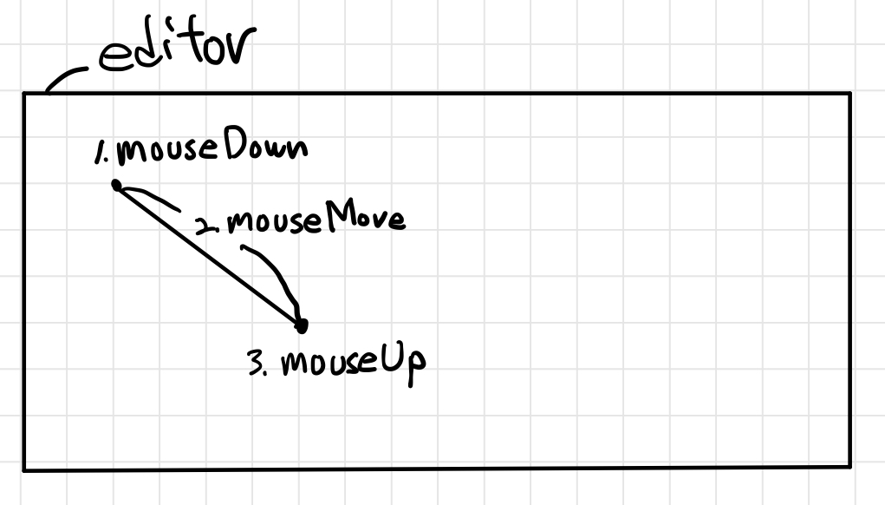
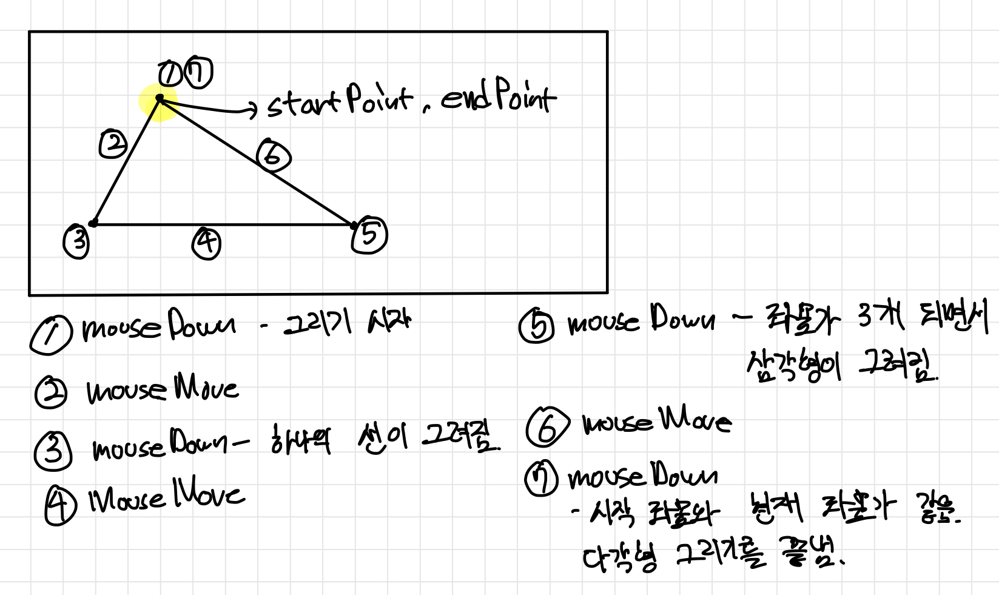
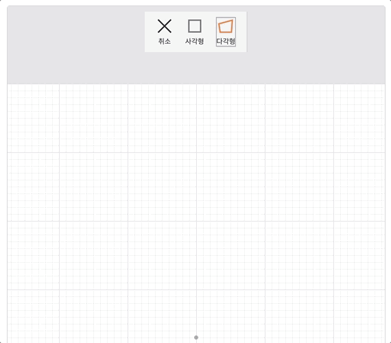
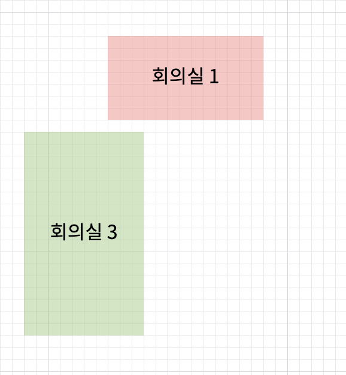
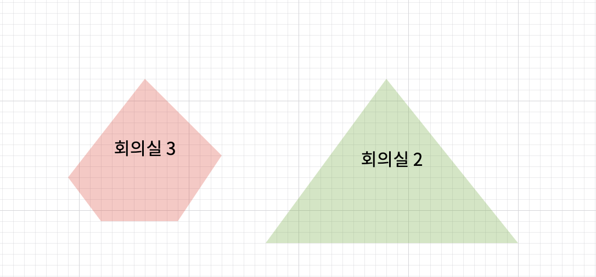

## 0. 프로젝트 정보

- 서비스 링크 : https://zzimkkong.com/
- 저장소 링크: https://github.com/woowacourse-teams/2021-zzimkkong

## 1. 다각형을 그리기 구현 전 고민했던 부분



다각형 그리기 기능 이전에 구현했던 선과 사각형 그리기는 위와 같은 사이클로 진행되었습니다.

선과 다각형을 그리기 위해 필요한 최소 정보는 2개의 좌표였습니다. 따라서 2개의 좌표는 드래그를 시작하는 지점, 드래그를 끝마치는 지점 두 개의 좌표값을 사용함으로서 그릴 수 있었습니다.

그러나 다각형의 경우는 드래그 앤 드랍으로 구현할 수 없었습니다. 특정한 모양을 갖춘 오각형, 육각형을 그리는 기능이 아니라 N개의 꼭짓점을 가준 N각형을 그려야 했기 때문에 드래그 앤 드랍으로는 N개의 꼭짓점을 특정할 수 없었습니다.

그렇다보니 자연스럽게 사용자로부터 더 많은 정보를 가져와야 했습니다. 사용자에게 많은 정보를 요구한다는 것은 곧 사용자가 하나의 도형을 완성시키기 위해 더 많은 행동을 해야 한다는 뜻이기도 합니다.

다른 에디터를 참고하여 사용자들이 직관적으로 기능을 파악할 수 있도록 다음과 같은 로직을 구상하였습니다.



## 2. 다각형 그리기 기능

`mouseUp` 이벤트와 관련된 로직을 제거하고 `mouseDown`, `mouseMove` 이밴트만 사용하였습니다.

사용자가 다각형 그리기를 선택하고 최초에 `mouseDown`이벤트가 발생하면 해당 포인트를 시작점으로 지정하고 이후 `mouseMove`와 `mouseDown`이벤트를 반복하여 원하는 모양의 N각형을 그릴 수 있도록 하였습니다.

시작 지점과 `mouseDown`이벤트가 발생한 지점의 좌표가 같으면 다각형을 완성한 것으로 간주하여 다각형 그리기를 마치도록 했습니다.

시작 지점을 사용자가 잘 파악할 수 있도록 시작 지점은 별도로 표시를 하였습니다. 또한, 선 그리기, 사각형 그리기 기능과 마찬가지로 사용자가 미리 완성된 모습을 파악할 수 있도록 임시로 `polygon`을 그려 보여주는 기능도 추가 했습니다.

미리 보기를 구현할 때도 기존과는 달리 여러 차례에 걸쳐 모양을 보여줘야 했기 때문에 완성된 영역은 진한 색으로, 현재 그려지고 있는 영역은 연한 색으로 구분하여 차등을 줬습니다.

완성된 다각형 그리기 기능의 동작은 다음과 같습니다.



## 3. 다각형 그리기 구현 후 고민했던 부분

다각형은 '공간 에디터'에 속한 기능이었습니다. 기존 공간 에디터에서는 다음과 같이 이름을 등록할 수 있는 기능이 존재 했습니다.



사각형의 경우 x, y 좌표값과 width, height가 존재하기 때문에 정중앙을 찾는 것은 어려운 일이 아니었습니다.

하지만, N각형의 경우 N개의 꼭짓점이 존재했기 때문에 정중앙을 찾기 위한 방법을 고민 했습니다. 그 과정에서 찾게 된 두가지 방법은 아래와 같습니다.

1. 전체 x좌표와 y좌표를 순회하며 x, y 좌표의 최댓값, 최솟값을 구해 그 값을 바탕으로 중앙점을 찾는 방법
2. `svg`의 `getBBox` 메서드를 사용하여 해당 엘리먼트를 포함하는 영역(사각형)을 찾아 그 영역의 중앙점을 찾는 방법

그 중 저희는 첫 번째 방법을 채택하여 중앙점을 찾았습니다. 두 번째 방법을 사용한다면 좀 더 간편하게 구할 수 있었겠지만 `getBBox` 메서드를 사용하기 위해서는 모든 `polygon` 엘리먼트에 `ref`를 등록해야 했습니다. `ref`를 모든 `polygon` 엘리먼트들에 등록하는 것 역시 비용이 발생한다고 생각했기 때문에 첫번째 방법을 사용 했습니다.

polygon의 중앙점을 찾기 위해 사용한 로직은 다음과 같습니다.

```js
const getPolygonCenterPoint = coordinates => {
  const x = coordinates.map(p => p.x)
  const y = coordinates.map(p => p.y)

  const maxX = Math.max(...x)
  const maxY = Math.max(...y)
  const minX = Math.min(...x)
  const minY = Math.min(...y)

  return {
    x: (minX + maxX) / 2,
    y: (minY + maxY) / 2,
  }
}
```

위 로직을 사용하여 중앙점을 찾을 수 있었고 다음과 같이 적용하였습니다.



## 4. 마치며

1, 2, 3 편을 작성하며 그동안 에디터를 구현하기 위해 했던 고민들을 되짚어 볼 수 있어 굉장히 재밌었습니다.

새롭게 에디터를 구현하시려고 하는 분들이 이 글을 보시고 조금이나마 인사이트를 얻으셨으면 좋겠네요.

단순히 요소를 그리는 것 이외에도 요소를 선택하고 이동하는 기능, 삭제하는 기능 등 여러가지 기능을 구현 했습니다. 이 기능들에 대해서도 다음에 정리를 해보겠습니다.
