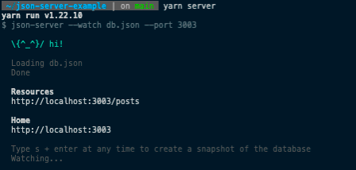
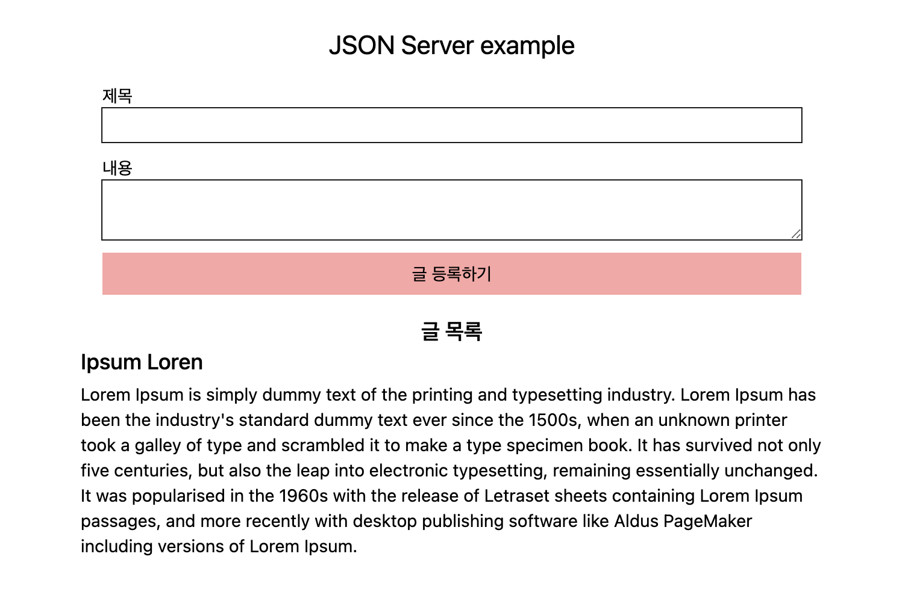
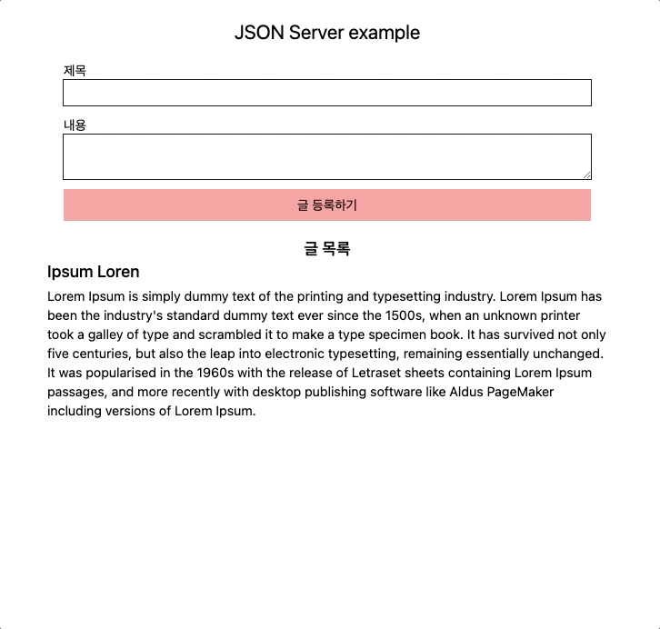

## 1. json-server로 Mock Server 만들기

프론트엔드 개발을 하다보면, Mock Server가 필요한 순간들이 종종 생깁니다.

Recoil과 같은 상태관리 라이브러리를 새로 도입하기 위해 Test할 때도, Project를 진행하는 중 API 명세만 나와있는 경우 등이 그렇습니다.

이번에는 JSON server를 통해 간단하고 빠르게 Mock Server 만드는 방법을 다뤄보겠습니다.

- [json-server / npm](https://www.npmjs.com/package/json-server)

### 1-1. json-server package 설치

```shell
yarn add -D json-server
```

### 1-2. script 추가

- `--watch {target}` : {target}을 DB로 사용합니다.
- `--port {port number}` : {port number}를 sever로 사용합니다.

```json
"scripts": {
    "server": "json-server --watch db.json --port 3003"
},
```

### 1-3. 실행

```shell
yarn server
```



## 2. json-server example app

위 방법이 json-server를 실행하기 위한 전부입니다.

이후 db.json파일에 원하는 schema를 세팅해서 사용하면 됩니다. 실제 server처럼 들어오는 데이터의 유효값을 검증해주지는 않지만 `id`는 자동으로 매겨집니다.

동작을 확인하기 위해 간단한 React 코드를 준비 했습니다.

- src/App.tsx

```tsx
import React, { useEffect, useState } from 'react'
import { getPost, addPost } from './api'

interface Post {
  id: number
  title: string
  content: string
}

const App = (): JSX.Element => {
  const [title, setTitle] = useState<string>('')
  const [content, setContent] = useState<string>('')
  const [posts, setPosts] = useState<Post[]>([])

  const getPosts = async () => {
    const response = await getPost()
    setPosts(response.data)
  }

  const handleTitleChange = ({
    target: { value },
  }: {
    target: { value: string }
  }) => {
    setTitle(value)
  }

  const handleContentChange = ({
    target: { value },
  }: {
    target: { value: string }
  }) => {
    setContent(value)
  }

  const handleSubmit = (e: React.FormEvent<HTMLFormElement>) => {
    e.preventDefault()

    setTitle('')
    setContent('')

    addPost({ title, content })
    getPosts()
  }

  useEffect(() => {
    getPosts()
  }, [])

  return (
    <div className="flex flex-col justify-center items-center p-10 ">
      <h1 className="text-2xl">JSON Server example</h1>
      <form className="flex flex-col p-5 w-4/12" onSubmit={handleSubmit}>
        <label htmlFor="title">제목</label>
        <input
          id="title"
          className="ring-1 ring-black p-1 mb-3"
          value={title}
          onChange={handleTitleChange}
        />
        <label htmlFor="content">내용</label>
        <textarea
          id="content"
          className="ring-1 ring-black p-1 mb-3"
          value={content}
          onChange={handleContentChange}
        />
        <button className="p-2 bg-red-300">글 등록하기</button>
      </form>
      <h2 className="text-xl font-semibold">글 목록</h2>
      <div className="w-4/12">
        {posts?.map(post => (
          <div key={post.id}>
            <h3 className="text-xl font-medium mb-1">{post.title}</h3>
            <p className="overflow-hidden">{post.content}</p>
          </div>
        ))}
      </div>
    </div>
  )
}

export default App
function useSelector() {
  throw new Error('Function not implemented.')
}
```

- db.json

```json
{
  "posts": [
    {
      "id": 1,
      "title": "Ipsum Loren",
      "content": "Lorem Ipsum is simply dummy text of the printing and typesetting industry. Lorem Ipsum has been the industry's standard dummy text ever since the 1500s, when an unknown printer took a galley of type and scrambled it to make a type specimen book. It has survived not only five centuries, but also the leap into electronic typesetting, remaining essentially unchanged. It was popularised in the 1960s with the release of Letraset sheets containing Lorem Ipsum passages, and more recently with desktop publishing software like Aldus PageMaker including versions of Lorem Ipsum."
    }
  ]
}
```

위 App을 실행시켜 보면 다음과 같이 db.json에 있는 데이터들을 불러와 화면에 보여주는 것을 확인할 수 있습니다.



새로운 글을 등록해보겠습니다.



새로운 글이 잘 등록되었습니다. `db.json` 파일을 확인해보면 `db.json` 파일에도 데이터가 잘 추가된 것을 확인할 수 있습니다.

```json
{
  "posts": [
    {
      "id": 1,
      "title": "Ipsum Loren",
      "content": "Lorem Ipsum is simply dummy text of the printing and typesetting industry. Lorem Ipsum has been the industry's standard dummy text ever since the 1500s, when an unknown printer took a galley of type and scrambled it to make a type specimen book. It has survived not only five centuries, but also the leap into electronic typesetting, remaining essentially unchanged. It was popularised in the 1960s with the release of Letraset sheets containing Lorem Ipsum passages, and more recently with desktop publishing software like Aldus PageMaker including versions of Lorem Ipsum."
    },
    {
      "id": 2,
      "title": "json-server로 Mock Server 만들기",
      "content": "정말 쉽다ㅎㅎ"
    }
  ]
}
```

위에서 사용된 코드들은 아래 저장소에서 확인하실 수 있습니다.

- [json-server-example](https://github.com/yujo11/json-server-example)

추가로 json-server를 배포해서 사용하실 분들은 아래 링크를 참고해보시면 좋을거 같습니다!

- [json-server-heroku](https://github.com/jesperorb/json-server-heroku)
