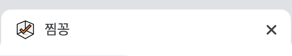
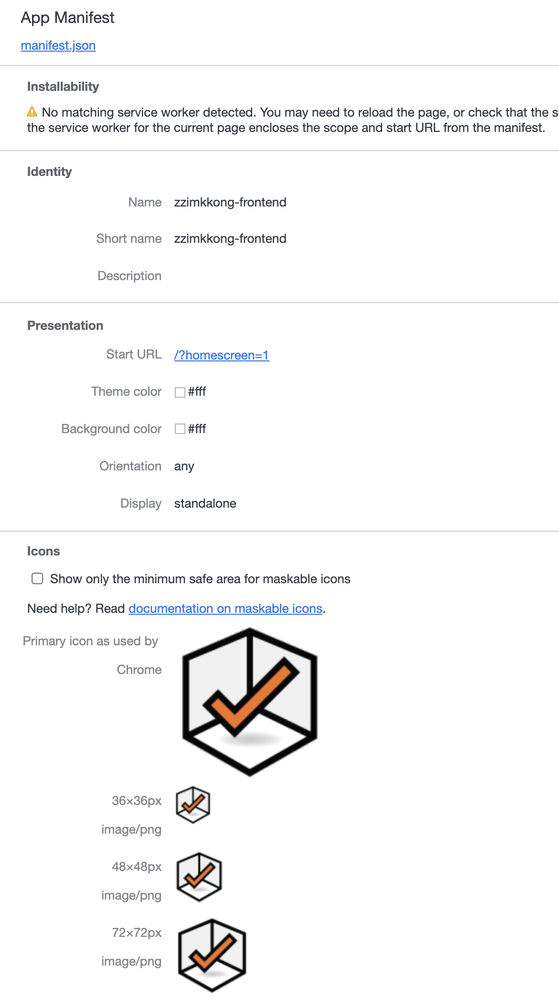
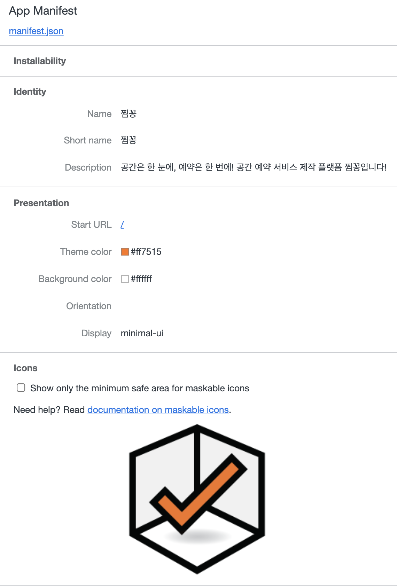

## favicon 추가하기

### 1. HtmlWebpackPlugin 사용

[HTMLWebpackPlugin](https://www.npmjs.com/package/html-webpack-plugin)에는 다음과 같은 옵션이 있습니다.

| Name          | Type     | Default                                             | Description |
| ------------- | -------- | --------------------------------------------------- | ----------- |
| **`favicon`** | {String} | `` | Adds the given favicon path to the output HTML |

해당 옵션을 사용해 아래와 같이 `favicon`을 등록할 수 있습니다.

```js
plugins: [
  new HtmlWebpackPlugin({
    template: 'public/index.html',
    favicon: 'src/assets/images/logo.png',
  }),
]
```

등록 후 다음과 같이 정상적으로 favicon이 표시되는 것을 확인할 수 있습니다.



build 된 HTML 코드를 확인해보면 다음과 같은 `<link />` 태그가 추가 된 것을 확인할 수 있습니다.

```html
<link rel="icon" href="logo.png" />
```

웹 페이지만 산정한다면 이렇게 간단한 방법으로 favicon을 추가하는 것도 좋지만 모바일 환경까지 고려한 PWA를 산정한다면 이것으로는 조금 부족합니다.

다양한 환경에서의 Icon이 보이길 바란다면 이어지는 내용을 참고해주시면 좋을거 같습니다.

### 2. FaviconsWebpackPlugin 사용

[FaviconsWebpackPlugin](https://www.npmjs.com/package/favicons-webpack-plugin)의 경우 다음과 같이 작성할 수 있습니다.

```js
plugins: [
  new HtmlWebpackPlugin({
    template: 'public/index.html',
  }),
  new FaviconsWebpackPlugin({
    logo: 'src/assets/images/logo.png',
  }),
],
```

등록 후 역시 favicon이 표시되는 것을 확인할 수 있습니다.


그러나 build 된 HTML 파일을 확인해보면 이전 `HtmlWebpackPlugin`을 사용했던 것과 달리 다양한 `<link />`태그들이 추가된 것을 확인할 수 있습니다.

```html
<link rel="shortcut icon" href="assets/favicon.ico" />
<link
  rel="icon"
  type="image/png"
  sizes="16x16"
  href="assets/favicon-16x16.png"
/>
<link
  rel="icon"
  type="image/png"
  sizes="32x32"
  href="assets/favicon-32x32.png"
/>
<link
  rel="icon"
  type="image/png"
  sizes="48x48"
  href="assets/favicon-48x48.png"
/>
<link rel="manifest" href="assets/manifest.json" />
<link
  rel="apple-touch-icon"
  sizes="57x57"
  href="assets/apple-touch-icon-57x57.png"
/>

...(생략)
```

그리고 또 하나 다른 점이라면 `HtmlWebpackPlugin`을 사용했을 때와 달리 `manifest`가 추가된 것을 확인할 수 있습니다.



## Manifest 설정하기

favicon을 성공적으로 추가했지만 `manifest`는 원하는 모양으로 표시되지 않습니다. `FaviconsWebpackPlugin`을 통해 추가적으로 `manifest`설정이 가능합니다.

`manifest` 설정을 변경하는 방법은 크게 두 가지로 나눠볼 수 있습니다.

### 1. manifest.json 작성 후 링크 추가

- public/manifest.json

```json
{
  "short_name": "찜꽁",
  "name": "찜꽁",
  "description": "공간은 한 눈에, 예약은 한 번에! 공간 예약 서비스 제작 플랫폼 찜꽁입니다!",
  "start_url": "/",
  "display": "minimal-ui",
  "theme_color": "#ff7515",
  "background_color": "#ffffff"
}
```

- webpack.config.js

```js
plugins: [
  new HtmlWebpackPlugin({
    template: 'public/index.html',
  }),
  new FaviconsWebpackPlugin({
    logo: 'src/assets/images/logo.png',
    manifest: 'public/manifest.json',
  }),
],
```

### 2. `favicons` 설정 추가

- webpack.config.js

```js
plugins: [
  new HtmlWebpackPlugin({
    template: 'public/index.html',
  }),
  new FaviconsWebpackPlugin({
    logo: 'src/assets/images/logo.png',
    favicons: {
      appName: '찜꽁',
      appShortName: '찜꽁',
      appDescription: '공간은 한 눈에, 예약은 한 번에! 공간 예약 서비스 제작 플랫폼 찜꽁입니다!',
      theme_color: '#ff7515',
      background: '#fff',
      display: 'minimal-ui',
    }
  }),
],
```

1번 방법과 2번 방법 모두 같은 manifest 정보를 보여주는 걸 확인할 수 있습니다.


