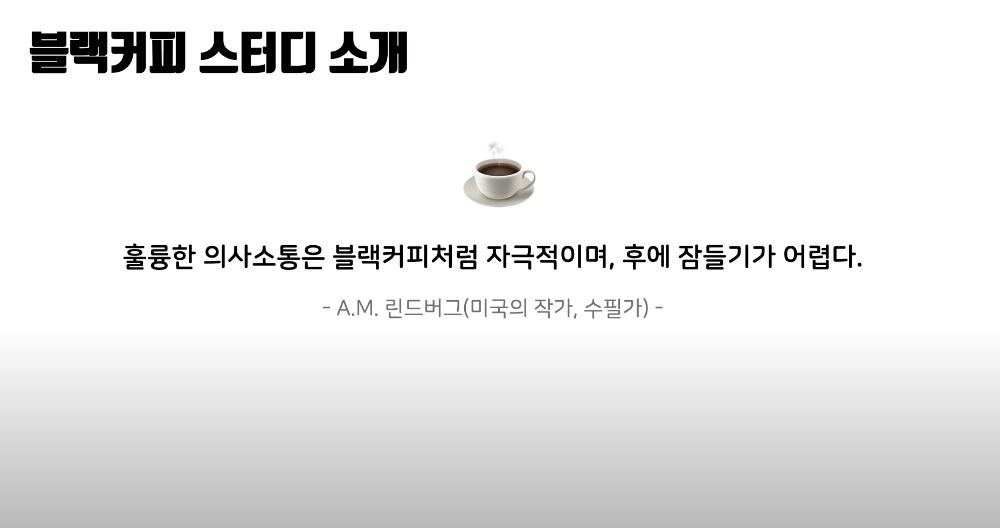
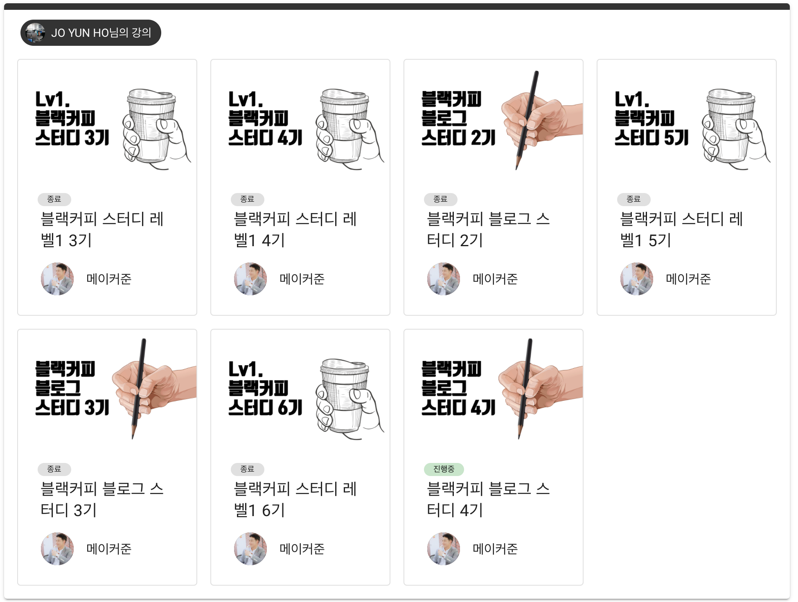
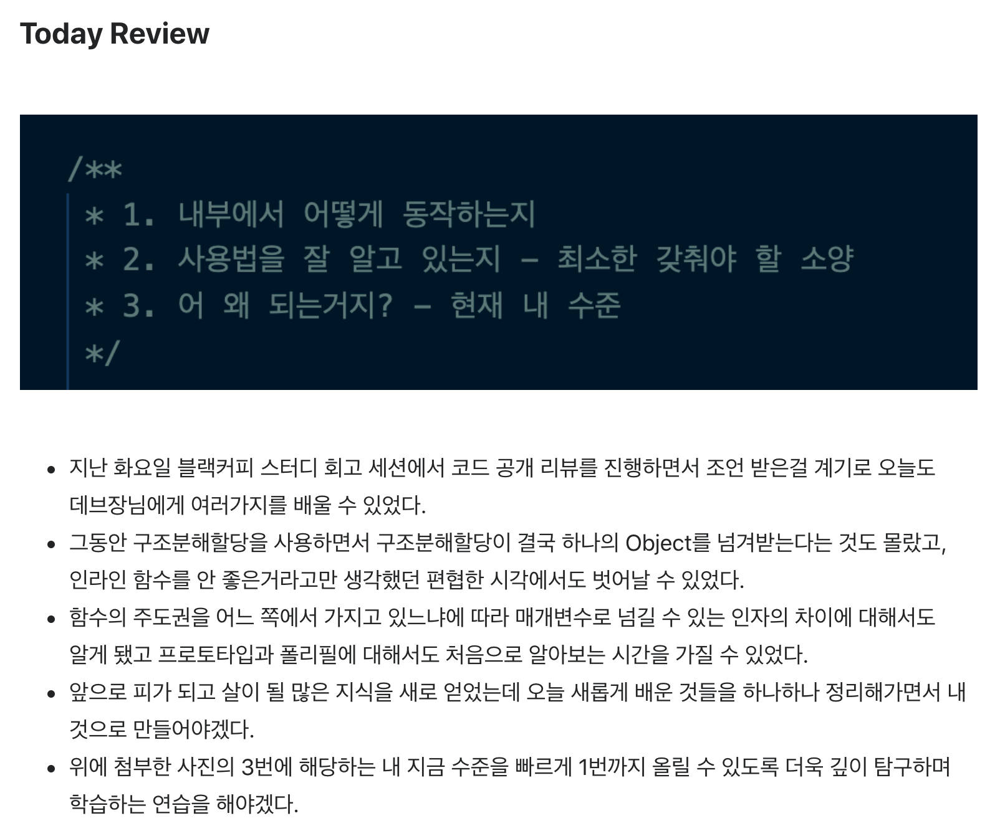

# 블랙커피 프론트엔드 스터디 레벨1 후기

## ☕️ 블랙커피 프론트엔드 스터디?

블랙커피 프론트엔드 스터디는 [nextstep](https://edu.nextstep.camp/)이라는 플랫폼에서 운영되고 있는 스터디입니다.

프론트엔드 스터디 외에도 블로그 스터디도 활발하게 운영되고 있습니다! 블랙커피 프론트엔드 스터디가 궁금하시다면 [링크](https://www.youtube.com/watch?v=hYjsaIdHDzM)의 유튜브 영상을 참고하시면 더 많은 정보를 있습니다!(매 기수마다 업데이트 되고 있어서 참여하시는 시점과는 내용이 조금 달라졌을 수도 있습니다.)

## 🙋‍♂️ 스터디 참여 계기

막 프론트엔드에 관심을 가지고 공부를 하던 중 같이 공부하는 친구에게 스터디를 추천 받았습니다. 추천을 받고 같은 관심사(프론트엔드)를 가진 사람들을 만나고 싶었고 같은 목표를 가진 사람들과 함께 공부하면 좋겠다는 생각으로 참여하게 됐습니다.

## 🏃‍♂️ 장수의 늪

위 사진을 보시면 아시겠지만 레벨 1 스터디를 무려 4번이나 참여하고서야 겨우 모든 미션을 마칠 수 있었습니다. 어떤 생각을 가지고 스터디에 참여했고 어떤 일들이 있었는지 간략히 정리해 보겠습니다.

### 🥚 3기

처음으로 스터디를 참여했던 기수입니다. 이 때는 제 코드를 다른 사람에게 보여주는 일에 대한 두려움이 굉장히 컸습니다. 블랙커피 스터디는 스터디 참여자들 간의 페어 프로그래밍과 코드 리뷰가 적극 권장 되는 스터디입니다.

그러나 저는 제 부족한 실력이 만천하에 드러나는 것만 같아서 페어 프로그래밍을 하는 것도, PR을 올려서 코드 리뷰를 받는 것도 무서워 했습니다. 이런 생각을 가지고 위축되다 보니 기능을 완성하고도 조금 더 개선하고 제출해야겠다는 다짐만 여러 번 반복 했습니다. 다짐만 반복하던 저는 결국 총 3개의 미션 중 단 하나의 미션도 마치지 못한 채 3기 스터디를 마무리 하게 됐습니다.

### 🐣 4기

4기 스터디에 참여할 때는 조금 더 적극적으로 페어 프로그래밍과 코드 리뷰를 이용하자는 마음을 먹었습니다. 공개 코드 리뷰, 페어 프로그래밍을 통해 많은 피드백을 얻기 위해 노력했습니다.

당시 나나님과 페어 프로그래밍을 진행하면서 헬퍼인 준일님, 데브장님에게 많은 인사이트를 얻을 수 있었습니다. 특히 데브장님은 따로 시간을 내주시면서까지 여러가지 막혔던 부분들에 대해 보충 설명을 해주셔서 나나님과 함께 빠르게 성장할 수 있었습니다.

- 당시 작성했던 TIL의 일부

짧은 시간 동안 정말 많이 배운 알찬 스터디였습니다. 그러나 2단계 미션의 벽을 넘지 못 하고 스터디를 마치게 됐습니다.

### 🐥 5기

지난 4기 스터디에 참여하면서 얻게 된 많은 인사이트들을 바탕으로 빠르게 성장하던 시기였습니다. 시의적절하게 우아한 테크코스 프리코스에 참여하게 되면서 4기를 진행하면서 얻은 인사이트들을 온전히 제 것으로 체화할 수 있는 시간이었습니다.

스터디를 진행하면서 처음으로 코드를 작성하고 공개하는게 두렵지 않게 된 시기이기도 했습니다. 코드에 자신감이 붙은 것도 있지만 지난 4기 스터디의 경험으로 빠르게 성장하기 위해서는 피드백을 두려워해서는 안 된다는 생각이 더 컸습니다.

프리코스 중 짬을 내서 열심히 참여했지만 아쉽게도 마지막 미션의 벽을 넘지 못 하고 스터디를 마치게 됐습니다.

### 🐓 6기

처음 3기로 참여했을 때는 3단계의 미션 중 첫번째 미션도 아득하고 어렵게만 느껴졌었습니다. 그러나 6기로 스터디에 참여했을 때는 마지막 미션까지 구현에 큰 어려움을 느끼지 못 했습니다. 스터디에 참여하면서 많이 성장했다는걸 느낄 수 있었습니다.

지난 기수에서는 구현하기에도 벅차 다른 사람들의 코드를 많이 보지 못 했습니다. 6기에 참여하면서는 꼭 다른 사람의 코드를 많이 보자고 마음 먹었습니다. 그 결과 1단계, 2단계, 3단계에 올라온 모든 PR에 리뷰를 남길 수 있었습니다. 다른 스터디원들의 PR에 먼저 적극적으로 리뷰를 남기다보니 제 PR에도 많은 피드백을 받고 성장할 수 있었습니다.

그리고 드디어 블랙커피 프론트엔드 스터디 레벨1을 졸업할 수 있었습니다!🎉🎉🎉

## 🗂 미션

### 🚀 step1. TodoList with CRUD

#### 🎯 기본 요구사항

- [x] todo list에 todoItem을 키보드로 입력하여 추가하기
- [x] todo list의 체크박스를 클릭하여 complete 상태로 변경. (li tag 에 completed class 추가, input 태그에 checked 속성 추가)
- [x] todo list의 x버튼을 이용해서 해당 엘리먼트를 삭제
- [x] todo list를 더블클릭했을 때 input 모드로 변경. (li tag 에 editing class 추가) 단 이때 수정을 완료하지 않은 상태에서 esc키를 누르면 수정되지 않은 채로 다시 view 모드로 복귀
- [x] todo list의 item갯수를 count한 갯수를 리스트의 하단에 보여주기
- [x] todo list의 상태값을 확인하여, 해야할 일과, 완료한 일을 클릭하면 해당 상태의 아이템만 보여주기

#### 🎯🎯 심화 요구사항

- [x] localStorage에 데이터를 저장하여, TodoItem의 CRUD를 반영하기. 따라서 새로고침하여도 저장된 데이터를 확인할 수 있어야 함

#### 📝 후기

처음 만나게 되는 미션입니다. 저는 최초 구현 후 localStorage에 데이터를 저장하는 부분에서 고생을 했습니다. 배열 혹은 객체를 통한 상태관리에 대해 배울 수 있었고 더불어 Web Storage의 사용법에 대해서도 익힐 수 있었습니다.

- [전체 코드](https://github.com/yujo11/js-todo-list-step1-1/tree/yujo42)
- [PR 링크](https://github.com/next-step/js-todo-list-step1/pull/106)

### 🚀🚀 step2. TodoList with Ajax

#### 🎯 요구사항

- [x] 1. User 추가하기
- [x] 2. User의 투두리스트 불러오기
- [x] 3. User 삭제하기
- [x] 4. todoItem 추가하기
- [x] 5. todoItem 불러오기
- [x] 6. todoItem complete하기
- [x] 7. todoItem 삭제하기
- [x] 8. todoItem contents 내용 수정하기

#### 🎯🎯 심화 요구사항

- [x] 1. 데이터를 불러오기전 로딩바를 이용해, 사용자가 데이터가 불러와지고 있다는 것을 보여줍니다.
- [x] 2. fetch api 사용하는 부분을 async await을 사용하여 리팩토링합니다.
- [x] 3. github issue에서 라벨을 붙이는 것처럼, 우선순위에 따라서 badge를 추가합니다.
- [x] 4. ES6 impot & export를 이용해 자바스크립트 파일을 리팩토링합니다.

#### 📝 후기

다양한 API 요청을 보내고 `response`를 받으면서 Ajax에 대해 공부해 볼 수 있었습니다. 처음 사용해보는 `Fetch API`에 많이 헤매기도 했습니다. 하지만 다른 분들의 PR에서 request를 모듈화 해서 재사용하는 방법, option들을 모듈화 해서 재사용하는 방법 등을 보며 많은 인사이트를 얻고 미션을 해결할 수 있었습니다.

- [전체 코드](https://github.com/yujo11/js-todo-list-step2/tree/yujo42)
- [PR 링크](https://github.com/next-step/js-todo-list-step2/pull/45)

### 🚀🚀🚀 step3. TodoList For Team

#### 🎯 index.html 팀 페이지 요구사항

- [x] 팀 추가하기
- [x] 팀 리스트 불러와서 화면에 보여주기

#### 🎯 kanban.html 팀의 투두리스트 페이지 요구사항

- [x] 팀에 멤버 추가하기
- [x] 팀원별 todoList 불러오기
- [x] 팀원별 todoItem 추가하기
- [ ] 팀원별 todoItem 삭제하기
- [x] 팀원별 todoItem complete하기
- [x] 팀원별 todoItem contents 내용 수정하기
- [x] todoItem의 우선 순위 정하기 (defulat값:0, 1순위:1, 2순위: 2)
- [x] todoList의 우측 하단의 전체 삭제버튼을 누르면 해당 유저의 아이템을 전체 삭제하기

#### 🎯🎯 kanban.html 심화 요구사항

- [x] todoItem의 우선 순위에 따라 정렬하기

#### 📝 후기

위의 step2 미션을 확장해서 팀을 위한 투두리스트를 만드는 미션입니다. step2에 비해 구현 상에 난이도가 크게 올라가진 않았습니다. 다만 관리해야 할 상태들이 많아지면서 상태관리에 조금 더 신경써야 됐는데 이 부분을 깔끔하게 처리하지 못한거 같아 아쉬움이 남습니다.

- [전체 코드](https://github.com/yujo11/js-todo-list-step3/tree/yujo42)
- [PR 링크](https://github.com/next-step/js-todo-list-step3/pull/34)

## 🎉 마치며

스터디에서 많은 사람을 만나고 많은 인사이트를 받을 수 있었습니다. 레벨1 스터디를 졸업하게 돼서 너무 기쁘고 다음 레벨 스터디도 얼른 열렸으면 좋겠네요!

블랙커피 스터디에 참여할까말까 고민하고 계신 분이 있다면 참여하시는걸 적극 추천 드리고 싶습니다! 또한 참여하실 때 예전의 저처럼 두려움에 떨지 마시고 페어 프로그래밍과 코드 리뷰에 활발하게 참여하셔서 더 많은 성장을 하셨으면 좋겠네요!
