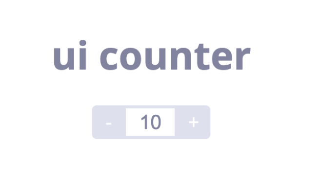

### cypress 첫걸음

우아한 테크코스에서 처음으로 진행하게 된 미션은 `cypress` 맛보기 마션이었습니다.

이번 미션을 진행하면서 처음으로 `cypress`를 사용하게 됐습니다. 위와 plus, minus를 할 수 있는 `<button>`태그와 그 값을 보여주는 `<input>` 태그로 구성된 간단한 UI 상에서 다음과 같은 간단한 요구사항들을 cypress를 사용해서 테스트까지 작성하는 미션이었습니다.

> - 생성시 버튼과 초기값(10)을 렌더링 한다.
> - '+' 버튼을 클릭 시 count가 증가한다.
> - '-' 버튼을 클릭 시 count가 감소한다.
> - '+' 버튼을 눌렀을 때 count가 12보다 커지는 경우 증가하지 못 한다.(Max 값이 12)
> - '-' 버튼을 눌렀을 때 count가 8보다 작아지는 경우 감소하지 못 한다.(Min 값이 8)

기능을 구현하기 전에 먼저 테스트코드를 작성 했습니다. 처음 작성하는 테스트 코드에 적응하기 쉽지 않았습니다. 다행히 페어 프로그래밍으로 pair인 [하루](https://github.com/365kim)와 함께 진행해서 헤매는 시간을 많이 줄일 수 있었습니다.

### 증감 테스트

```js
describe("ui-counter", () => {
  beforeEach(() => {
    cy.visit("http://localhost:5500/");
  });

  it("+ 버튼 클릭시 1 증가한다.", () => {
    cy.get(".count-display").then(($input) => {
      const prevInputValue = Number($input.val());

      cy.get(".plus-button").click();
      cy.get(".count-display").should("have.value", prevInputValue + 1);
    });
  });

  it("- 버튼 클릭시 1 감소한다.", () => {
    cy.get(".count-display").then(($input) => {
      const prevInputValue = Number($input.val());

      cy.get(".minus-button").click();
      cy.get(".count-display").should("have.value", prevInputValue - 1);
    });
  });
}
```

위에 첨부한 테스트 코드는 버튼 클릭시 증감 연산이 정상적으로 이뤄지는지 확인하는 테스트코드입니다. 이 부분을 작성하면서 고민을 많이 했습니다. 값의 증감을 확인하려면 이전에 해당 target이 가지고 있는 값을 알고있어야 하는데 target의 값을 저장하는 방법을 찾기 위해 많이 헤맸습니다.

처음 `cy.get(".count-display")`을 통해 타겟 노드를 불러오는데는 성공했지만 이후 해당 노드가 가지고 있는 `value`를 얻기는 쉽지 않았습니다. 이후 페어와 문서를 찾아보던 중 콜백으로 처리하는 예시 코드를 발견해 콜백 함수를 등록해서 처리했습니다.

### 테스트 코드를 위한 테스트

아직 `cypress`의 메서드들이 익숙하지 않아 간단한 코드를 작성하는데도 많은 시간이 걸렸습니다. 기능을 테스트 하기 위한 테스트 코드인데 해당 코드가 동작할지에 대한 확신이 없어 테스트 코드를 위한 테스트를 하는 웃지 못할 상황이 반복되고는 했습니다.

그래도 GUI로 테스트 환경이 제공되고 메서드들이 `get()`, `click()`등 직관적으로 표현된 부분이 많아서 걱정했던 것만큼 난이도가 높지는 않았습니다. 다음 미션인 계산기 미션, 그 다음 미션인 자동차 경주 미션을 마칠 때 쯤이면 다양한 메서드를 능숙하게 활용할 수 있도록 열심히 해야겠다는 생각을 했습니다.

### BDD와 TDD

페어 프로그래밍이 끝난 후 [하루](https://github.com/365kim)가 BDD에 대한 얘기를 해주면서 위에 사용한 `should()`메서드가 아닌 `assert.equal()` 메서드를 사용해 리팩토링 한 코드를 보내줬습니다다. `should()` 메서드를 사용한 것보다 코드의 가독성이 훨씬 높게 느껴졌습니다. BDD에 대한 얘기는 오늘 처음 들었는데 TDD와 BDD의 차이를 찾아보고 어떤 방식이 제가 하려는 테스트에 더 적합한지 고민을 해야겠습니다.

#### [TDD Assertions을 사용한 전체 코드](https://github.com/YUJO42/cypress-basic/)

#### [BDD Assertions을 사용한 전체 코드](https://github.com/YUJO42/cypress-basic/)
