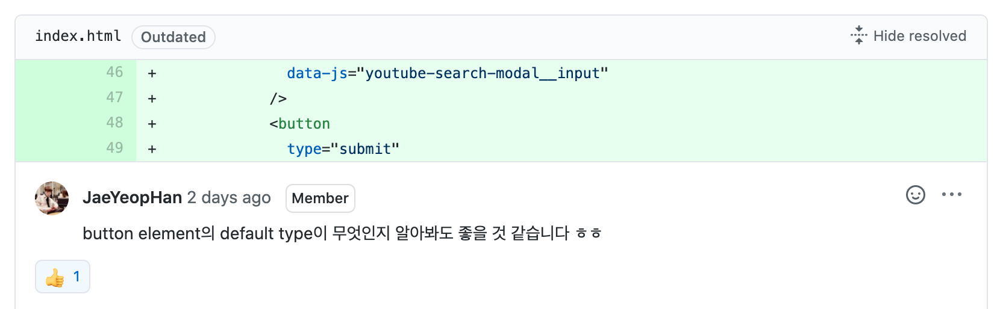
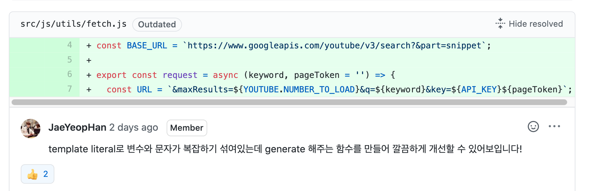
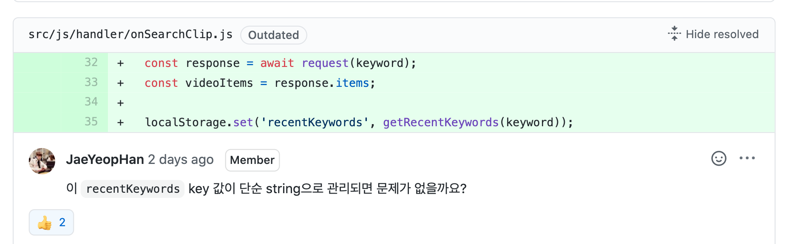
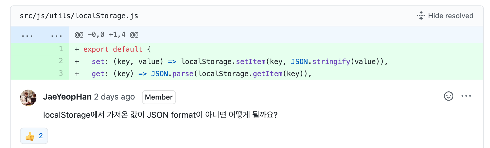
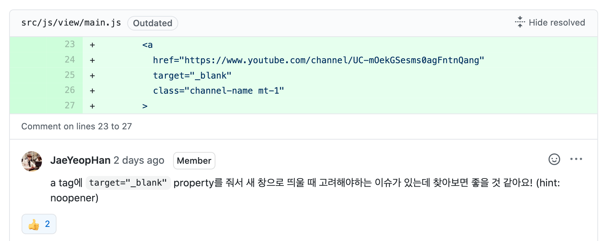
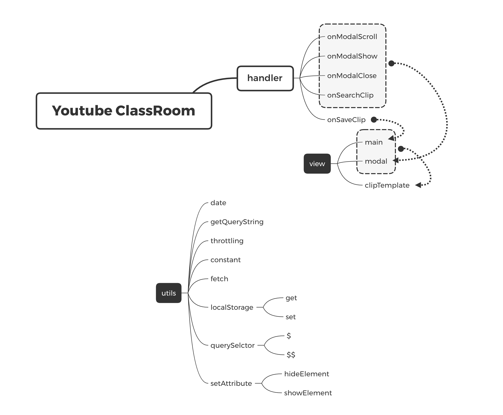

<p align="middle" >
  
</p>
<h2 align="middle">level1 - 나만의 유튜브 강의실</h2>
<p align="middle">자바스크립트와 외부 API를 이용해 구현 하는 나만의 유튜브 강의실</p>

## 0. 구현 요구사항

### 🎯 step1

- [x] [유튜브 검색 API](https://developers.google.com/youtube/v3/getting-started?hl=ko)를 통해서, 내가 추가로 보고 싶은 영상들을 검색할 수 있다.
  - [x] 검색 시 엔터키를 눌렀을 때와 마우스로 검색 버튼을 눌렀을 때 검색 동작이 이루어진다.
- [x] 로딩컴포넌트: 데이터를 불러오는 중일 때, 현재 데이터를 불러오는 중임을 skeleton UI로 보여준다.
- [x] 검색 결과가 없는 경우 결과 없음 이미지를 추가하여, 사용자에게 메시지를 보여준다.
  - [x] 검색 결과 없음 이미지는 `src/images/status/not_found.png` 경로에 있다.
- [x] 최초 검색결과는 10개까지만 보여준다. 더 많은 데이터는 스크롤을 내릴 때 추가로 불러온다.
  - 검색 결과 화면에서 유저가 브라우저 스크롤 바를 끝까지 이동시켰을 경우, 그다음 10개 아이템을 추가로 api요청하여 불러온다.
- [x] 내가 검색한 영상들의 json 데이터를 `저장`할 수 있다. (실제 저장이 아닌 영상 id를 Web Storage에 저장). 단 이미 저장된 경우는 저장 버튼이 보이지 않게 한다.
- [x] 저장 가능한 최대 동영상의 갯수는 100개이다.
- [x] 검색 모달에 다시 접근했을 때 가장 마지막에 검색한 키워드로 검색한 결과를 보여준다.
- [x] 최근 검색 키워드를 3개까지 화면상에 검색창 하단에 보여준다.

## 1. 진행하며 고민하고 배운 점 👨‍💻

### 1-1. Dead Line

데드라인 안에 요구사항 구현을 마쳤습니다. 그러나 리팩터링을 진행하기에는 시간이 부족했습니다. 따라서 다음 두가지 중 하나를 선택해야 했습니다.

- 구현을 빠르게 마치고 일단 데드라인 안에 제출한다.
- 데드라인을 넘더라도 리팩터링까지 마친 후 제출한다.

페어인 브랜과 많은 논의를 했습니다. 논의 끝에 step1에서 다소 만족스럽지 못한 코드를 제출하더라도 이후 step2, step3를 진행하면서 개선할 수 있다는 쪽으로 의견을 모았습니다. 결국 부랴부랴 기능 구현만 마친 채로 PR을 보냈는데 찝찝함이 많이 남았습니다.

초반에 조금 여유를 부리면서 구현을 진행했는데 해당 부분이 결국 독이 되어 돌아온거 같습니다. 다음부터는 전체 일정을 미리 계산해보고 이런 일이 반복되지 않도록 노력해야겠습니다.

### 1-2. Client의 Key 관리

미션을 진행하기 위해 `API_KEY`를 사용해야 하는 상황이었습니다. `API_KEY`를 숨길 수 있는 방법에 대해 많은 고민을 했습니다. `webpack`, `dotenv`, `dotenv-webpack` 등 다양한 방법을 시도해봤지만 결국 Client만 존재하는 경우 환경정보를 숨길 수 없다는 사실을 알게 됐습니다.

현재는 API에만 호출제한을 걸어서 데모페이지에서 보내는 요청만 받을 수 있도록 설정을 해뒀지만 이런 상황이 반복되지 않도록 Netlipy나 firebase를 통해 간단하게 서버를 같이 붙일 수 있도록 공부해야겠다는 생각을 했습니다.

### 1-3. API 명세와 요청횟수 제한

이번 미션을 진행하기 위해 Google의 [Youtube Data API](https://developers.google.com/youtube/v3/getting-started?hl=ko)를 사용했습니다. 처음에는 API명세를 살펴보며 request요청을 보내는데만 신경을 썼습니다.

기능을 구현하며 이런저런 테스트를 하던중 `403 error`를 만나게 됐습니다. 그제서야 부랴부랴 [API cost](https://developers.google.com/youtube/v3/determine_quota_cost)를 확인해봤습니다. Youtube Data API에서 무료로 사용가능한 cost가 10,000이었는데 100의 비용이 드는 `search` request를 보내 금방 cost를 소진해버린 것이었습니다.

다음부터는 API를 사용하기 전 요청에 드는 cost와 사용 가능한 cost를 꼭 확인해야겠다는 생각을 했습니다. 또한 API요청 횟수가 제한되어 있다면 mock data를 만들어서 진행하는 방법도 고려해봐야겠습니다.

### 1-4. scroll event와 throttling

> - [x] 최초 검색결과는 10개까지만 보여준다. 더 많은 데이터는 스크롤을 내릴 때 추가로 불러온다.
> - 검색 결과 화면에서 유저가 브라우저 스크롤 바를 끝까지 이동시켰을 경우, 그다음 10개 아이템을 추가로 api요청하여 불러온다.

위 요구사항을 구현하기 위해 `scroll`이벤트를 사용했습니다. 1-3에 적은 것처럼 API요청 횟수가 제한되어 있는 상황이었는데 `scroll` 이벤트가 과도하게 발생하게 되는 문제가 있었습니다. 이벤트를 제한하기 위해 `debounce`와 `throttling`를 찾아봤고 `scroll` 이벤트에는 `throttling`이 더 적합하다는 생각이 들었습니다. 아래와 같이 `throttling` 코드를 구현하고 이벤트에 등록해서 사용 했습니다.

- throttling

```js
let timer
export const throttling = (func, event) => {
  if (!timer) {
    timer = setTimeout(() => {
      timer = null
      func(event)
    }, 3000)
  }
}
```

- add event

```js
$('[data-js="youtube-search-modal__inner"]').addEventListener(
  'scroll',
  event => {
    throttling(onModalScroll, event)
  }
)
```

## 2. 코드 리뷰 및 피드백 📝

### 2-1. `<button>` tag의 default type



HTML을 작성하면서 상당히 많은 태그들을 작성할 때 default type을 활용하여 작성해왔습니다. 그러나 그 default tpye에 대한 관심을 별로 안 가졌던거 같습니다.

매번 `<button>`을 `<form>`과 함께 사용할 때 `tpye='submit'`을 명시해주고는 했는데 이번 피드백을 통해 처음으로 default type이 submit인걸 알게 됐습니다. 앞으로는 무작정 `type`을 부여하기 전 default로 가지고 있는 속성에 대해서도 알아봐야겠습니다.

### 2-2. template literal의 과도한 사용



template literal을 사용해 아래와 같은 코드를 만들었습니다.

`const URL = &maxResults=${YOUTUBE.NUMBER_TO_LOAD}&q=${keyword}&key=${API_KEY}${pageToken}`

늘 사용하던대로 template literal을 사용했는데 피드백을 받고 코드를 다시 보니 상당히 더럽다는 생각을 했습니다. 짧은 String이나 HTML 템플릿을 사용할 때는 가독성이 괜찮았는데 이런 경우에는 오히려 template literal을 사용함으로써 가독성을 해쳤다는 생각이 들었습니다.

피드백을 반영해 다음과 같이 queryString을 반환하는 함수를 만들어서 사용하도록 개선했습니다.

```js
export const getQueryString = params => {
  let queryString = '?'
  for (const [key, value] of Object.entries(params)) {
    queryString += `&${key}=${value}`
  }

  return queryString
}
```

### 2-3. localStorage의 key



key값을 모두 상수로 분리해 관리하도록 개선했습니다.

```js
export const LOCAL_STORAGE_KEY = {
  CURRENT_KEYWORD: 'currentKeyword',
  RECENT_KETWORDS: 'recentKeywords',
  NEXT_PAGE_TOKEN: 'nextPageToken',
  SAVED_CLIPS: 'savedClips',
  RECENT_SEARCH_RESULTS: 'recentSearchResults',
}
```

이 부분은 문제가 있다고 인지하고 있었는데 시간이 부족하여 코드에 적용하지 못 했습니다. 리뷰어 분의 시간에도 한계가 있을텐데 지적받지 않아도 될 부분을 지적받아 아쉬움이 남았습니다.

다음 step에서는 이런 아쉬움이 남지 않도록 시간을 잘 분배하고 꼼꼼히 리팩터링 후 제출해야겠다는 생각을 했습니다.

### 2-4. localStorage 사용의 안정성



이번 미션에서 Web Storage 중 localStorage를 활용하여 정보를 관리하는 부분이 많았습니다. localStorage의 `getItem`과 `setItem`을 다음과 같이 util로 분리해서 사용했습니다.

```js
export default {
  set: (key, value) => localStorage.setItem(key, JSON.stringify(value)),
  get: key => JSON.parse(localStorage.getItem(key)),
}
```

그러나 이 코드에는 JSON format이 아닌 값을 get할 경우 error가 생길 수 있다는 문제가 있었습니다.

이 문제를 해결하기 위해 localStorage에 저장할 때 type 검사를 하는 방어코드를 추가했습니다.

```js
import { ERROR_MESSAGE } from './constant.js'

export default {
  set: (key, value) => {
    if (typeof value !== 'string' && !Array.isArray(value)) {
      throw new Error(
        ERROR_MESSAGE.ONLY_STRING_OR_ARRAY_CAN_BE_STORED_IN_LOCAL_STORAGE
      )
    }

    localStorage.setItem(key, JSON.stringify(value))
  },
  get: key => JSON.parse(localStorage.getItem(key)),
}
```

다음 step을 진행할 때는 페어와 논의를 해서 `get`에도 방어코드를 추가해야겠습니다.

### 2-5. `<a>` tag의 `target=_blank` 옵션이 고려해야할 이슈



그동안 `<a>` tag를 사용하면서 `target=_blank` 옵션을 많이 사용해 왔습니다. 그러나 noopener, noreferer, nofollow 옵션에 대해서는 처음으로 알게 됐습니다.

아래 글들을 참고하면서 noopener, noreferer, nofollow 에 대해 공부했고 window.opner를 안전하게 보호하기 위해 noopener, noreferer 옵션을 추가 했습니다. 또한 Link Juice를 전달하지 않기 위해 nofollow 옵션 역시 추가했습니다.

```js
<a
  href="https://www.youtube.com/"
  target="_blank"
  rel="noopener noreferer nofollow"
  class="channel-name mt-1"
>
  ${video.snippet.channelTitle}
</a>
```

#### 참고 링크

- [target="\_blank" 좀 더 알고 사용하자](https://webruden.tistory.com/262)
- [rel 속성 - noreferrer, noopener, nofollow](https://3rabbitz.com/blog_ko/08d34c69855fbcad)
- [Nofollow, noreferrer and noopener / 영문](https://behind-the-scenes.net/using-nofollow-noreferrer-and-noopener-rel-attributes/)

### 2-6. submit event 객체에서 값 찾기


```js
export const onSearchClip = async (event) => {
  event.preventDefault();

  const $input = $('[data-js=youtube-search-modal__input]');

  ...
}
```

`submit`이벤트에 위와 같은 callback 함수를 등록하고 사용하고 있엇습니다. `submit`된 값을 찾기 위해 DOM에 접근해서 값을 가져왔습니다.

피드백을 받고 `submit` 이벤트가 넘겨준 `event`객체를 뜯어보니 `event.target.elements`이 제출한 element들을 가지고 있는걸 확인할 수 있었습니다. 코드는 아래와 같이 수정했습니다.

```js
export const onSearchClip = async (event) => {
  event.preventDefault();

  const $input = event.target.elements['youtube-search-modal__input'];

  ...
}
```

그동안 `submit`을 사용할 때 불필요하게 DOM에 접근하고는 했었습니다. 다음부터는 무작정 DOM을 파싱하는걸 지양하고 먼저 `event`객체를 확인해보는 습관을 들여야겠습니다.

## 3. 코드 구조 시각화 🔎



## 4. 링크 🔗

- [전체 코드 링크](https://github.com/yujo11/javascript-youtube-classroom/tree/step1)
- [PR 링크](https://github.com/woowacourse/javascript-youtube-classroom/pull/1)
