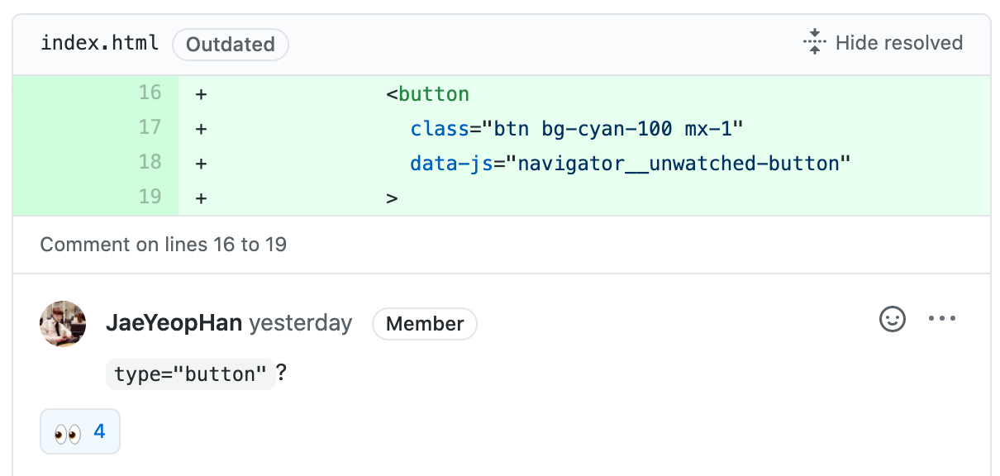
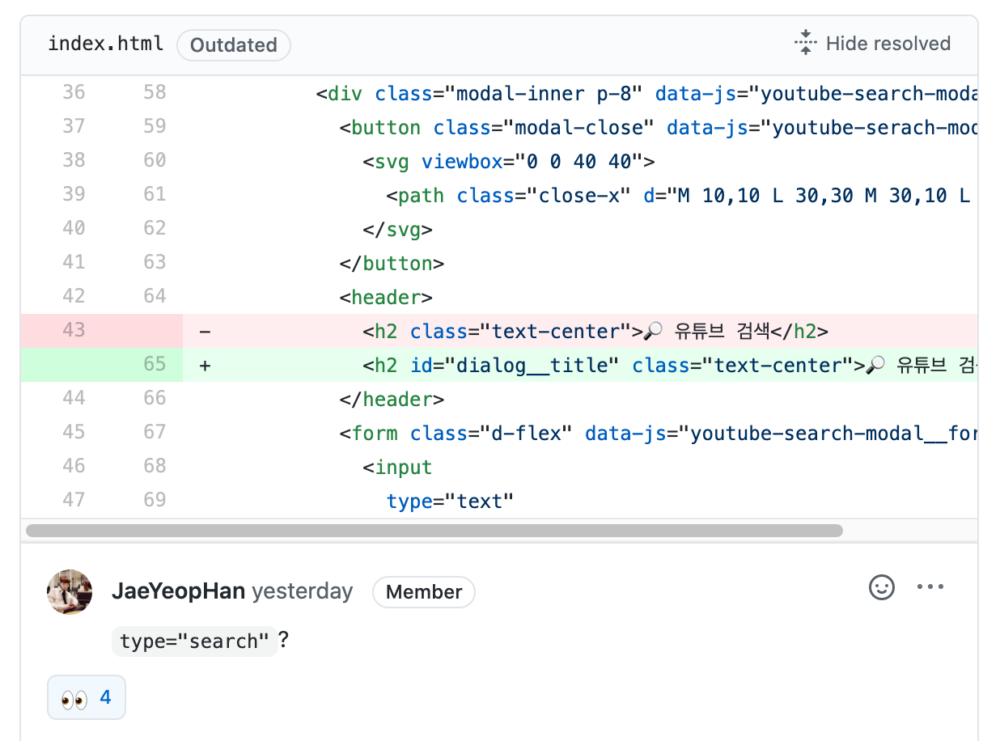
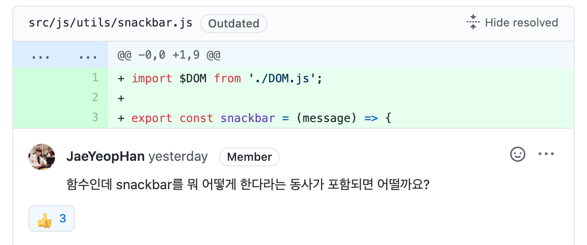
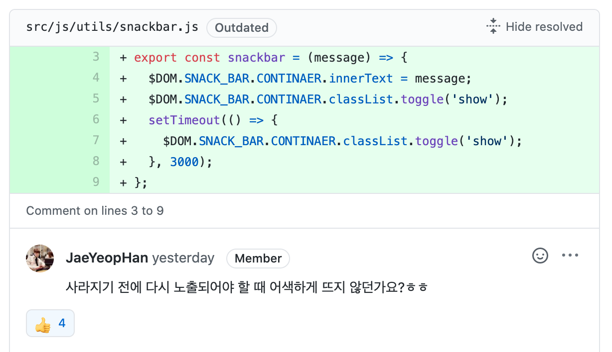
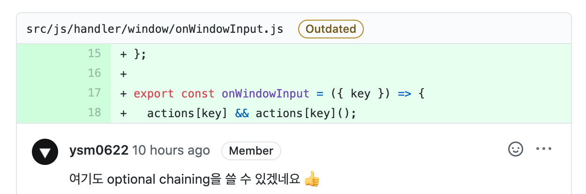
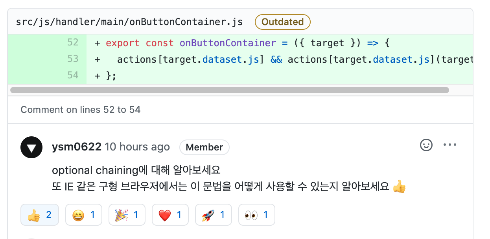
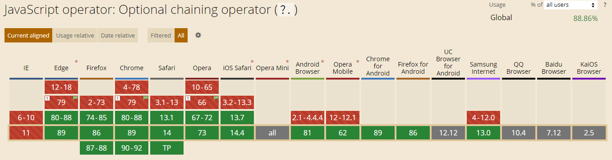

<p align="middle" >
  
</p>
<h2 align="middle">level1 - 나만의 유튜브 강의실</h2>
<p align="middle">자바스크립트와 외부 API를 이용해 구현 하는 나만의 유튜브 강의실</p>

## 0. 구현 요구사항

### 🎯🎯 step2 강의실 관리, 구현 요구사항

- [x] 가장 처음에는 저장된 영상이 없음으로, 비어있다는 것을 사용자에게 알려주는 상태를 보여준다.
- [x] 이후 페이지를 방문했을 때 기본 메인 화면은 내가 **볼 영상**들의 리스트를 보여준다.
- [x] 영상 카드의 이모지 버튼을 클릭하여 아래와 같은 상태 변경이 가능해야 한다.
  - [x] ✅ 본 영상으로 체크
  - [x] 🗑️ 버튼으로 저장된 리스트에서 삭제할 수 있습니다. (삭제 시 사용자에게 정말 삭제할 것인지 물어봅니다.)
- [x] 사용자가 버튼을 클릭했을 때 해당 행위가 정상적으로 동작하거나, 실패하였음을 `snackbar`를 통해 보여준다.
- [x] 본 영상, 볼 영상 버튼을 눌러 필터링 할 수 있다.

### 🚀🚀 구현 요구사항 외 구현 기능들

- [x] 키보드를 활용해 다양한 조작이 가능하도록 해야한다.
  - [x] F1, F2, F3 키를 통해 볼 영상, 본 영상, 동영상 검색을 선택 가능해야 한다.
  - [x] 동영상 검색 모달 open시 input창에 focus가 되야 한다.
  - [x] 'Escape' 키를 통해 동영삼 검색 모달 창을 닫을 수 있도록 해야한다.
- [x] API key가 외부에 노출되지 않아야 한다.
  - [x] Netlify serverless 함수를 통해 API요청을 리다이렉션 한다.
- [x] 영상을 저장했을 때 사용자에게 영상이 저장되었다는 피드백을 제공해야 한다.

## 1. 진행하며 고민하고 배운 점 👨‍💻

### 1-1. API Key 숨기기

지난 1단계 미션을 진행하면서 클라이언트에서 코드를 완전히 숨기는게 불가능 하다는 것을 꺠달았습니다.

같은 미션을 진행하며 비슷한 고민을 한 크루들이 많이 있었습니다. 크루들이 진행한 내용을 글로 정리해서 올려준 덕분에 간단하게 Netlify를 통한 API Request 우회 서버를 구성할 수 있었습니다.

- [동동 : Client-Side에서 Youtube API Key 숨기기](https://velog.io/@bigsaigon333/Client-Side%EC%97%90%EC%84%9C-Youtube-API-Key-%EC%88%A8%EA%B8%B0%EA%B8%B0)
- [하루 : 쉽게 쓰인 유튜브 API 튜토리얼](https://365kim.tistory.com/93)

Netlify를 통해 사용한 코드는 다음 레포지토리에서 보실 수 있습니다!

- [netlify-lambda](https://github.com/yujo11/netlify-lambda)

### 1-2. 키보드를 통한 입력을 어떻게 처리할 것인가

이전 미션인 행운의 로또 미션에서는 `handleAccessibility` 라는 함수를 만들어서 키보드를 통한 입력을 관리했습니다. 그런데 위 방법에는 두가지 문제가 있다고 생각했습니다.

1. 모든 이벤트를 `window`에 등록하고 위임한다.
1. `handleAccessibility`라는 이름이 가르키는 범위가 너무 광범위하다.

그래서 이번에는 이름을 조금 바꾸고 Object Literal을 통한 분기를 주는 방식을 적용했습니다.

```js
import $DOM from '../../utils/DOM.js'
import { closeModal } from '../../view/modal.js'
import { onModalShow } from '../modal/visibility/onModalShow.js'
import { onToggleRenderedClips } from '../main/onToggleRenderedClips.js'

const actions = {
  F1: () => onToggleRenderedClips({ target: $DOM.NAVIGATOR.UNWATCHED_BUTTON }),
  F2: () => onToggleRenderedClips({ target: $DOM.NAVIGATOR.WATCHED_BUTTON }),
  F3: () =>
    $DOM.SEARCH_MODAL.CONTAINER.classList.contains('open')
      ? closeModal()
      : onModalShow(),
  Escape: () =>
    $DOM.SEARCH_MODAL.CONTAINER.classList.contains('open') && closeModal(),
}

export const onWindowInput = ({ key }) => {
  actions[key]?.()
}
```

### 1-3. export 되는 함수의 관리

`1-2`에서 첨부한 함수를 보면 다음과 같은 구조로 되어있는걸 확인할 수 있습니다.

```js
const actions = () => {
  ...
}

export const onWindowInput = ({ key }) => {
  actions[key]?.()
}
```

위 코드를 작성하기 전 다른 크루의 미션 리뷰에 달린 다음 피드백을 발견할 수 있었습니다.

> 상수가 함수 안에 있을 필요가 있을까요? 함수가 호출될 때마다 메모리에 할당되는게 비효율적인거 같아서요!

이 피드백을 보고 최대한 export 하는 모듈들을 가볍게 만들면 어떨까라는 고민을 하면서 코드를 작성해봤습니다. 그러나 한편으로는 굳이 재사용되지 않는 `actions`를 밖에 둬야할까? 라는 생각도 하고 있습니다. 아직 import, export되는 모듈들에 포함된 변수들이 어떻게 할당, 재할당 되는지에 대한 레퍼런스를 찾지는 못 했기 때문에 머리가 조금 더 복잡해지는거 같습니다.

혹시 이 글을 보시는 분들 중 이와 관련된 레퍼런스나 아티클을 알고 계시다면 알려주시면 감사하겠습니다..😢

## 2. 코드 리뷰 및 피드백 📝

### 2-1. HTML tag들의 default type




step1을 진행할 때도 피드백 받았던 부분입니다.

매번 HTML tag들의 default type을 간과하고 코드를 작성하고 있는데 다시 한번 꼼꼼하게 확인해보는 습관을 들여야겠습니다.

### 2-2. 네이밍



snackbar를 보여주는 동작을 하는 util함수인데 '동작'이 빠져 어색함이 있었습니다.

함수의 네이밍에 좀 더 신경써야겠다는 생각을 했습니다.

### 2-3. 중첩되는 setTimeout의 어색함



`setTimeout`을 통해 snackbar를 보여주고 있는데 기존 실행되고 있는 timer때문에 연속으로 snackbar를 보여줘야 되는 상황에서는 어색한 지연이 생기는 문제가 있었습니다.

기존 함수는 다음과 같이 작성되어 있었습니다.

```js
import $DOM from './DOM.js'

export const snackbar = message => {
  $DOM.SNACK_BAR.CONTINAER.innerText = message
  $DOM.SNACK_BAR.CONTINAER.classList.toggle('show')
  setTimeout(() => {
    $DOM.SNACK_BAR.CONTINAER.classList.toggle('show')
  }, 3000)
}
```

위 함수에 연속으로 snackbar가 호출될 경우 기존의 timer를 초기화 해주는 부분을 추가했습니다. 또한 기존처럼 innerText를 통해 변경했을 메세지가 바뀌고 빠르게 사라지는 오류를 발견하여 해당 부분도 수정하여 문제를 해결했습니다.

```js
import $DOM from './DOM.js'
import { $ } from './querySelector.js'

let id
export const showSnackbar = message => {
  $DOM.SNACK_BAR.CONTAINER.innerHTML = snackbar(message)

  const $snackbarContainerMessage = $('[data-js="snackbar-container__message"]')

  $snackbarContainerMessage.classList.toggle('show')

  if (id) {
    clearTimeout(id)
  }

  id = setTimeout(() => {
    $snackbarContainerMessage.classList.toggle('show')
  }, 3000)
}
```

### 2-4. optional chaning의 활용



그동안 Object Literal을 활용하여 코드를 작성할 때 다음과 key 값아 존재했을 때만 함수를 실행가능하도록 `&&` 논리 연산자를 통한 방어코드를 작성했습니다.

```js
const actions = {
  ...
}

export const onButtonContainer = ({ target }) => {
  actions[target.dataset.js] && actions[target.dataset.js](target);
};
```

이번 피드백을 통해 Optional Chaining으로도 위와 같은 방어코드를 작성 가능하다는걸 알게 됐습니다.

```js
const actions = {
  ...
}

export const onButtonContainer = ({ target }) => {
  actions[target.dataset.js]?.(target);
};
```

사실 피드백을 받기 전 이전의 코드를 개선할 생각조차 못 해 조금 부끄럽기도 합니다. 관습적으로 사용하던 코드들을 살펴보고 개선할 방법이 있는지 찾아봐야겠습니다.

### 2-4. 구형 브라우저에서의 optional chaning



위와 같은 피드백을 받고 찾아보니 다음과 같은 지원율을 보이고 있었습니다.



88%가 높은 지원율이 아닌만큼 크로스 브라우징을 고려할 경우 babel같은 트랜스파일러, 혹은 polyfil과 함께 사용해야 한다는 점을 알게 됐습니다.

### 3. 코드 구조 시각화 🔎


## 4. 동작 화면(GIF) 🎥


## 5. 링크 🔗

- [전체 코드 링크](https://github.com/yujo11/javascript-youtube-classroom/tree/step1)
- [PR 링크](https://github.com/woowacourse/javascript-youtube-classroom/pull/1)
