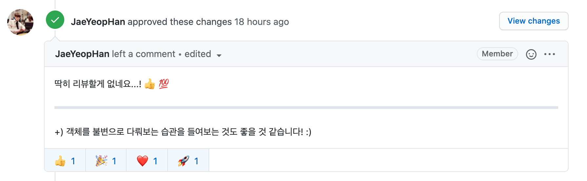

  

<h2 align="middle">level1 - 나만의 유튜브 강의실</h2>

자바스크립트와 외부 API를 이용해 구현 하는 나만의 유튜브 강의실

## 0. 구현 요구사항

### 🎯🎯🎯 step3 유저 경험 증가 기능

- [x] 👍 좋아요 버튼을 누른 데이터만 필터링해서 보여줄 수 있는 메뉴를 만든다.
  - [x] 👍 좋아요 버튼을 누른 경우, 로컬에서 데이터를 변경한다.
  - [x] 👍 좋아요 버튼을 다시 클릭해서 해지할 수 있어야 한다.
- [x] 스크롤 페이징 방식을 이용해서 Lazy loading을 개선한다.
- [x] 반응형 웹: 유저가 사용하는 디바이스의 가로 길이에 따라 검색결과의 row 당 column 갯수를 변경한다.
  - youtubeCard.css 파일에 있는 .video-wrapper의 css 속성 중 grid-template-columns의 속성을 auto-fill에서 아래의 요구사항에 맞게 변경한다.
  - 1280px 이하: 4개
  - 960px 이하: 3개
  - 600px 이하: 2개
  - 400px 이하: 1개

## 1. 진행하며 고민하고 배운 점 👨‍💻

### 1-1. lazy loading

> 스크롤 페이징 방식을 이용해서 lazy loading을 개선한다.

위 요구사항을 통해 처음으로 lazy loading을 접하게 됐다. 여러 자료들을 보면서 lazy loading을 어떻게 구현할지에 대해 고민하게 됐다.

#### lazy loading이란?

- 일반적으로 HTML에서 이미지 태그를 삽입할 때 `src`속성을 사용한다. HTML에서는 페이지가 열렸을 때 `src`속성을 가진 태그를 무조건 로드한다.
- `src`속성을 가진 태그가 몇 개 없을 때는 상관없지만 몇백, 몇천개가 있는 경우 심각한 성능상의 이슈를 초래할 수 있다.
- 이 때 로딩을 사전에 막는 것을 lazy loading이라고 한다.

#### lazy loading을 사용하려면?

1. Javascript Event를 활용한 방법
   - scroll, resize 등 이벤트 리스너를 등록하한다.
   - 이벤트 리스너를 이용하여 viewport안에 특정 이미지가 들어왔는지 확인 후 미리 지정된 dataset을 이용하여 이미지를 로드한다.
   - 모든 이미지가 로드되면 이벤트 리스너를 제거한다.
2. Intersection Observer API를 활용한 방법
   - Intersection Observer API는 엘리먼트 요소가 뷰포트에 들어가는 것을 감지하고 액션을 취하는 것을 간단하게 할 수 있도록 도와준다.
   - 이미지 로드를 지연시키기 위해 모든 이미지에 Obeserver를 부착시키고 뷰포트에 들어간 것을 감지하게 되면 dataset으로 지정한 속성을 src속성으로 옮겨 이미지를 로드한다.
3. Native Lazy loadng을 사용하는 방법
   - 최신 브라우저에서 지원되는 Native lazy loading을 사용한다면 정말 쉽고 간단하게 구현이 가능하다.
   - ``, `<iframe>`에 사용할 수 있는 해당 속성은 `` 이런식으로 사용할 수 있다.
   - 그러나 Javascript event나 Intersection Observer API(지원율 93%) 에 비해 지원율이 낮다는 단점이 있다.
     - [lazy 지원율 검색결과(73%) / Can I use?](https://caniuse.com/?search=lazy)

#### 참고 자료

- [Lazy loading / MDN](https://developer.mozilla.org/en-US/docs/Web/Performance/Lazy_loading)
- [Intersection Observer API / MDN](https://developer.mozilla.org/ko/docs/Web/API/Intersection_Observer_API)
- [크롬 네이티브 레이지 로딩 / TOAST](https://meetup.toast.com/posts/183)
- [Browser-level image lazy-loading for the web](https://web.dev/browser-level-image-lazy-loading/)

이번에는 크로스 브라우징 이슈를 고려하지 않아도 돼서 `<iframe>`에 `lazy`속성을 주는 것으로 구현을 마쳤다. 미션을 진행하면서 점점 크로스 브라우징을 신경써야 할텐데 `webpack`, `babel`을 공부하자.

### 1-2. 반응형 웹과 Media Query

> 반응형 웹: 유저가 사용하는 디바이스의 가로 길이에 따라 검색결과의 row 당 column 갯수를 변경한다.

위 요구사항을 구현하기 위해 midea query를 사용하게 됐다. 이번에는 간단하게 너비만을 조건으로 걸어서 간단하게 구현할 수 있었지만 복잡한 경우에는 꽤나 까다로울거 같다.

- [미디어 쿼리 초보자 안내서 / MDN](https://developer.mozilla.org/ko/docs/Learn/CSS/CSS_layout/Media_queries)

## 2. 코드 리뷰 및 피드백 📝

### 2-1. 불변 객체를 통한 상태관리

3단계는 1, 2 단계와 비교하여 요구사항이 별로 없었다. 그러다보니 작성한 코드의 양도 많지 않았다.

리뷰어인 Jbee님에게 마지막으로 받은 피드백은 '객체를 불변으로 다뤄보는 습관'이다. 이번 미션을 진행하면서 대부분의 정보를 localStorage에서 관리하다보니 객체의 불변성에 대해 의식하지 못한 부분이 많았던거 같다.

다음 미션에서는 객체의 불변성을 유지하면서 상태를 관리할 수 있도록 노력해야겠다.

### 3. 코드 구조 시각화 🔎

## 4. 동작 화면(GIF) 🎥

## 5. 링크 🔗

- [전체 코드 링크](https://github.com/yujo11/javascript-youtube-classroom/tree/step3)
- [PR 링크](https://github.com/woowacourse/javascript-youtube-classroom/pull/47)
