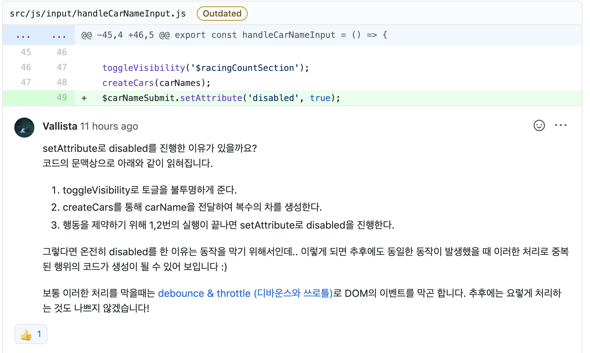
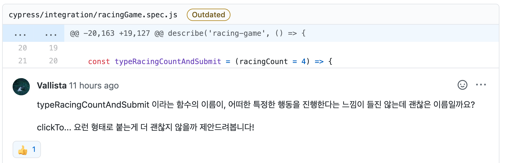
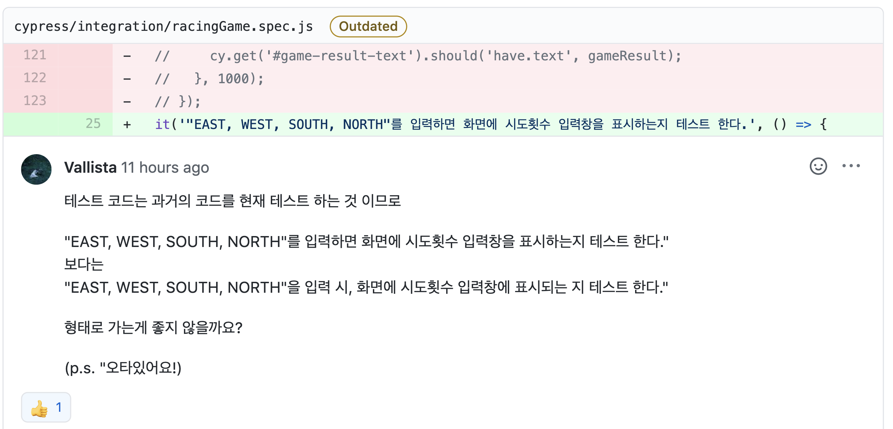
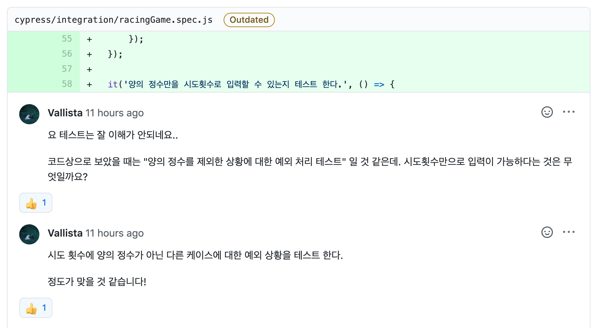
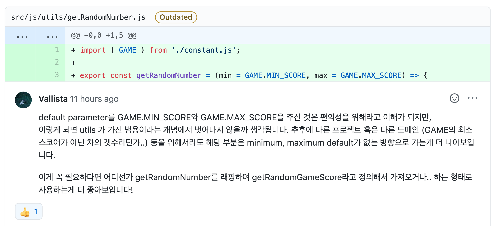

<p align="middle" >
  
</p>

# 자동차 경주 게임 step1

## 0. 구현 요구사항

### 🎯 step1

- [x] 주어진 횟수 동안 n대의 자동차는 전진 또는 멈출 수 있다.
- [x] 자동차에 이름을 부여할 수 있다. 전진하는 자동차를 출력할 때 자동차 이름을 같이 출력한다.
- [x] 자동차 이름은 쉼표(,)를 기준으로 구분하며 이름은 5자 이하만 가능하다.
- [x] 사용자는 몇 번의 이동을 할 것인지를 입력할 수 있어야 한다.
- [x] 전진하는 조건은 0에서 9 사이에서 random 값을 구한 후 random 값이 4 이상일 경우 전진하고, 3 이하의 값이면 멈춘다.
- [x] 자동차 경주 게임을 완료한 후 누가 우승했는지를 알려준다. 우승자는 한 명 이상일 수 있다.
- [x] 우승자가 여러명일 경우 ,를 이용하여 구분한다.

## 1. 진행하며 고민한 점들

### 1-1 구현 방식에 대한 고민

미션을 처음 시작하면서 페어인 [하루](https://github.com/365kim)와 함께 새로운 방식에 대한 얘기를 나눴습니다. 지난 초간단 미션, 계산기 미션을 진행할 때는 모든 테스트를 작성하고 기능을 구현하는 방식으로 진행했습니다. 지난 강의에서 준이 테스트와 기능을 번갈아 작성하는 것을 보고 그 방식을 따라해보기로 했습니다.

그러나 위와 같은 방식으로 진행하던 중 예상하지 못 했던 문제에 봉착했습니다. 하나의 테스트코드를 작성하고 해당 테스트에 대한 기능을 구현하던 중 하나의 기능 범위를 초과하는 기능들을 만들게 되는 문제였습니다. 먼저 기능을 구현하고 해당 기능에 대한 테스트를 작성하게 되면 기능에 끼워맞추듯 테스트를 작성하게 되고 이렇게 되면 TDD를 하는 의미가 없다는 생각이 들었습니다. 그래서 다시 이전처럼 모든 테스트 코드를 작성하고 기능 구현을 하는 방식으로 이번 미션을 진행했습니다.

### 1-2 BDD 안의 TDD

[하루](https://github.com/365kim)와 페어 프로그래밍을 진행하며 테스트 코드를 작성하던 중 가장 많은 얘기를 나눈 부분은 자동차 경주를 진행했을 때 랜덤한 값을 부여하고 그 결과를 테스트 하는 부분이었습니다.

저는 이 부분을 통합테스트로 진행하고 싶었고 하루는 이 부분을 하나씩 분리해서 테스트 하기를 원했습니다. 이 부분에 대해 많은 얘기를 나눴지만 결론적으로는 아래와 같은 이유들로 페어의 의견을 따르기로 결정했습니다.

1. 통합테스트 구현에 드는 비용이 단위테스트를 여러개 작성하는 비용보다 크다.
   - 해당 기능을 통합 테스트를 통해 검증하기 위해선 단위테스트보다 복잡한 코드를 작성해야 했습니다. 테스트를 작성하는데 드는 시간 역시 비용이라는 측면에서 접근하면 두가지를 비교했을 때 적은 비용이 드는 방법을 선택하는 것이 더 합리적이라고 생각했습니다.
2. 통합테스트와 여러 개의 단위 테스트를 비교했을 때 테스트의 신뢰성에 큰 차이가 없다.
   - 위의 이유와 비슷한 이유입니다. 두 테스트의 신뢰성 차이가 크지 않다면 비교했을 때 비용이 적게 드는 여러 개의 단위테스트를 작성하는게 좋다고 생각했습니다. 또한 두 방법의 신뢰성에 큰 차이가 없다면 여러 개위 단위테스트를 작성하며 조금 더 readable하게 작성할 수 있다고 생각했습니다.

위와 같은 이유들로 랜덤한 값을 부여하고 그 결과를 테스트하는 기능은 통합 테스트가 아닌 여러 개의 단위 테스트로 쪼개서 구현하며 빠르게 작성을 마칠 수 있었습니다. BDD, TDD 하나에 너무 매몰되지 않고 상황에 따라 적절하게 선택할 수 있도록
생각의 폭을 넓히고 역량을 길러야겠다는 생각을 했습니다.

### 1-3 cypress 실패 사례(\*의존성 있는 함수)

기능 구현을 하면서 테스트를 통해 기능을 검증하던 중 문제를 발견했습니다.

```js
it('자동차 경주를 마쳤을 때 우승자를 정상적으로 출력하는지 테스트 한다.', () => {
  let winner
  typeCarNameAndSubmit()
  typeRacingCountAndSubmit()

  winner = getWinner()
  cy.get('#game-result-text').should(`🏆 최종 우승자: ${winner} 🏆`)
})
```

기능 구현에 사용한 `getWinner()`함수를 테스트 코드에서도 사용해 간단하게 테스트를 할 계획으로 위와 같은 테스트 코드를 작성했습니다. 그러나 위 코드에서는 `typeCarNameAndSubmit()`, `typeRacingCountAndSubmit()` 함수가 실행되기 전 `getWinner()`가 실행되는 시점에서 자동차 목록과 게임 진행 상황을 불러오지 못 했습니다.

```js
it('랜덤 함수가 정상적으로 동작하는지 테스트 한다.', () => {
  const possibleScores = Array.from({
    length: GAME.MAX_SCORE - GAME.MIN_SCORE + 1,
  }).map((v, i) => i)

  for (let i = 0; i < 100; i++) {
    expect(possibleScores).to.include(getRandomNumber())
  }
})
```

비슷하게 `getRandomNumber()` 함수를 호출해서 테스트하는 위 코드의 `getRandomNumber()` 같은 경우는 의존성 없이 독립적으로 실행되는 모듈이지만 `getWinner()`의 경우 실행되기 위해서는 DOM에 있는 요소들이 필요하기 때문에 생기는 문제였습니다. async/await 를 추가해보기도 하는 등 여러 방법을 시도했지만 테스트는 계속 실패했습니다. 결국 `setTimeOut()` 을 통해 임시방편으로 아래와 같이 테스트를 고쳤습니다.

```js
it('자동차 경주를 마쳤을 때 우승자를 정상적으로 출력하는지 테스트 한다.', () => {
  let winner

  typeCarNameAndSubmit()

  typeRacingCountAndSubmit()

  setTimeout(() => {
    winner = getWinner()

    cy.get('#game-result-text').should(`🏆 최종 우승자: ${winner} 🏆`)
  }, 1000)
})
```

위와 같이 테스트를 고친 후 ✅를 보며 일단은 실행되는 상태까지는 만들었다고 생각했지만 큰 착각이었습니다. 테스트가 정상적으로 실행되며 ✅가 생긴게 아니고 `setTimeOut()` 가 동작하지 않고 넘어가면서 ✅가 생성되고 있었습니다. 결국 모듈을 불러와서 사용하는 걸 포기하고 테스트 코드에서 직접 DOM을 파싱해서 실행되도록 아래와 같이 코드를 수정했습니다.

```js
it('자동차 경주를 마쳤을 때 우승자를 정상적으로 출력하는지 테스트 한다.', () => {
  typeCarNameAndSubmit()
  typeRacingCountAndSubmit()

  cy.get('.car').then($cars => {
    const counts = [...$cars].map($car => {
      return $car.querySelectorAll('.forward-icon').length
    })
    const maxScore = Math.max(...counts)
    const winners = []
    counts.forEach((carCount, index) => {
      if (carCount === maxScore) {
        winners.push(carNames[index])
      }
    })

    cy.get('#game-result-text').should(
      'have.text',
      `🏆 최종 우승자: ${winners.join(', ')} 🏆`
    )
  })
})
```

위와 같이 코드를 수정하고 다시 테스트를 통해 확인해보니 이제서야 의도대로 테스트가 동작하는걸 확인할 수 있었습니다.

### 1-4 테스트코드의 비용

아직 cypress에 익숙하지 않아 그런것도 있겠지만 테스트 코드 구현과 기능 구현을 놓고 봤을 때 테스트 코드를 구현하는데 더 오랜 시간이 걸리는거 같습니다. 물론 테스트 코드를 미리 구현함으로써 기능을 구현할 때 빠르게 작성 가능한 부분도 있다. 하지만 결국 테스트 코드가 모든 예외사항을 100% 커버할 수는 없기 때문에 어느 정도 수준까지 커버할 수 있게 테스트 코드를 작성해야 할지에 대한 고민을 하고 있습니다.

이제 막 cypress를 처음 사용해보면서 테스트 코드를 처음 작성했기 때문에 생기는 고민인거 같기도 합니다. 지속적으로 테스트를 작성하면서 숙련도가 오른다면 이런 고민을 하지 않아도 될거 같다는 생각을 했습니다.

## 2. 코드 리뷰 및 피드백

### 2-1 debouncing, throttling



`debouncing`, `throttling` 을 통해 이벤트를 제어할 수 있다는걸 리뷰어 분이 남겨주신 리뷰를 통해 처음으로 알게 됐습니다. 지금은 단순히 `<button>`에 클릭이 한번 발생하면 해당 노드에 `disabled` 속성을 부여해 이벤트가 다시 호출되는걸 막고 있는데 해당 코드를 보고 이런 기법들에 대해 소개해주셨습니다.

- `debouncing` : 마지막 함수가 호출된 후 일정 시간 동안 함수의 호출을 막는 것.
  - 주로 ajax 검색에 쓰인다.
- `throttling` :

  - 주로 스크롤을 올리거나 내릴 때 사용한다.

이 키워드를 잘 기억해뒀다가 이벤트가 단 시간에 여러번 호출 되는 것을 방지해야할 상황에서 사용해봐야겠다고 생각 했습니다.

### 2-2 함수의 네이밍



cypress에서 생성한 함수의 네이밍에 대한 피드백을 받았습니다. cypress의 `type`과 `click` 메서드를 실행해주는 함수인 만큼 피드백대로 단순히 `type...AndSubmit`보다는 `click`이라는 이름이 들어가는게 직관적일거라는 생각을 했습니다.

피드백을 통해 함수를 아래와 같이 변경했습니다.

```js
// 변경 전
const typeCarNameAndSubmit = (){...}
const typeRacingCountAndSubmit = () => {...};

// 변경 후
const typeCarNameAndClickToSubmitButton = (){...}
const typeRacingCountAndClickToSubmitButton = () => {...};
```

앞으로 함수나 변수의 네이밍에 더욱 신경을 써야겠다고 느꼈습니다.

### 2-3 테스트 네이밍



테스트 코드를 명명할 때는 알아채지 못 했는데 피드백을 받으니 바로 문제점을 찾을 수 있었습니다. 리뷰어 분의 피드백대로 과거의 코드를 현재 테스트 하는 것이기 때문에 제안해주신 명명법이 가독성과 명확성 둘 다 뛰어나다는 생각을 했습니다.



이 부분은 실제 코드가 아래와 같이 구성되어 있었습니다.

```js
it('음수와 공백을 시도 횟수로 입력 시, 경고메세지가 출력되는지 테스트 한다.', () => {
  const negativeRacingCount = -7
  const alertStub = cy.stub()

  cy.on('window:alert', alertStub)
  typeCarNameAndClickToSubmitButton()
  typeRacingCountAndClickToSubmitButton(negativeRacingCount).then(() => {
    expect(alertStub.getCall(0)).to.be.calledWith(
      '1 이상의 숫자를 입력해주세요.'
    )
    cy.get('#racing-count-input').should('have.text', '')
  })

  cy.get('#racing-count-submit')
    .click()
    .then(() => {
      expect(alertStub.getCall(1)).to.be.calledWith(
        '1 이상의 숫자를 입력해주세요.'
      )
      cy.get('#racing-count-input').should('have.text', '')
    })
})
```

실제로는 nagative 케이스들을 테스트 하는 코드였는데 `'양의 정수만을 시도횟수로 입력할 수 있는지 테스트 한다.'`라는 기존의 이름은 실제 작동하는 테스트와는 거리가 있다고 느꼈습니다.

피드백을 토대로 테스트들의 이름을 수정했는데 훨씬 역할이 명확하게 보이는게 느껴졌습니다.

### 2-4 default parameter



리뷰어 분의 말대로 범용성을 생각하면 `default parameter`를 사용하지 않고 인자를 전달 받는게 훨씬 나을거라는 생각을 했습니다. `utils` 폴더에 생성한 것도 범용적으로 사용하기 위함이었는데 `default parameter`를 사용함으로써 제한적으로 사용된다는 점을 생각하지 못 했습니다. 피드백을 반영해 `default parameter`를 제거했습니다.

## 3. 링크

- [전체 코드 링크](https://github.com/yujo11/javascript-racingcar/tree/yujo42)
- [PR 링크](https://github.com/woowacourse/javascript-racingcar/pull/5)
