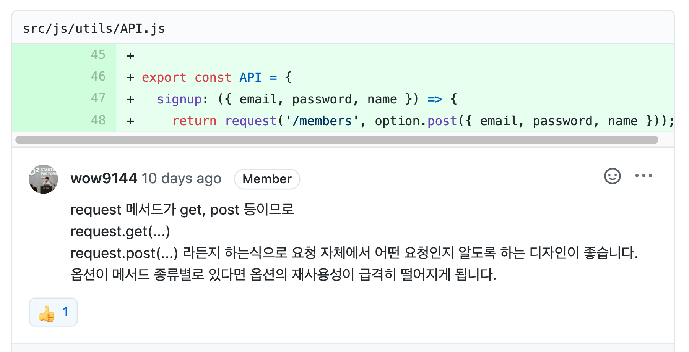
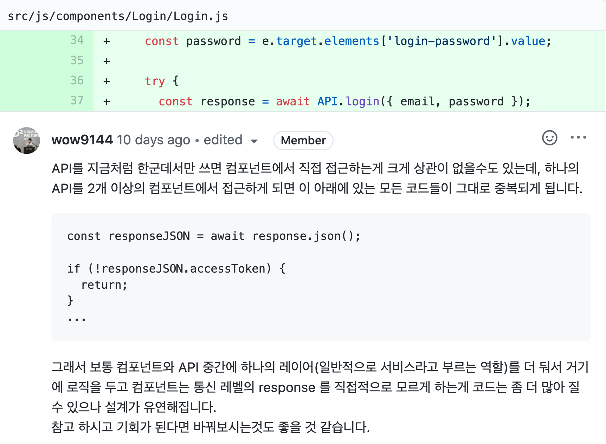
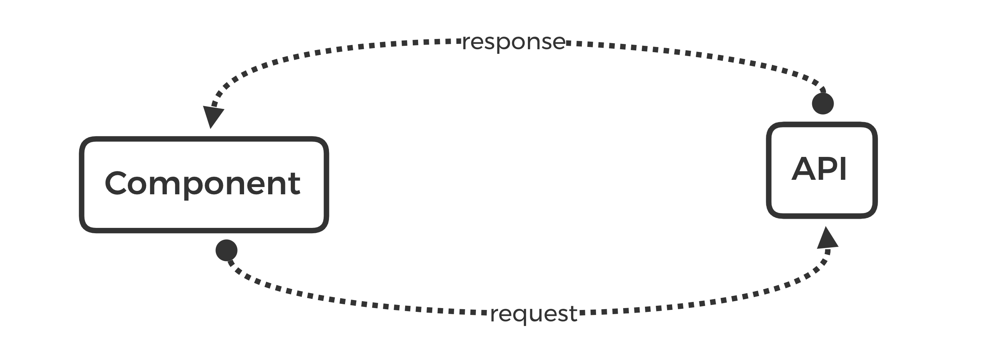
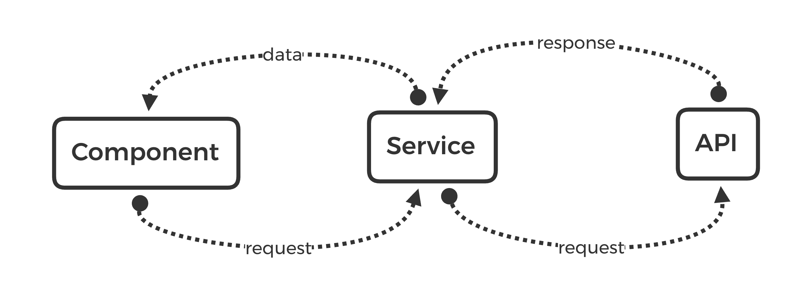
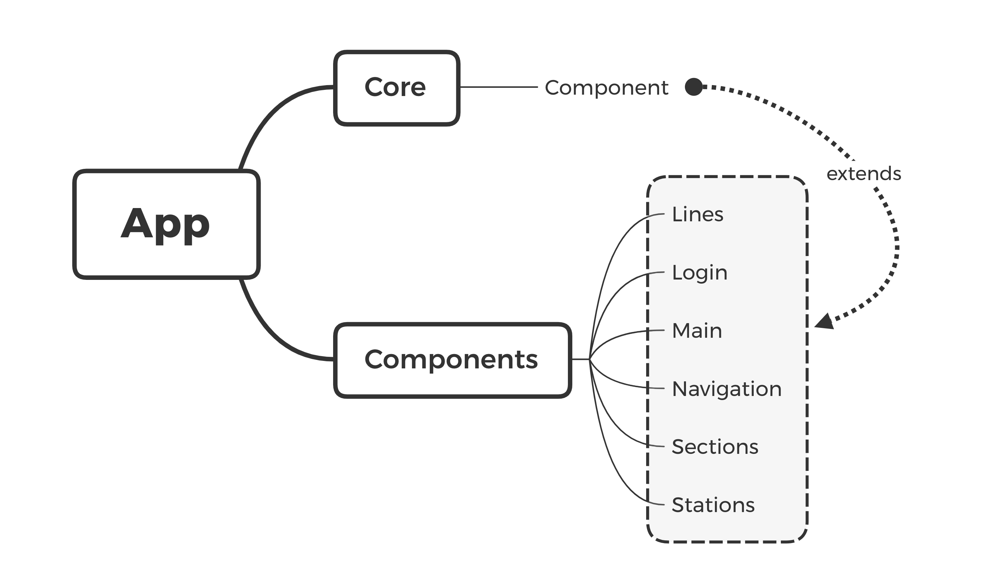
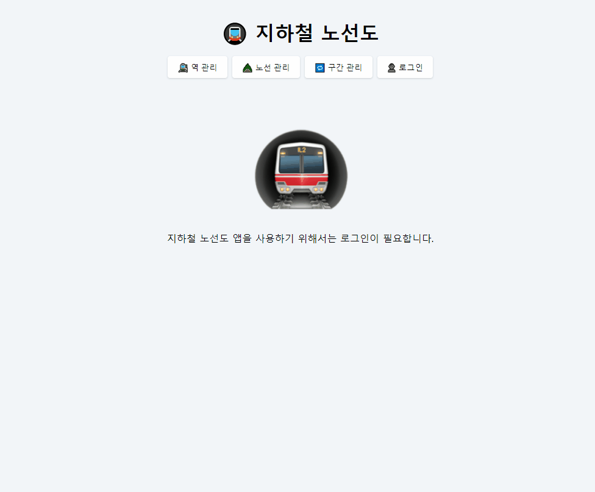

<p align="middle" >
  
</p>
<h2 align="middle">level1 - 지하철 노선도 관리 SPA</h2>
<p align="middle">Browser History API를 이용해 구현하는 지하철 노선도 관리 SPA</p>

## 0. 구현 요구사항

### 🎯 step1

#### Webpack을 통한 번들링

- [x] Webpack에서 babel을 설정한다.
- [x] 기타 플러그인 및 설정은 본인이 필요에 따라 추가한다.

#### 라우팅 기능

- [x] Browser History Api를 이용하여 SPA처럼 라우팅을 적용한다.

#### 회원 기능

- [x] 유저는 회원 가입을 할 수 있다,
  - [x] 회원 가입시 받는 정보는 `email`, `name`, `password`이다.
- [x] 유저는 로그인 할 수 있다.
  - [x] 로그인하고 나면 로그인 버튼은 로그아웃 버튼으로 변경되어야 한다.
  - [x] 로그인한 유저만, 정보의 수정이 가능하다.
  - [x] 로그인하지 않은 유저가 기능에 접근했을 때는, 로그인이 필요하다는 안내를 보여준다.
- [x] 유저는 로그아웃할 수 있다.
  - [x] 로그아웃하고 나면 로그인 버튼으로 변경되어야 한다.
- [x] `access token`이 만료된 경우, 사용자를 로그아웃 시키고 로그인 화면으로 이동시킨다.

## 1. 진행하며 고민하고 배운 점 👨‍💻

### 1-1. Component 단위의 모듈 분리

그동안 기능 단위로 모듈을 분리하며 미션을 진행 했습니다.

이번 미션을 진행하면서도 Handler와 View를 나누어 기능 단위로 작게 모듈을 분리하면서 진행하려는 계획이 있었습니다. 그러나 이번 미션 페어인 곤이가 Component단위로 모듈을 분리하면서 진행하면 어떻겠냐는 의견을 제시해줬습니다.

Component 단위로 모듈을 분리하니 각각의 Component에서 수행할 역할들을 한 곳에 모아서 관리할 수 있어 좋았습니다. 또한 반복되는 코드를 Class로 추상화 시켜 extends를 통해 확장하며 사용해가니 코드를 작성하기도 한결 편해졌습니다.

다만, 각 Component가 수행할 동작들은 하나의 Class에 모두 정의하다보니 Class가 비대해진다는 느낌을 받았습니다.

### 1-2. Webpack

지난 미션을 진행하면서 API Key를 숨기기 위해 Webpack을 알아보았습니다. 하지만 Webpack을 실제 프로젝트에 적용해 번들링 하는 단계까지는 나아가지 못 했습니다.

이번 미션 요구사항 중 `Webpack을 통한 번들링` 부분이 있어 지난 미션을 진행하며 학습했던 webpack을 적용해 볼 수 있었습니다.

webpack을 실제 적용하기 위해

### 1-3. Router

SPA를 구현하기 위해 Router를 만들어야 했습니다.

전통적인 Link 방식과 AJAX를 통한 방식을 공부했습니다.

Hsah를 이용한 라우터를 구현은 SEO 이슈가 존재해 History API를 통한 PJAX방식으로 구현했습니다.

- [History API / MDN](https://developer.mozilla.org/ko/docs/Web/API/History_API)

## 2. 코드 리뷰 및 피드백 📝

### 2-1. request 메서드의 위치



기존 API 요청을 보내는 코드는 다음과 같이 작성되어 있었습니다.

```js
const option = {
  post: (contents) => ({
    method: 'POST',
    headers: {
      'Content-Type': 'application/json; charset=UTF-8',
    },
    body: JSON.stringify(contents),
  }),

  ...
};

const request = async (url, option = {}) => {
  try {
    const response = await fetch(`${BASE_URL}${url}`, option);
    if (!response.ok) {
      throw new Error(response.message);
    }
    return response;
  } catch (err) {
    throw err;
  }
};

export const API = {
  signup: ({ email, password, name }) => {
    return request('/members', option.post({ email, password, name }));
  }

  ...
}
```

API 요청을 보낼 때 `request(URL, 옵션)` 이런식으로 사용하고 있었는데 `request.옵션(URL)` 과 같은 형식으로 보내는게 더 좋을거 같다는 피드백을 받았습니다.

피드백을 받고 API요청을 다음과 같은 형식으로 변경했습니다.

```js
const _request = async (url, option = {}) => {
  try {
    const response = await fetch(`${BASE_URL}${url}`, option);
    if (!response.ok) {
      throw response.status;
    }
    return response;
  } catch (status) {
    throw status;
  }
};

const request = {
  post: async (info) => {
    const { url, contents, token } = info;
    const option = {
      method: 'POST',
      headers: {
        'Content-Type': 'application/json; charset=UTF-8',
      },
      body: JSON.stringify(contents),
    };
    if (token) {
      option.headers.Authorization = `Bearer ${token}`;
    }
    return _request(url, option);
  },

  ...
}

export const API = {
  signup: ({ email, password, name }) => {
    return request.post({
      url: '/members',
      contents: { email, password, name },
    });
  },

  ...
}
```

다음과 같은 형식으로 변경하니 확실히 어떤 메서드를 사용해 요청을 보내는지 일목요연하게 확인할 수 있었습니다.

### 2-2. 레이어 분리



전체 구조를 컴포넌트 구조로 가져가면서 다음과 같이 API 요청을 컴포넌트들에서 직접 보내는 방식을 사용했습니다.



이 방식을 사용하면 response에 대한 핸들링도 컴포넌트에서 진행하고 있었고 피드백 내용처럼 해당 API를 다른 곳에서 호출할 때 중복된 코드가 생긴다는 문제가 있었습니다.

리뷰어 분의 피드백을 적용해 중간에 Service 레이어를 두고 컴포넌트에서는 요청에 대한 데이터만 받아서 사용하니 훨씬 코드가 깔끔해지고 중복이 줄어들었습니다. 또한 레이어를 분리함으로 인해 각각의 역할과 책임이 분명해졌습니다.



## 3. 코드 구조 시각화 🔎



## 4. 동작 화면(GIF) 🎥



## 5. 링크 🔗

- [전체 코드 링크](https://github.com/yujo11/javascript-subway/tree/step1-component)
- [PR 링크](https://github.com/woowacourse/javascript-subway/pull/17)
