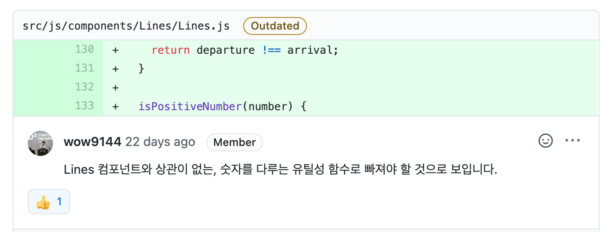
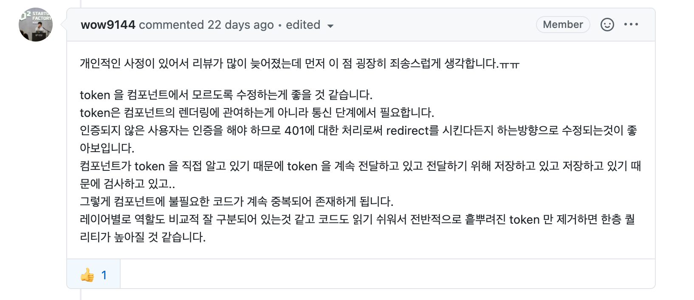

<p align="middle" >
  
</p>
<h2 align="middle">level1 - 지하철 노선도 관리 SPA</h2>
<p align="middle">Browser History API를 이용해 구현하는 지하철 노선도 관리 SPA</p>

## 0. 구현 요구사항

## 🎯🎯 step2

### 지하철역 관리 기능

- [x] 지하철역을 등록할 수 있다.
  - [x] 엔터키 또는 마우스 클릭으로 역을 추가할 수 있어야 한다.
  - [x] 중복된 지하철역은 추가할 수 없다.
  - [x] 지하철역은 2글자 이상, 20자 이하여야 한다.
- [x] 지하철역의 이름을 수정할 수 있다.
  - [x] 수정하는 UI는 modal을 이용하여 수정할 수 있게 한다.
- [x] 지하철역을 삭제할 수 있다.
  - [x] 삭제 시 confirm을 이용하여 한 번 더 유저가 확인할 수 있어야 한다.
  - [x] 이미 노선에 등록된 역인 경우 삭제할 수 없다.

### 지하철 노선 관리 기능

- [x] 지하철 노선을 등록할 수 있다.
  - [x] 중복된 지하철 노선 이름이 등록될 수 없다.
  - [x] 지하철 노선의 이름은 2글자 이상, 10글자 이하여야 한다.
  - [x] 지하철 노선 생성시 필요한 값은 색상, 상행역, 하행역, (최초 상행역과 하행역 구간의)거리, 시간이다.
- [x] 지하철 노선을 수정할 수 있다.
  - [x] 지하철 노선의 이름, 상행역, 하행역, 거리, 시간, 색상을 수정할 수 있다.
- [x] 지하철 노선을 삭제할 수 있다.
- [x] 지하철 노선 리스트를 조회할 수 있다.

### 지하철 구간 관리 기능

- [x] 지하철 노선에 구간을 추가, 수정, 삭제할 수 있다.
  - 지하철 노선에 구간을 추가하는 기능은 노선에 역을 추가하는 기능이라고도 할 수 있다.
  - 역과 역사이를 구간이라 하고 이 구간들의 모음이 노선이다.
  - 하나의 역은 여러개의 노선에 추가될 수 있다.
  - 역과 역 사이에 새로운 역이 추가 될 수 있다.
  - 노선에서 갈래길은 생길 수 없다.
- [x] 구간 조회 시, 노선을 변경하면 해당 노선의 Color로 Select 엘리먼트의 배경색을 변경한다.

### 지하철 노선 전체보기 기능

- [x] 전체보기 버튼을 클릭하면 전체 노선을 볼 수 있어야 한다.

## 2. 코드 리뷰 및 피드백 📝

### 2-1. 함수의 위치



컴포넌트 단위로 코드를 분리했는데 특정 컴포넌트에서만 쓰이지 않는(범용성 있는) 함수가 특정 컴포넌트의 메서드로 존재하고 있었습니다.

재사용성과 함수의 역할에 대한 부분을 좀 더 고민하면서 코드를 작성해야겠다고 생각했습니다.

### 2-2. token의 위치



컴포넌트 단위로 분리한 Class들에 다음과 같은 로직이 중복적으로 수행되고 있었습니다.

```js
async render(token, sortedSectionList = []) {
    $('main').innerHTML = token ? subwayMapTemplate(sortedSectionList) : LOGIN_REQUIRED_TEMPLATE;
}
```

매번 컴포넌트에서 render로직을 수행할 때 token을 검증하고 그에 따른 로직을 수행하게 한 것입니다.

사실 이런 설계가 나오게 된 배경에는 service layer의 잘못된 분리도 존재했습니다.

service layer에서 API요청을 보낼 때 다음과 같이 token을 외부에서 넘겨받고 있었습니다.

```js
 isValidToken: async (token) => {
    try {
      await API.getUserInfo(token);

      return true;
    } catch (err) {
      console.error(err);
      return false;
    }
  },
```

service 로직에서 token을 요구하니 이 service 로직을 사용하는 컴포넌트들이 token을 알고 있어야 하는 상황이 왔고 악순환의 반복으로 비슷한 로직을 되풀이하고 있었습니다.

service 로직 token을 자체적으로 얻어오도록 하는 방식으로 중복되는 코드들을 대폭 줄일 수 있었습니다.

기존 component에만 위임했던 render를 다음과 같이 token 유무에 따라 App에서도 직접 렌더하도록 수정했습니다.

```js
// 기존

this.router = {
  '/': (token = '') => this.Main.load(token),
  '/stations': (token = '') => this.Stations.load(token),
  '/lines': (token = '') => this.Lines.load(token),
  '/sections': (token = '') => this.Sections.load(token),
  '/map': (token = '') => this.SubwayMap.load(token),
  '/login': (token = '') => this.Login.load(token),
  '/signup': (token = '') => this.Signup.load(token),
}

await this.router[pathName]?.()

// 변경 후
this.router = {
  '/': () => this.Main.load(),
  '/stations': () => this.Stations.load(),
  '/lines': () => this.Lines.load(),
  '/sections': () => this.Sections.load(),
  '/map': () => this.SubwayMap.load(),
  '/login': () => this.Login.load(),
  '/signup': () => this.Signup.load(),
}

token ? await this.router[pathName]?.() : this.render()
```

아직 전체 코드를 설계하고 책임과 역할을 분리시키는 일은 쉽지 않다. 코드를 작성하기 전 layer 분리에 대해 고민하면서 각 layer의 책임과 역할을 명확히 하자는 생각을 했습니다.

## 3. 코드 구조 시각화 🔎


## 4. 동작 화면(GIF) 🎥


## 5. 링크 🔗

- [전체 코드 링크](https://github.com/yujo11/javascript-subway/tree/step2)
- [PR 링크](https://github.com/woowacourse/javascript-subway/pull/57)
