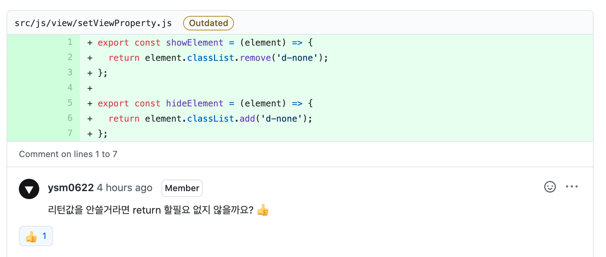
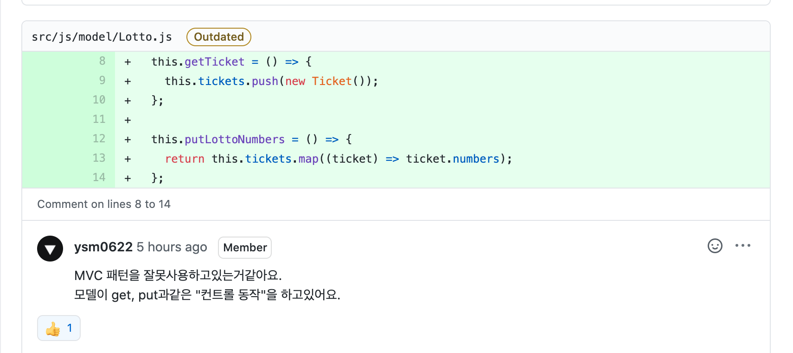
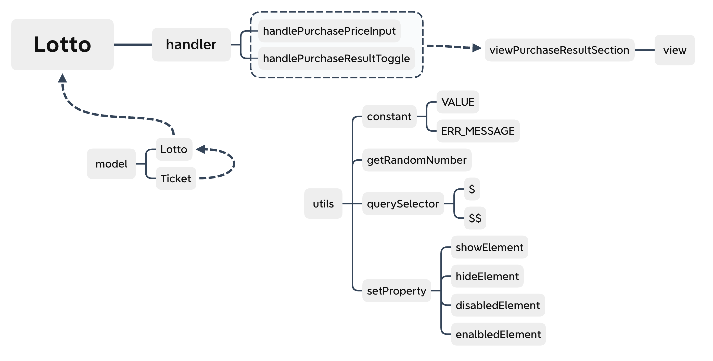

<p align="middle" >
  
</p>
<h2 align="middle">level1 - 행운의 로또</h2>
<p align="middle">자바스크립트로 구현 하는 로또 어플리케이션</p>

## 0. 구현 요구사항

### 🎯 step1 구입 기능

- [x] 로또 구입 금액을 입력하면, 금액에 해당하는 로또를 발급해야 한다.
- [x] 로또 1장의 가격은 1,000원이다.
- [x] 소비자는 **자동 구매**를 할 수 있어야 한다.
- [x] 복권 번호는 번호보기 토글 버튼을 클릭하면, 볼 수 있어야 한다.

## 1. 진행하며 고민하고 배운 점

### 1-1 cy.stub()을 사용하는 더 우아한 방법

alert를 검증하기 위해 `cy.stub()`을 사용하는데 그동안은 아래와 같이 작성하고 있었습니다.

```js
const alertStub = cy.stub();
cy.on('window:alert', alertStub);
typeCarNameAndClickToSubmitButton(longCarName).then(() => {
  expect(alertStub.getCall(0)).to.be.calledWith(
    '이름은 5글자 이하로 입력해 주세요.',
  });
```

위와 같은 코드로도 `alert`를 검증하는데는 무리가 없었지만 `stub`의 콜 스택에 쌓이는 요소들을 `getCall(Number)`같은 방식으로 매직넘버를 사용해서 인덱스에 접근해 꺼내서 검증하는게 직관성이 많이 떨어진다는 생각을 했습니다.

이번 미션을 페어로 진행하게 된 [심바](https://github.com/0imbean0)가 저에게 좀 더 우아한 방법을 제시해줬습니다.

```js
it.only('구입 금액에 1000원 이하의 값을 입력 시, 경고 메시지가 출력되야 한다.', () => {
  cy.window().then(win => cy.stub(win, 'alert').as('windowAlert'))

  typePurchasePriceAndClickSubmitButton(-1)

  cy.get('@windowAlert').should(
    'be.calledWith',
    ERR_MESSAGE.LOTTO.INVALID_PRICE
  )
})
```

위와 같이 `cy.window()`에 체인 메서드를 통해 `cy.stub()`을 담아 놓고 `.as`를 통해 별칭을 지정하는 방식입니다.

그러고나서 똑같이 `be.calledWith`메서드를 활용해 `alert`를 검증했습니다. 이렇게 진행하니 Number값을 통해 콜 스택에 있는 값을 꺼내어 검증하는 것보다 훨씬 가독성이 좋고 우아하다고 느껴졌습니다.

이전 미션을 진행하면서도 콜 스택에 직접 접근하는 방식이 마음에 들지 않았는데 `cy.stub()`을 활용해 조금 더 우아하게 `alert`를 검증할 수 있는 방법을 알게되어 좋았습니다.

### 1-2 HTML/CSS 컨벤션

JS컨벤션은 많이 찾아보고 적용하기 위해 노력했지만 부끄럽게도 HTML 컨벤션은 찾아본 적이 없었습니다. 페어인 [심바](https://github.com/0imbean0)를 통해 HTML/CSS 컨벤션에 대해 알게 됐고 처음으로 HTML/CSS컨벤션을 기반으로 요소들에 `id`를 부여했습니다.

기존에 작성하던 방식은 아래와 같이 Javascript에서 파싱해 올 요소들에만 특정 id를 부여해오는 방식이었습니다.

```html
<form class="mt-5">
  <label class="mb-2 d-inline-block">
    구입할 금액을 입력해주세요.
  </label>
  <div class="d-flex">
    <input id="purchase-price-input" <!-- id -- />
    type="number" class="w-100 mr-2 pl-2" placeholder="구입 금액" />
    <button id="purchase-price-submit" <!-- id -->
      type="button" class="btn btn-cyan" > 확인
    </button>
  </div>
</form>
```

이번에 새로 적용한 방식은 아래와 같이 상위 태그에 특정 아이디 값을 부여하고 `상위 태그의 id__요소` 이런식으로 네이밍하는건데 네이밍의 통일성을 유지할 수 있어 좋았습니다.

```html
<form id="purchase-price-input-form" class="mt-5">
  <!-- id -->
  <label class="mb-2 d-inline-block">구입할 금액을 입력해주세요. </label>
  <div class="d-flex">
    <input id="purchase-price-input-form__input" <!-- id -- />
    type="number" class="w-100 mr-2 pl-2" placeholder="구입 금액" />
    <button id="purchase-price-input-form__button" <!-- id -->
      type="button" class="btn btn-cyan" > 확인
    </button>
  </div>
</form>
```

앞으로는 JS 뿐만 아니라 CSS와 HTML컨벤션도 찾아보면서 좋은 컨벤션을 코드에 적용할 수 있도록 노력해야겠다고 생각 했습니다.

### 1-3 MV\* 패턴에 대한 고민

지난 자동차경주 미션 리뷰에서 '객체'를 통해 상태를 관리해보라는 마지막 피드백을 받았습니다. 이번 미션을 시작하기 전 심바와 다양한 얘기를 나누면서 상태를 '객체'로 관리해보고 싶다는 의견을 전달했습니다. 다행히 페어인 심바는 이전 미션을 진행하면서 상태관리에 객체를 사용해본 경험이 있었고 나아가 이번 미션에서는 MVC패턴을 적용해보고 싶다는 의견을 내줬습니다.

둘 다 MVC에 대한 깊은 이해는 없었지만 각자가 생각하는 Model, View, Controller의 역할에 대해 많은 얘기를 나눌 수 있었습니다. 토론을 하면서 즐겁게 페어 프로그래밍을 진행했습니다.

## 2. 코드 리뷰 및 피드백

### 2-1 불필요한 return



이전에도 한번 피드백을 받았던 부분이었습니다. 사용되지 않는 값들을 습관척으로 `return`해버리고는 하는데 신경쓰려고 하고있는데 구현을 하는 과정에서 같은 실수를 반복하게 됐습니다. 벌써 2번이나 피드백 받았으니 다음부터는 같은 실수를 반복하지 않기 위해 의식적으로 노력해야겠습니다.

### 2-2 MVC에서 Model의 역할



기존에 작성한 모델은 다음과 같았습니다.

- Ticket.js

```js
import { getRandomNumber } from '../utils/getRandomNumber.js'

export default function Ticket() {
  const init = () => {
    this.numbers = getLottoNumber()
    this.profit = 0
  }

  const getLottoNumber = () => {
    const lottoNumbers = new Set()

    while (lottoNumbers.size < 6) {
      lottoNumbers.add(getRandomNumber(1, 45))
    }

    return [...lottoNumbers].sort((a, b) => a - b)
  }

  init()
}
```

- Lotto.js

```js
import Ticket from './Ticket.js'

export default function Lotto() {
  const init = () => {
    this.tickets = []
  }

  this.getTicket = () => {
    this.tickets.push(new Ticket())
  }

  this.putLottoNumbers = () => {
    return this.tickets.map(ticket => ticket.numbers)
  }

  init()
}
```

리뷰어 분에게 피드백을 받고 어제 읽었던 글을 찬찬히 다시 읽어봤습니다.

> 모델은 데이터입니다. - [뉴비를 위한 MV\* 패턴 / 코드 스피츠](https://www.bsidesoft.com/5948)

모델은 데이터인데 데이터를 조작하는 부분까지 Model에 담아서 사용했습니다. 해당 Object의 내부 프로퍼티를 Object의 내부 메서드를 사용해 조작하는게 좋다고 생각했는데 구현하려고 헀던 MVC패턴을 생각해보면 어긋났다는걸 깨달을 수 있었습니다.

처음으로 MVC패턴을 적용해보면서 MVC의 역할에 대한 고민을 많이 했는데 피드백을 통해 다시 한번 MVC의 역할을 생각해보고 코드에 어떻게 적용되었는지를 고민해 볼 수 있어서 좋았습니다.

### 2-3. Class 사용


사실 이 부분을 작성할 때 Class의 사용을 고민했었습니다. 그러나 전체 로직이 function으로 구성되어 있어서 Model에만 Class를 사용하게 되면 전체 코드의 일관성을 해치는거 같아 function을 사용했습니다. 프리코스 때부터 전체 코드의 일관성과 관련하여 부분적으로 Class를 사용하는게 괜찮은지에 대한 많은 고민을 했었는데 이제 어느정도는 정리가 되는거 같습니다.

## 3. 코드 구조 시각화



## 4. 링크

- [전체 코드 링크](https://github.com/yujo11/javascript-lotto/tree/step1)
- [PR 링크](https://github.com/woowacourse/javascript-lotto/pull/3)
