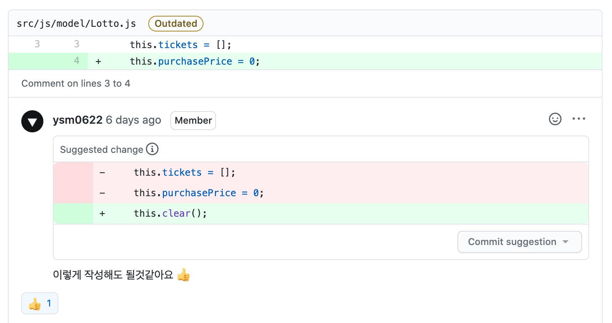
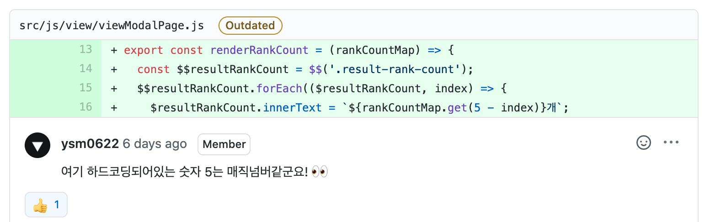

<p align="middle" >
  
</p>
<h2 align="middle">level1 - 행운의 로또</h2>
<p align="middle">자바스크립트로 구현 하는 로또 어플리케이션</p>

## 0. 구현 요구사항

### 🎯🎯 step2 당첨 결과 기능

- [x] 결과 확인하기 버튼을 누르면 당첨 통계, 수익률을 모달로 확인할 수 있다.
- [x] 로또 당첨 금액은 고정되어 있는 것으로 가정한다.
- [x] 다시 시작하기 버튼을 누르면 초기화 되서 다시 구매를 시작할 수 있다.

## 1. 진행하며 고민하고 배운 점

### 1-1. MVC에서 Model의 역할

지난 stpe1 PR에서 Model이 Controller의 역할까지 수행하고 있다는 점을 지적 받았습니다. 지적을 받고 모델이 데이터만을 가지고 있도록 아래와 같이 간소화 시켰습니다.

```js
export default class Lotto {
  constructor() {
    this.tickets = []
    this.purchasePrice = 0
  }
}

export default class Ticket {
  constructor() {
    this.numbers = []
    this.winningRank = 0
    this.profit = 0
  }
}
```

이렇게 간소화 시켜서 생성자로 새로운 인스턴스를 생성하는 역할만 하도록 했는데 한가지 문제가 생겼습니다. 생성한 모델의 내부 프로퍼티를 변경할 때 `Lotto.purchasePrice = 1000;`처럼 외부에서 직접 프로퍼티의 이름을 명시하고 값을 변경해야 하는 문제였습니다. 이런 식으로 값을 변경하다보니 `numbers`를 `number`로 적어 새로운 프로퍼티가 생성하는 등 여러 휴먼 에러를 겪었습니다.

그래서 페어인 심바와 논의 끝에 model 내부에 `get`, `set` 메서드를 모델 내부에 정의해서 프로퍼티를 변경할 일이 있을 때는 무조건 내부 메서드를 통해 변경이 가능하도록 수정했습니다.

```js
export default class Lotto {
  constructor() {
    this.clear()
  }

  getTickets() {
    return this.tickets
  }

  setPurchasePrice(purchasePrice) {
    this.purchasePrice = purchasePrice
  }

  addTicket(ticket) {
    this.tickets.push(ticket)
  }

  clear() {
    this.tickets = []
    this.purchasePrice = 0
  }
}

export default class Ticket {
  constructor() {
    this.numbers = []
    this.winningRank = 0
    this.profit = 0
  }

  setNumbers(numbers) {
    this.numbers = numbers
  }

  getNumbers() {
    return this.numbers
  }

  setWinningRank(winningRank) {
    this.winningRank = winningRank
  }

  setProfit(profit) {
    this.profit = profit
  }
}
```

내부 프로퍼티를 변경하거나 해당 값을 외부에서 사용할 때 내부 메서드를 통해 접근하면서 휴먼 에러를 줄일 수 있었고 코드의 가독성도 높일 수 있었습니다.

### 1-2. UI/UX에 대한 고민

코치인 포코와 얘기하던 중 FE를 지망하는데 E에만 신경 쓰고 F에는 신경을 안 쓰는거 같다는 말을 들었습니다. 미션을 진행하면서 다른 크루들이 적용하는 MVC패턴, Flux패턴을 어떻게 코드에 적용할까에 대한 고민에만 빠져 UI/UX에 신경을 안 쓰고 있다는걸 느꼈습니다.

UI/UX에 대한 고민을 하며 아래와 같이 코드를 수정했습니다.

```html
<div class="d-flex">
  <input
    id="purchase-price-input-form__input"
    step="any"
    type="number"
    class="w-100 mr-2 pl-2"
    placeholder="구입 금액"
    required
    autofocus
  />
  <button
    id="purchase-price-input-form__button"
    type="submit"
    class="btn btn-cyan"
  >
    확인
  </button>
</div>
```

- `<input>` 태그에 `autofocus`를 추가해 페이지 최초 로딩시 input에 focus가 되게 하고 `required` 옵션을 통해 입력값이 있는 경우에만 제출되도록 변경했습니다.
- `<button>` 태그의 type도 submit으로 변경해 click 뿐만 아니라 'Enter' 키 입력으로도 제출할 수 있도록 변경했습니다.

## 2. 코드 리뷰 및 피드백

### 2-1. 중복을 줄이자



게임을 다시 시작할 때 Lotto 인스턴스를 초기화 하기 위해 아래와 같이 `clear()`라는 메서드를 사용했습니다.

```js
export default class Lotto {
  constructor() {
    this.tickets = []
    this.purchasePrice = 0
  }

  ...

  clear() {
    this.tickets = []
    this.purchasePrice = 0
  }
}

```

`clear()` 메서드와 `constructor()`메서드의 코드 내용이 동일한데 이 부분을 간과하고 있었습니다. 리뷰어 분의 피드백을 반영해 아래와 같이 수정했습니다.

```js
export default class Lotto {
  constructor() {
    this.clear()
  }

  ...

  clear() {
    this.tickets = []
    this.purchasePrice = 0
  }
}
```

### 2-2. 매직넘버



'이 정도는 상수로 분리하지 않아도 괜찮지 않을까...?' 라는 안일한 생각으로 넘어갔던 부분이었습니다. 리뷰어 분의 피드백을 받고 저 매직넘버를 어떻게 분리할건지에 대한 고민을 했는데 예상외로 간단했습니다. NodeList를 순회하기 떄문에 매직넘버대신 파싱해온 NodeList의 length를 넣는 방법으로 해결했습니다.

```js
export const renderRankCount = rankCountMap => {
  const $$resultRankCount = $$('.result-rank-count')
  $$resultRankCount.forEach(($resultRankCount, index) => {
    $resultRankCount.innerText = `${rankCountMap.get(
      $$resultRankCount.length - index
    )}개`
  })
}
```

## 3. 코드 구조 시각화


## 4. 링크

- [전체 코드 링크](https://github.com/yujo11/javascript-lotto/tree/step2)
- [PR 링크](https://github.com/woowacourse/javascript-lotto/pull/28)
