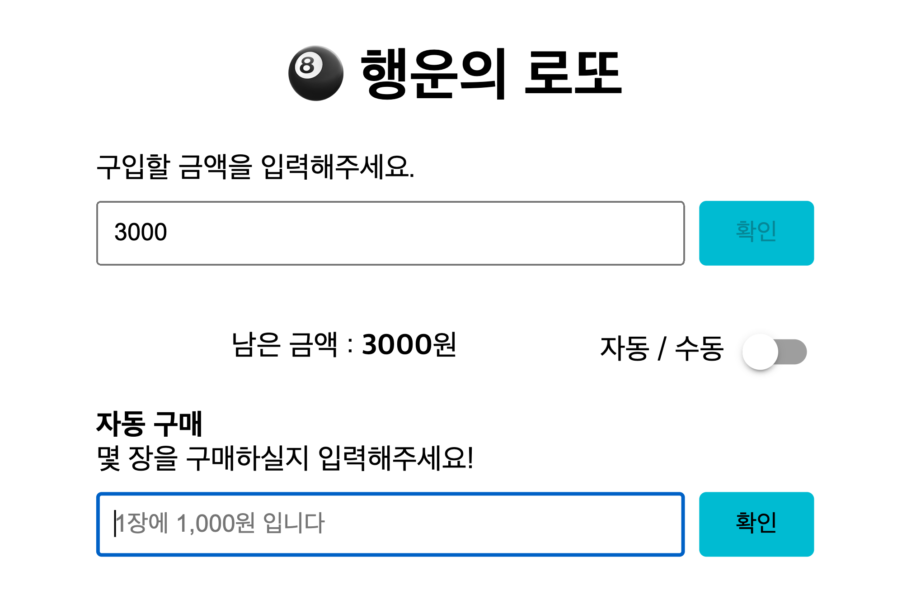
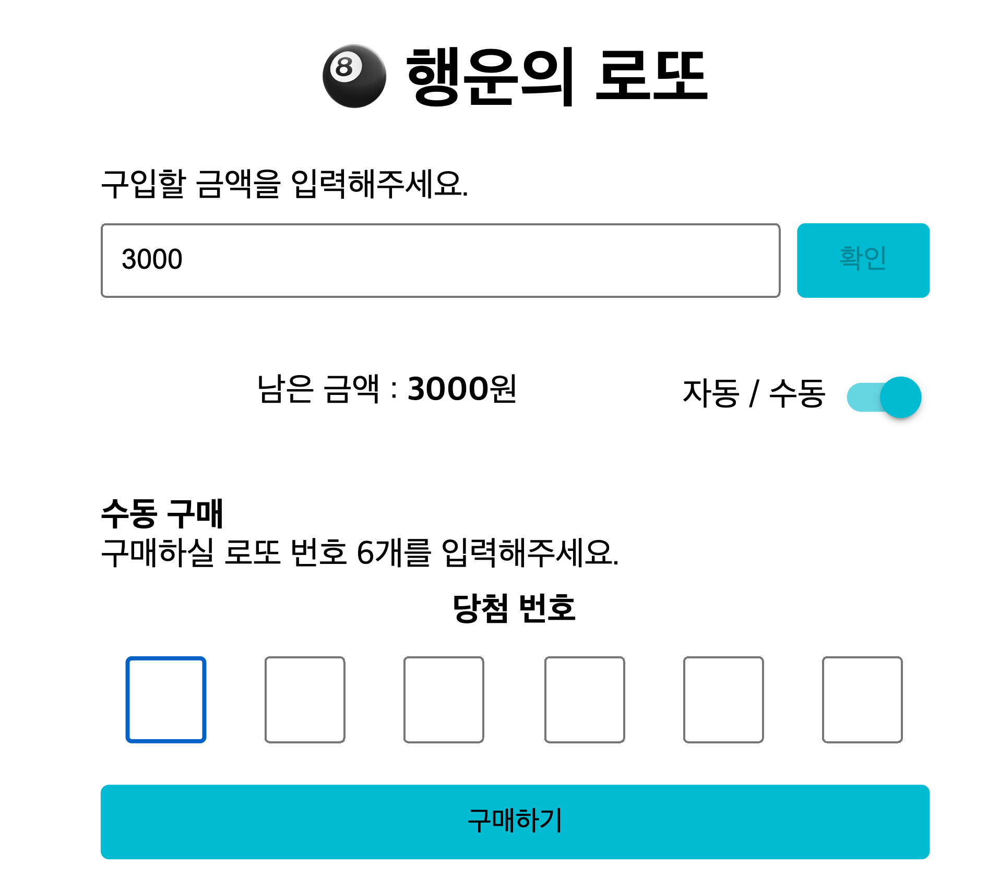
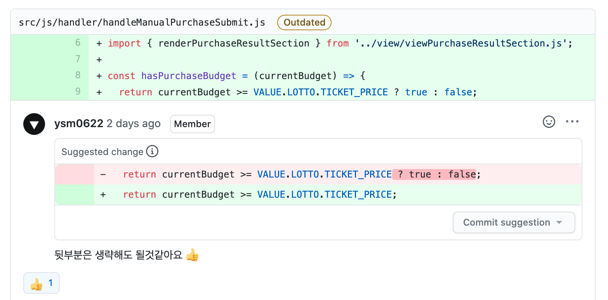
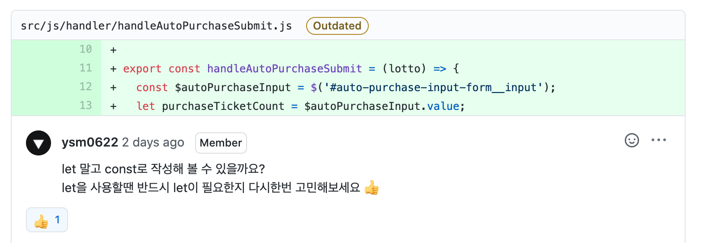

  

<h2 align="middle">level1 - 행운의 로또</h2>

자바스크립트로 구현 하는 로또 어플리케이션

## 0. 구현 요구사항

### 🎯🎯🎯 step3 수동 구매

- [x] 소비자는 수동 구매(스스로 구매 번호를 입력)를 할 수 있어야 한다.
  - 수동 구매를 위한 input UI는 스스로 구현한다.
- [x] 수동 구매 후 남는 금액이 있다면 자동으로 구매할 수 있어야 한다.
- [x] 위 기능들이 정상적으로 동작하는지 Cypress를 이용해 테스트한다.

## 1. 진행하며 고민하고 배운 점

### UI

step3을 진행하면서 기존에 자동으로 구매되던 로또를 수동/자동을 선택가능하게 변경해야 했습니다.

여러 방법을 생각하다가 toggle 버튼을 통해 자동, 수동을 움직일 수 있게 하면 직관적이고 좋을거 같다는 생각이 들어 해당 아이디어를 반영 했습니다.

## 2. 코드 리뷰 및 피드백

### 2-1. 불필요한 코드

불필요한 코드가 들어가 불필요한 연산이 이루어지고 있었다.

리팩터링 할 때는 발견하지 못 했던 부분인데 불필요한 코드로 불필요한 연산을 하지 않도록 주의하자.

### 2-2. let, const

해당 변수의 횟수만큼 반복해야 하는 작업이 있어 `let`으로 선언한 다음 `while(var--)` 같이 사용하고 싶어서 `let`을 사용했다. 사실 `for`문을 사용해도 되는 부분이었는데 왠지 `for`문을 쓰기 싫어서 고민 끝에 `let`으로 선언하는 방법을 생각했는데 장고 끝에 악수를 둬버렸다.

## 3. 코드 구조 시각화

## 4. 링크

- [전체 코드 링크](https://github.com/yujo11/javascript-lotto/tree/step3)
- [PR 링크](https://github.com/woowacourse/javascript-lotto/pull/57)
