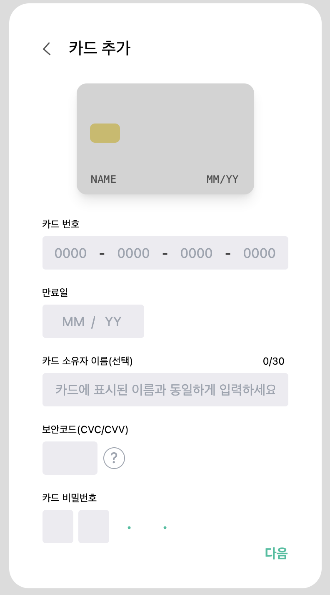
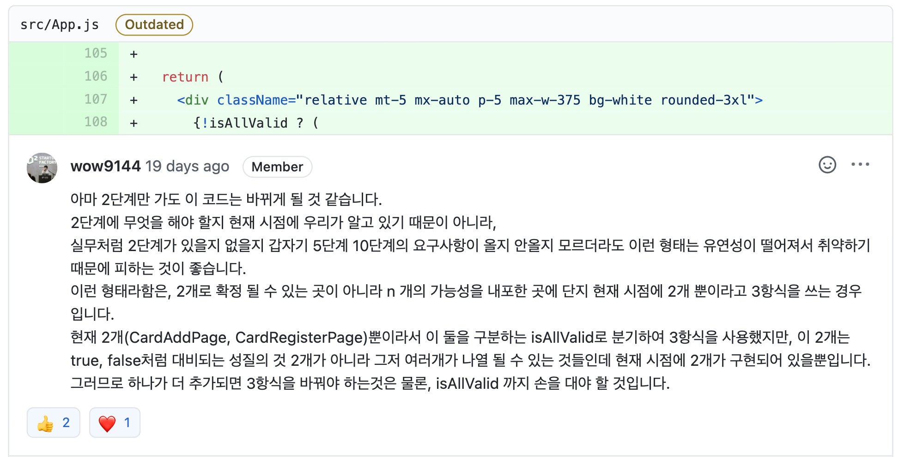
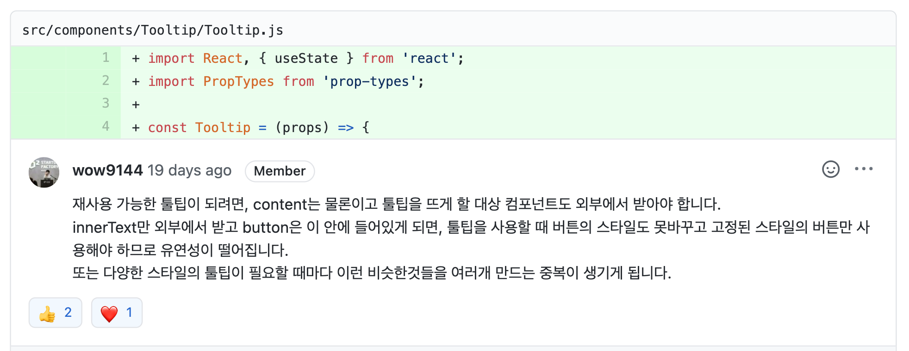
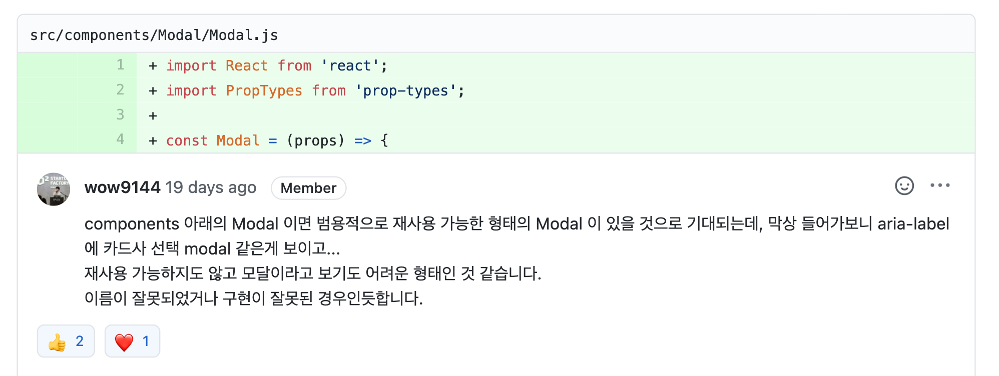

<p align="middle" >
  
</p>
<h2 align="middle">Level2 - 페이먼츠</h2>
<p align="middle">React 모바일 페이먼츠 애플리케이션</p>
</p>

## 📝 구현 요구사항

### 📖 공통 요구사항

- [x] `storybook` 상호 작용 테스트

### 🚀 Step1

- [x] REQUIREMENTS.md에 요구 사항 도출
- [x] 재사용 가능한 Component 작성
- [x] 카드 추가 폼
- [x] 카드 추가 확인

### 🚀🚀 Step2

- [x] `Controlled` & `Uncontrolled Components`에 입각하여 Form 핸들링
- [x] 카드 목록

## 1. 진행하며 고민한 점

### 1-1. storybook

처음으로 storybook을 도입해서 사용했습니다. 처음에 낯설기도 했지만 이내 storybook의 존재로 Component를 작은 단위로 나눠 확인 가능한 점에 매료되었습니다.

미션을 마친 지금은 storybook없이 Component UI를 구현하기 힘들다는 생각도 하고 있습니다. Component의 재사용성은 React로 코드를 작성하면서 중점이 되는 부분 중 하나입니다. 재사용성을 위해 작은 단위의 Component를 만들고 또 UI를 구현해서 확인하는 부분이 storybook의 도입으로 굉장히 편해졌습니다.

chromatic으로 배포할 경우 snapshot 테스트를 굉장히 편하게 할 수 있다는 점도 큰 장점이라고 생각합니다.

앞으로 React Project를 세팅할 때 storybook은 항상 필수적으로 사용하게 될거 같습니다.

### 1-2. Controlled Components VS Uncontrolled Components



이번 미션을 진행하면서 위와 같은 Form을 구현 했습니다. Form을 구현하면서 이 Form을 제어 컴포넌트로 관리할지 비제어 컴포넌트로 관리할지가 큰 고민이었습니다.

결국은 각 Input의 Validation에 따른 메세지를 관리하기 위해 제어 컴포넌트를 사용하였는데 이에 따라 카드 번호, 만료일, 카드 소유자 이름 등등 관리해야할 상태가 굉장히 많아졌습니다.

상황에 따라 제어 컴포넌트를 사용할지 비제어 컴포넌트를 사용할지가 달라지겠지만 여러 상태들을 동시에 Handling하면서 Type의 필요성과 상태관리 라이브러리의 필요성을 느꼈습니다.

## 2. 코드 리뷰 및 피드백

## 2-1. 유연하지 못한 조건부 렌더링



1단계 미션을 진행할 때는 구현해야 하는 페이지가 2개였습니다. 2개의 페이지만 구현하면 되기에 큰 고민없이 삼항식을 통한 조건부 렌더링을 도입했습니다. 그러나 리뷰어님의 피드백처럼 유연성이 굉장히 떨어지는 구조라는걸 인지하지 못 했었습니다.

```jsx
const [isAllValid, setIsAllValid] = useState(false);

return !isAllValid ? <CardAddPage /> : <CardRegisterPage />}
```

위와 같이 삼항식으로 Render하던 페이지를 다음과 같이 변경했습니다.

```jsx
const [pageRouter, setPageRouter] = useState(PAGE.MAIN)

const pageTable = {
  [PAGE.MAIN]: Page.CardAddPage,
  [PAGE.REGISTER]: Page.CardRegisterPage,
}

return pageTable[pageRouter]
```

1단계에서 위의 피드백을 적용해 삼항식으로 조건부 렌더링 하는 방식에서 Router를 두고 관리하는 방식으로 변경한 덕분에 2단계에서 새로운 페이지를 추가할 때도 구조의 변경 없이 페이지를 간단하게 추가할 수 있었습니다.

### 2-2. Component의 재사용성



피드백처럼 기존의 `Tooltip` Component는 대상을 props로 전달받지 않고 있었습니다. 재사용성을 위해서는 `Tooltip`에서 대상을 정하는게 아니라 대상까지 props로 받아야 한다는걸 알게 됐습니다.

비단 `Tooltip` Component 뿐만 아니라 대부분의 Component들을 재사용 가능한 Component로 만들기 위해선 Component가 미리 알고 있는 정보를 최대한 제안하고 Component안에서 판단하는 일이 없도록 최대한 멍청하게 만들어야 한다는걸 생각하게 됐습니다.

### 2-3. Component Naming



Component들을 모두 Component 디렉토리에 넣어놓고 관리했습니다. 리뷰어님의 피드백처럼 이 Modal은 재사용 가능한 Modal이 아니라 단 한 군데서만 사용할 수 있는 특정한 Modal인데 위치와 이름 때문에 혼란을 줄 수 있을거 같다는 생각을 했습니다.

이번 미션에서는 Component들을 모두 한 폴더에 넣었지만 다음 미션에서는 Component를 재사용성이 높은 Component와 재사용성이 낮은 Component를 구분해야겠다는 필요성을 느꼈습니다.

## 3. 데모


## 4. 링크

### 4-1. step1 링크

- [전체 코드 링크](https://github.com/yujo11/react-payments/tree/step1)
- [PR 링크](https://github.com/woowacourse/react-payments/pull/13)

### 4-2. step2 링크

- [전체 코드 링크](https://github.com/yujo11/react-payments/tree/step2)
- [PR 링크](https://github.com/woowacourse/react-payments/pull/48)
