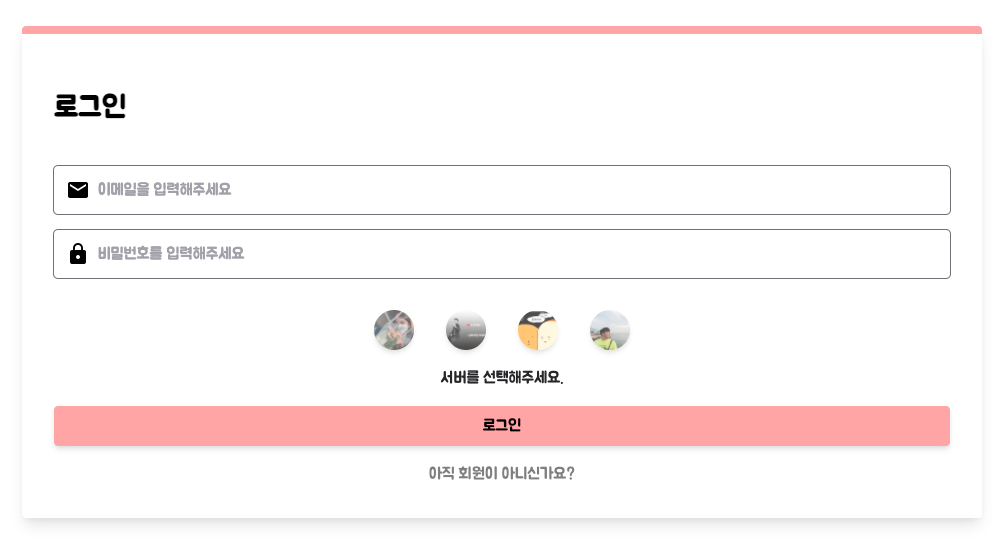
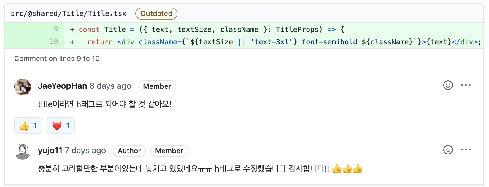
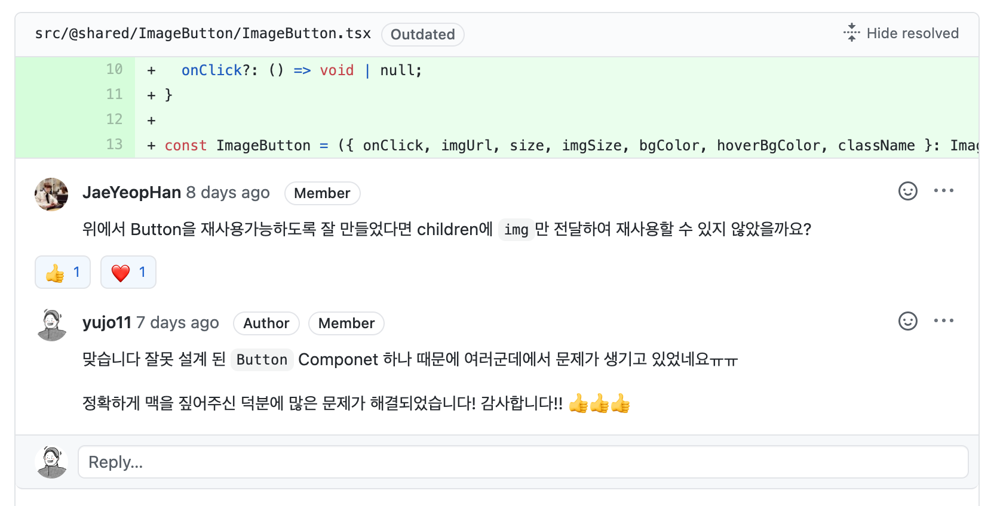
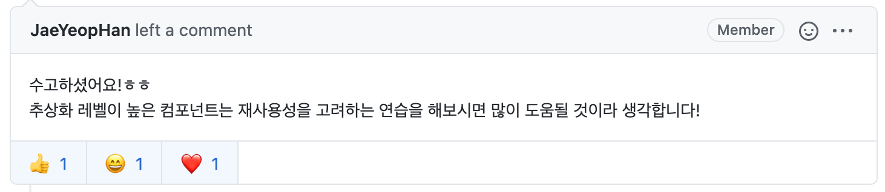

<p align="middle" >
  
</p>
<h2 align="middle">Level2 - 지하철 노선도</h2>
<p align="middle">React 지하철 노선도 SPA</p>
</p>

## 📝 요구사항

### 🚀 step1

#### 👨‍👩‍👧‍👦 협업 요구사항

- 백엔드 페어와 협업을 위해 필요한 사항들을 논의합니다.
- step1에서 사용할 API의 배포 일정, 이후 step2에서의 추가 개발을 위한 설계 논의, 그 외 필요한 사항들 있는 지 확인
- 배포한 API 4개 중 하나를 무작위로 연결하더라도 어플리케이션이 정상 동작해야 합니다.
- 무작위 연결을 확인해볼 수 있는 방법은 페어와 자율적으로 결정합니다.

#### 📝 구현 요구사항

- 요구사항 명세를 먼저 작성합니다.
- 상태 관리 방법을 스스로 선택합니다. 선택한 상태 관리 방법이 적절하다고 생각한 이유를 명시해주세요.
- 레벨 1에서 구현했던 기능들을 React로 다시 구현해보는 작업입니다. 레벨 1에서 개발했던 어플리케이션을 다시 확인해보세요.

<details>
<summary> <b> step1 요구사항 정의 </b>  </summary>
<div markdown="1">

- 메인 페이지

  - [x] 로그인 되지 않은 사용자가 접속할 경우 로그인 페이지로 리다이렉션 한다.
  - [x] 로그인 된 사용자가 접속할 경우 메인 페이지를 보여준다.

- 로그인/회원가입 페이지

  - [x] 사용자는 회원 가입을 할 수 있다.
    - 필요 정보: 이름, 이메일, 비밀번호, 비밀번호 확인 정보
    - 가입시 이미 가입한 이메일인지 중복 확인
  - [x] 사용자는 가입한 계정으로 로그인을 할 수 있다.
  - [x] 사용자는 로그인하여 지하철 노선도 관리 페이지에 접근할 수 있다.
    - 로그인되지 않은 상태로 접근시 로그인 페이지로 리다이렉션 된다.

- 역 관리 페이지

  - [x] 사용자는 지하철 역을 추가할 수 있다.
  - [x] 사용자는 지하철 역을 삭제할 수 있다.
    - 노선에 등록되어 있는 역인 경우 삭제할 수 없어야 한다.
  - [x] 사용자는 등록되어 있는 전체 지하철 역 목록을 조회할 수 있다.

- 노선 관리 페이지

  - [x] 사용자는 지하철 노선을 추가할 수 있다.
    - 필요 정보: 노선 이름, 상행역, 하행역, (최초 상행역과 하행역 구간의)거리, (최초 상행역과 하행역 구간 통행에 걸리는)시간, 색상
    - 상행역, 하행역: 기존에 등록되어 있는 지하철 역 목록 중에서 선택
    - 색상: 미리 지정되어 있는 10가지 색상 중 한 색상 선택. 다른 노선에서 사용하는 색은 선택 불가능
  - [x] 사용자는 등록되어 있는 지하철 노선을 삭제할 수 있다.
  - [x] 사용자는 등록되어 있는 전체 지하철 노선 목록을 조회할 수 있다.

- 구간 관리 페이지

  - [x] 사용자는 특정 노선의 전체 구간 목록을 확인할 수 있다.
  - [x]사용자는 특정 지하철 노선에 구간을 추가할 수 있다.
    - 하나의 역은 여러 개 노선에 중복되어 포함될 수 있음
    - 역과 역 사이에 새로운 역 추가 가능
    - 하나의 노선에서 갈래길은 생길 수 없음
  - [x] 사용자는 노선에 등록되어 있는 구간을 삭제할 수 있다.

</div>
</details>

### 🚀🚀 step2

#### 👨‍👩‍👧‍👦 협업 요구사항

- 백엔드 개발자와 API 설계 논의부터 함께합니다.
- 배포한 API 4개 중 하나를 무작위로 연결하더라도 어플리케이션이 정상 동작해야 합니다.
- 무작위 연결을 확인해볼 수 있는 방법은 페어와 자율적으로 결정합니다.

#### 📝 구현 요구사항

- 추가 기능을 위한 UI는 직접 설계하고 만듭니다.

<details>
<summary> <b> step2 요구사항 정의 </b>  </summary>
<div markdown="1">

- 전체 보기 페이지

  - [x] 전체 노선을 확인할 수 있어야 한다.
  - [x] 로그인 되지 않은 사용자도 전체 노선을 볼 수 있어야 한다.

  </div>
  </details>

## 1. 진행하며 고민한 점

### 1-1. 백엔드 크루들과의 협업

우테코 과정 중 처음으로 백엔드 크루들과 협업을 하게 됐습니다. 그동안 이미 구현 된 API를 사용해 본 적은 있었지만 직접적으로 Schema 설계에 관여하고 API를 요청하는 경험은 없었습니다.

백엔드 크루들과 협업을 위해 회의를 하고 함께 API 명세를 정의하는 과정은 무척 의미있는 경험이었습니다. 주어진 API만을 사용할 떄와는 달리 API의 response message, status code, 등을 함께 고민할 수 있었습니다.

### 1-2. Redux Toolkit

지난 미션에서 Redux, Redux Thunk를 사용해서 상태를 관리 했습니다. 코드를 작성하다 보니 코드가 굉장히 길어지고 Action과 Reducer를 분리해서 정의하면서 불편하다는 생각이 들었습니다.

이번 미션을 시작하며 상태관리에 대해 페어와 논의한 결과 다음과 같은 이유들로 Redux Toolkit 사용을 결정했습니다.

1. 전역으로 관리해야할 상태가 많았다. (AccessToken, 역 목록, 노선 목록)
1. 기존 Redux, Redux Thunk로 전역 상태관리를 하면서 불편한 점들이 있었다.
1. 일정에 압박이 있어 최대한 빠르게 도구를 선택하고 싶었다. (Redux에서 공식적으로 Redux Toolkit 사용을 추천)

이전 Redux, Redux Thunk를 사용할 때와 비교해 느낀 장점은 다음과 같습니다.

1. Redux, Redux Thunk를 사용할 때에 비해 코드량이 줄어들었다.
1. Action, Reducer를 다른 파일에 작성할 필요가 없어 개발 속도가 빨라졌다.
1. 공식문서에 정리가 잘 되어있다. + (TS 작성 예시까지 정리가 잘 되어 있다.)
1. 러닝커브가 낮다.

백엔드 크루들과 협업을 하며 진행하는 미션인만큼 평소보다 타이트하게 일정을 잡았습니다. 일정 내에 구현을 마치기 위해서 Redux Toolkit을 선택했고 만족하며 사용할 수 있었습니다.

하지만 추상화가 많이 이루어져 있고 Thunk, Immer 등이 내장되어 있어 나중에 Toolkit없이 Redux를 사용할 때 Redux 자체에 대한 이해도가 떨어질 수 있겠다는 생각이 들었습니다.

### 1-3. UI/UX

지난 미션들에서는 Figma로 작성 된 UI가 공유되었습니다. 하지만 이번 미션은 작성된 디자인 시안이 없었기 때문에 디자인 또한 직접 정해야 했습니다. 다행히 페어인 [주모(@jum0)](https://github.com/jum0)가 뛰어난 디자인 감각을 가지고 있어 주모 덕분에 빠르게 Primary Color를 정하고 전체적인 UI를 구성할 수 있었습니다.



다만, 구현과정에서 UI/UX 적으로도 계속 욕심이 생겼는데 일정 안에 구현을 마치기 위해 포기한 부분이 많아 아쉬웠습니다. 구현 속도가 빠르지 않아 생긴 일인거 같습니다. 일정을 지키며 퀄리티 있는 코드와 퀄리티 있는 UI/UX를 모두 구현할 수 있는 개발자가 되기 위해 노력해야겠습니다.

## 2. 코드 리뷰 및 피드백

## 2-1. semantic tag



HTML 코드를 작성할 때 Semantic하게 작성해야 하는데 'Title'이라는 Component의 이름과 역할에 맞지 않는 태그를 사용한 부분이 있었습니다.

semantic한 web application을 만들기 위해 더 신경써야겠다고 다시 한번 생각 했습니다.

## 2-2. component



이번 미션을 진행 하면서 마음에 걸렸던 부분이 몇 군데 있었습니다. 어느정도 예상은 했었지만 리뷰를 받고 확신이 들었습니다.

유연하지 못한 Button Component 때문에 비슷한 코드를 중복적으로 작성하고 있었고, props로 함수를 넘겨 처리하는 과정 또한 문제가 있었습니다.

기존에 유연하지 못 했던 Button Component를 다음과 같이 개선하였습니다.

```tsx
import React from 'react'

interface ButtonProps extends React.ButtonHTMLAttributes<HTMLButtonElement> {
  bgColor?: string
  hoverBgColor?: string
  children?: React.ReactNode
}

const Button = ({ children, className, ...props }: ButtonProps) => {
  return (
    <button
      className={`rounded focus:outline-none ${bgColor} hover:${hoverBgColor} ${className}`}
      {...props}
    >
      {children}
    </button>
  )
}

Button.defaultProps = {
  bgColor: 'bg-red-300',
  hoverBgColor: 'bg-red-400',
}
```

Button Component에게 기본적으로 사용할 Style만 제공하고 말랑말랑하게 만들어 전체 코드에서 사용할 수 있도록 개선하였습니다. 기존 작성했던 Button Component는 너무 많은 일을 하게 하려는 욕심 때문에 유연하게 사용하지 못 했었습니다.



리뷰어님이 merge를 해주시면서 남겨주신 피드백처럼 앞으로 추상화 레벨이 높은 컴포넌트들은 재사용성을 중점으로 고려하며 작성하기 위해 노력해야겠습니다.

## 3. 데모


## 4. 링크

### 4-1. step1 링크

- [전체 코드 링크](https://github.com/yujo11/react-subway-map/tree/step1)
- [PR 링크](https://github.com/woowacourse/react-subway-map/pull/24)

### 4-2. step2 링크

- [전체 코드 링크](https://github.com/yujo11/react-subway-map/tree/step2)
- [PR 링크](https://github.com/woowacourse/react-subway-map/pull/32)
