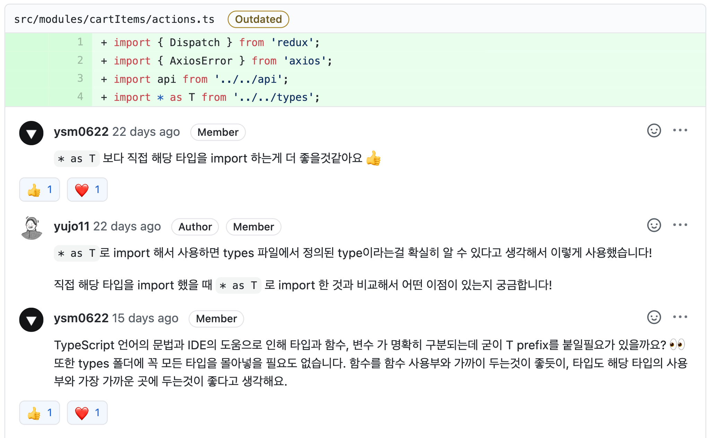
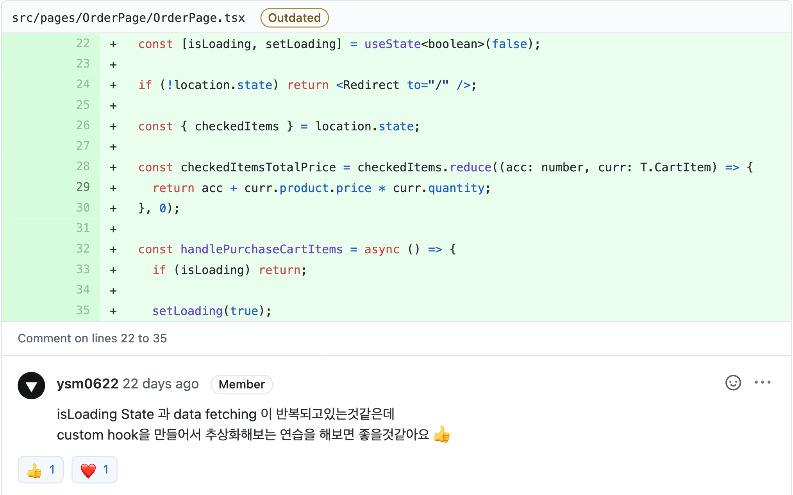
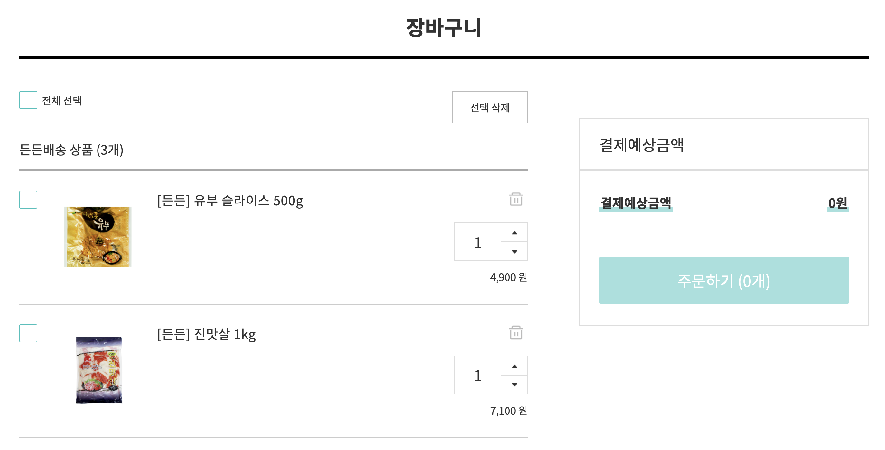
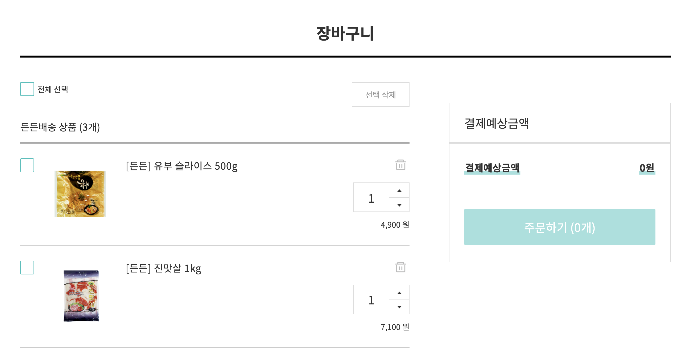
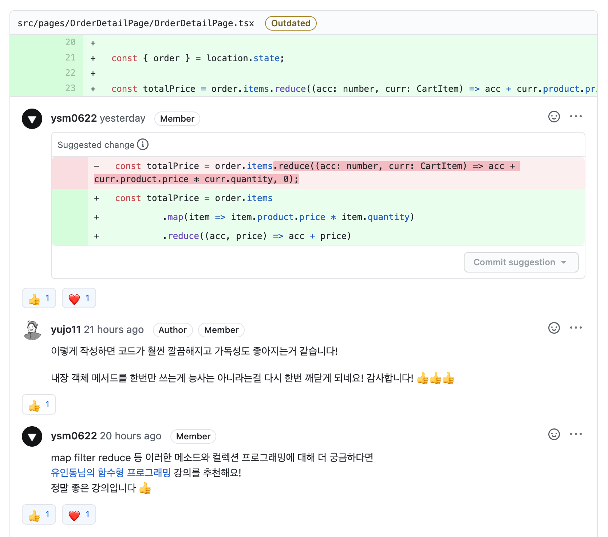
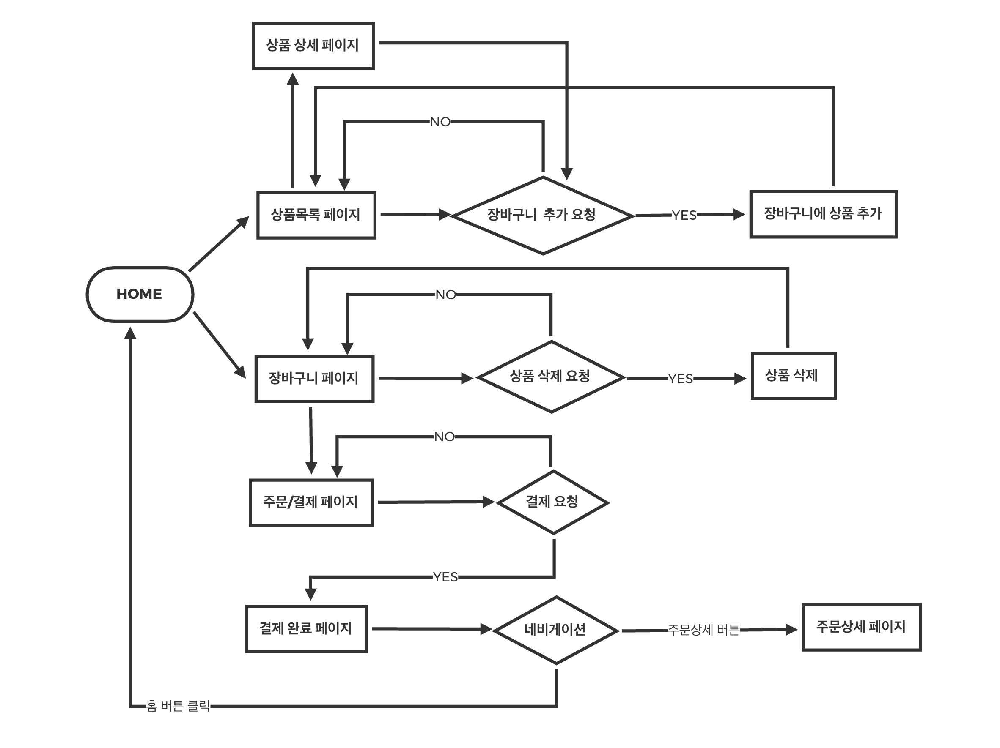

<p align="middle" >
  
</p>
<h2 align="middle">Level2 - 장바구니</h2>
<p align="middle">React & Redux 데스크탑 장바구니 애플리케이션</p>
</p>

## 📝 구현 요구사항

### 📖 공통 요구사항

- [x] REQUIREMENTS.md에 요구 사항 도출
- [x] Mock Data 혹은 Mock API를 직접 만들어 사용 (Schema 설계까지)

### 🚀 Step1

- [x] 상품 목록
- [x] 장바구니
- [x] 주문/결제

### 🚀🚀 Step2

- [x] 상품 상세
- [x] 주문 상세

## 1. 진행하며 고민하고 배운 점

### 1-1. TypeScript

그동안 defaultProps를 통해 타입을 체크해 오고 있었지만 미션으로 진행하는 프로젝트 규모가 점차 커짐에 따라 타입 체크에 대한 갈망이 생겼습니다.

타입 체크에 대한 갈망으로 TypeScript 도입에 대한 고민을 지속적으로 하고 있었으나 쉽사리 프로젝트에 도입하기는 쉽지 않았습니다. 매 미션마다 처음 사용해보는 라이브러리들을 도입하면서 TypeScript까지 적용할 수 있을지에 대한 고민이 컸기 떄문입니다.

그러던 중 이번 미션에서 페어로 만나게 된 지그가 기존 TypeScript 사용 경험이 있고 이번 미션에서도 TypeScript를 사용하고 싶다고 먼저 의견을 제시했습니다. 저는 좋은 기회라고 생각했고 이번 미션에서 처음으로 TypeScript를 사용하게 됐습니다.

TypeScript를 사용하면서 느낀 장점은 다음과 같습니다.

1. 주로 Visual Studio Code에서 코드를 작성하는데 코드 자동 완성과 가이드가 생각보다 강력하다.
2. Type Check를 통한 휴먼 에러 방지가 가능하다.

단점이라고 할만한 점은 크게 찾지 못 했지만 TypeScript를 처음으로 사용하면서 제가 느낀 어려움들은 다음과 같습니다.

1. 많은(세부적인) 타입들
   - Primitive Type 몇가지만 익히면 금방 쓸 수 있지 않을까? 라고 생각한 것도 잠시 세부적으로 많은 타입들이 정의되어 있었고 Type이 유추되지 않을 때는 꽤 많은 시간을 검색에 쏟기도 했습니다.
2. 새로운 개념들
   - Interface와 Type의 차이, Generic 등 JavaScript만 사용해오던 저에게는 낯선 개념들이 등장해 약간의 러닝커브를 만들었습니다.

이외에는 도입하지 않을 이유를 전혀 찾을 수 없었습니다. 아마 다음 번에도, 이후에도 TypeScript를 계속해서 사용하게 될거 같습니다.

아직 Generic, 상속, 하이브리드 타입 등의 고급 사용법(?)에 대해서는 잘 알지 못 하지만 앞으로의 프로젝트에서 의식적인 노력을 통해 능숙하게 사용하고 싶은 욕심이 생겼습니다.

### 1-2. Redux + ?

이번 미션의 요구사항 중에는 `Redux를 통한 전역 상태관리`가 포함되어 있었습니다. Redux의 사용이 정해진 상태에서 어떤 Middleware를 사용할 것인지에 대한 고민을 했습니다.

Redux Saga, Redux Thunk 두 가지를 최종후보에 놓고 페어들과 함꼐 고민했습니다. 고민 끝에 이번 미션에서는 Redux Thunk를 사용하게 됐습니다. Redux, TypeScript도 처음 사용해보는 상황에서 Redux Saga까지 사용하는건 욕심이라는 판단이 들어

### 1-3. Redux Thunk

```js
function createThunkMiddleware(extraArgument) {
  return ({ dispatch, getState }) => next => action => {
    if (typeof action === 'function') {
      return action(dispatch, getState, extraArgument)
    }

    return next(action)
  }
}

const thunk = createThunkMiddleware()
thunk.withExtraArgument = createThunkMiddleware

export default thunk
```

Redux Thunk를 사용하면서 가장 놀란 점은 코드였습니다.

위의 10줄 남짓한 코드가 Redux Thunk의 전부였는데 currying을 사용해 간단한 코드로 비동기 처리를 멋지게 처리하는 모습에 감탄했습니다.

이렇게 짧은 코드로 전세계 수많은 사람들이 사용하는 라이브러리를 만들었다는게 정말 놀라웠습니다. 언젠가는 저도 멋진 라이브러리를 만들고 싶다는 욕심도 들었습니다.

### 1-4. Mock Server

요구사항 중 하나인 Mock Server를 만드는 방식에 대해서도 고민 헀습니다. 그동안 Dummy Data들을 구성해 불러오는 식으로 사용한 적은 있었지만 API 요청을 주고 받을 수 있는 Mock Server를 구성하는건 처음이었기 때문입니다.

Firebase, JSON-Server 등의 후보를 두고 고민을 했고 가장 간단하게 구성할 수 있는 JSON-Server를 통해 Mock Server를 구축했습니다. 구축하고 사용하는 방법은 정말 간단했습니다. 앞으로 간단한 프로젝트를 진행하거나 협업을 하면서 Mock Server를 정말 요긴하게 사용할거 같습니다.

- [json-server / npm](https://www.npmjs.com/package/json-server)
- [json-server-heroku ](https://github.com/jesperorb/json-server-heroku)

## 2. 코드 리뷰 및 피드백

### 2-1. type 정의



여러 모듈에서 공통적으로 사용되는 타입을 `types.ts` 파일에서 정의하고 import 해서 사용했습니다. 위의 스크린샷에도 들어가 있는 것처럼 `types.ts`에 정의한 타입들은 `T` prefix를 통해 import 해온 것을 한번에 알 수 있어 좋다고 생각했습니다.

하지만 리뷰어 분의 피드백처럼 IDE의 더ㅗ움으로 함수, 변수, 타입을 명확히 구분할 수 있어 굳이 필요하지 않겠다는 생각을 했습니다.

### 2-2. custom hook



반복되는 작업을 custom hook을 통해 추상화 해보라는 피드백을 받았습니다. React를 사용하면서 처음으로 custom hook을 사용하게 되었습니다.

Vanilla Javascript에서 util 함수들을 분리하듯이 간단하게 분리가 가능할 것이라고 생각했지만 저의 첫 Custom Hook을 작성하는데는 다음과 같은 이유들로 어려움을 겪었습니다.

1. Component 내부에 있을 코드와 외부에 있을 코드를 구분하지 못 하고 있었다.
   - Component들을 작성하면서 그동안 Component 안에 존재할 필요가 없는 코드들까지 모두 Component 내부에 작성하고 있었습니다.
   - Component 내, 외부의 코드를 구분하지 않고 작성하다보니 Custom Hook으로 Component 내부의 코드를 분리할 때에도 경계가 모호해져 저에게 더 큰 혼란을 일으켰습니다.
2. Hook에 대한 이해도가 떨어졌다.
   - 그동안 useState, useEffect 등 다양한 Hook들을 사용해오면서도 Hook 자체에 대한 이해도가 떨어졌습니다.
   - 부끄럽게도 이번에 Custom Hook을 작성하고 사용하면서 Hook은 Component 내부의 최상단에서만 선언 가능하단 사실도 처음으로 알게 되었습니다.
   - 이렇게 Hook 자체에 대한 이해도가 떨어지다보니 custom hook이 해야할 역할, 사용되야 할 범위를 정확히 인지하지 못한 채 코드를 작성하게 됐고 그로 인한 어려움을 겪었습니다.

custom hook을 작성화는건 쉽지 않았지만 그만큼 저의 무지함을 깨닫고 발전할 수 있었습니다. 그리고 React Component 내부에서 발생하는 반복되는 로직들을 custom hook을 통해 추상화 시켜 반복되는 코드들을 줄일 수 있다는 것도 알게 됐습니다.

앞으로는 더욱 적극적으로 custom hook을 활용해 우아한 코드를 작성하기 위해 노력해야겠다는 생각을 했습니다.

### 2-3. UI/UX

> 장바구니에 상품이 없을 때에는 선택삭제 버튼을 disable 하는게 좋을거 같아요!

---

#### 변경 전



---

#### 변경 후



---

정말 간단하게 처리할 수 있는 부분인데 놓치고 있었습니다. 선택된 상품이 없을 때 '주문하기' 버튼이 disabled 되도록 했지만 '선택 삭제' 버튼은 disabled 되지 않고 있었습니다.

나름의 UX를 쓰려고 했지만 작은 부분을 놓치고 있었다는 생각이 듭니다. 조금 더 사용자 친화적인 어플리케이션을 작성하기 위해 고민하고 노력해야겠습니다.

### 2-4. 내장 객체 메서드의 활용



```js
const totalPrice = order.items.reduce(
  (acc: number, curr: CartItem) => acc + curr.product.price * curr.quantity,
  0
)
```

구매한 상품들의 총 가격을 구하기 위해 위와 같은 코드를 사용했습니다. `reduce`를 통해 전체 배열을 한번만 순회하며 원하는 값을 얻을 수 있는 코드라고 생각했습니다. type이 붙어 코드가 길어보이긴 하지만 당시에는 코드에서 나는 악취를 맡지 못 했습니다.

리뷰어 님의 피드백을 받고나서야 제 코드에서 나는 악취를 맡을 수 있었습니다.

```js
const totalPrice = order.items
  .map(item => item.product.price * item.quantity)
  .reduce((acc, price) => acc + price)
```

같은 로직을 수행하는 코드이지만 기존에 작성한 코드와 비교했을 때 어느 쪽이 보기 좋은지는 한눈에 확연히 드러나고 있습니다.

내장 객체 메서드를 적게만 사용하는게 능사가 아니라는걸 다시 한번 깨달을 수 있었던 리뷰였습니다. 크리스 님께서 추천 받은 강의를 우테코 레벨 2 방학 기간 동안 들으며 공부하고 정리 해봐야겠다는 목표가 하나 생겼습니다.

- [자바스크립트로 알아보는 함수형 프로그래밍 (ES5) / 유인동님](https://www.inflearn.com/course/%ED%95%A8%EC%88%98%ED%98%95-%ED%94%84%EB%A1%9C%EA%B7%B8%EB%9E%98%EB%B0%8D#)

## 3. 데모


## 4. 🔗 링크

### 4-1. step1 링크

- [전체 코드 링크](https://github.com/yujo11/react-shopping-cart/tree/step1)
- [PR 링크](https://github.com/woowacourse/react-shopping-cart/pull/20)

### 4-2. step2 링크

- [전체 코드 링크](https://github.com/yujo11/react-shopping-cart/tree/step1)
- [PR 링크](https://github.com/woowacourse/react-shopping-cart/pull/48)

### 5. 📊 User Flow Chart


