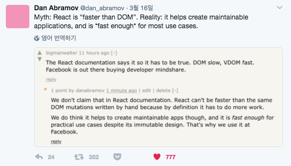

### 1. Virtual DOM

- DOM(Document Object Model - 문서 객체 모델)

  - DOM은 웹 페이지에 대한 인터페이스다. 문서의 구조화된 표현을 제공하며 프로그래밍 언어가 DOM 구조에 접근할 수 있는 방법을 제공하여 문서 구조, 스타일, 내용을 변경할 수 있게 돕는다.

- VDOM(Virtual DOM)

  - Virtual DOM (VDOM)은 UI의 이상적인 또는 “가상”적인 표현을 메모리에 저장하고 ReactDOM과 같은 라이브러리에 의해 “실제” DOM과 동기화하는 프로그래밍 개념. 이 과정을 재조정이라고 한다.
  - 이 접근방식이 React의 선언적 API를 가능하게 한다. React에게 원하는 UI의 상태를 알려주면 DOM이 그 상태와 일치하도록 한다.

* Diffing Alogorithm

  - Virtual DOM이 업데이트 되면, React는 Virtual DOM을 업데이트 이전의 Virtual DOM 스냅샷과 비교하여 정확히 어떤 Virtual DOM이 바뀌었는지 검사한다.
  - 두 개의 트리를 비교할 때, React는 두 엘리먼트의 루트(root) 엘리먼트부터 비교합니다. 이후의 동작은 루트 엘리먼트의 타입에 따라 달라집니다.

- Virtual DOM은 항상 빠를까? NO

  - 유저 인터랙션이 발생하지 않는 페이지에서는 일반 DOM의 성능이 더 좋을 수 있다. -> SPA로 제작된 큰 규모의 웹 페이지에서는 Virtual DOM을 사용해서 브라우저의 연산을 줄여 성능을 개선할 수 있다.
  - Dan 트위터
    

- 참고 문서
  - [Virtual DOM and Internals / React 공식 문서 ](https://reactjs.org/docs/faq-internals.html)
  - [Introduction to the DOM / MDN](https://developer.mozilla.org/en-US/docs/Web/API/Document_Object_Model/Introduction)
  - [문서 객체 모델(Document Object Model) / poiemaweb](https://poiemaweb.com/js-dom)
  - [[10분 테코톡]지그의 Virtual DOM / Youtube](https://www.youtube.com/watch?v=PN_WmsgbQCo)
  - [React and the Virtual DOM / Youtube](https://www.youtube.com/watch?v=BYbgopx44vo)

### 2. JSX

- JSX란?

  - JSX는 Javascript 언어 구문의 확장.

- JSX는 표현식이다.

  - JSX를 컴파일하면 JSX 표현식이 자바스크립트의 함수를 호출한다.
  - 따라서 if나 for 문 내에 JSX를 사용할 수 있고, 변수에 할당하거나 매개 변수로 전달하는 것 또한 가능하다.

  ```jsx
  const sayHello = name => {
    if (name) {
      return <h1>hello {name}!</h1>
    }

    return <h1>hello</h1>
  }
  ```

- JSX의 변환 과정

  1. JSX 코드

  ```jsx
  const element = <h1 className="greeting">Hello, world!</h1>
  ```

  2. React.createElement로 변환

  ```jsx
  const element = React.createElement(
    'h1',
    { className: 'greeting' },
    'Hello, world!'
  )
  ```

  3. Object로 변환

  ```jsx
  const element = {
    type: 'h1',
    props: {
      className: 'greeting',
      children: 'Hello, world',
    },
  }
  ```

* React에서는 반드시 JSX를 사용해야 하는가? NO

  - React는 JSX 사용을 필수로 하지 않는다. 하지만 자바스크립트 코드 내부의 UI로 작업할 때 시각적으로 더 도움된다고 생각한다.
  - 또한, React가 도움이 되는 에러 및 경고 메세지를 표시해준다.

* 참고 문서
  - [JSX 이해하기 / React 공식 문서](https://ko.reactjs.org/docs/jsx-in-depth.html)

### 3. Component
