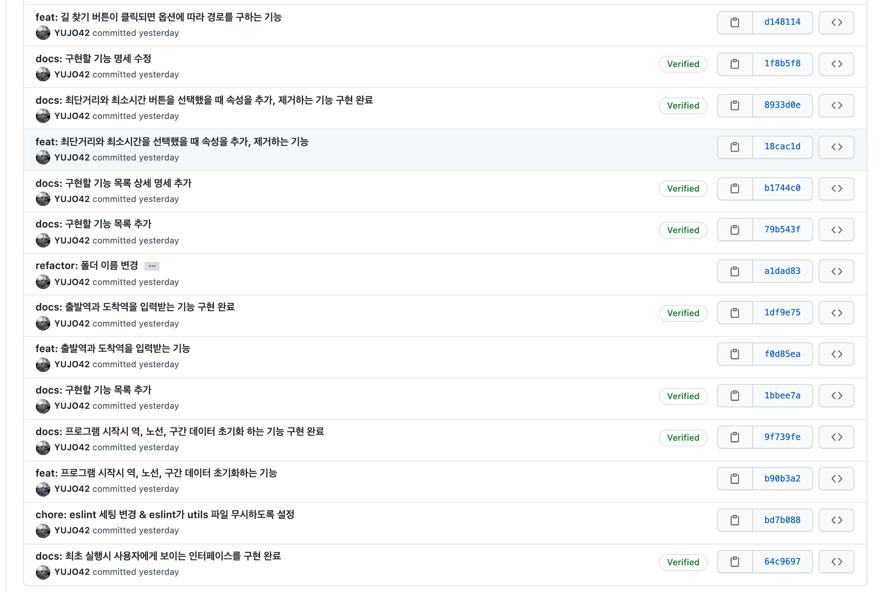

### 우테코 프리코스를 마치며... 👋

- 3번의 미션, 그리고 마지막 코딩테스트 과제 제출

근 한달 간 진행했던 우테코 3기 프리코스가 어제 코딩테스트를 마지막으로 막을 내렸습니다. 지난 한 달간 프리코스를 진행하는 동안 열과 성을 다해 미션 해결에 집중했습니다. 매 주 미션을 진행하면서 성장하는게 느껴질 정도로 많은 것들을 새롭게 배웠습니다. 특히 어제 코딩테스트를 진행하면서 프리코스를 시작하기 전이었다면 절대 주어진 5시간 안에 해결하지 못 했을 미션을 해결하면서 다시 한번 성장했다는걸 체감할 수 있었습니다.

매주 미션을 진행하며 어려움을 느낄 때도 있었지만 미션을 진행하면서 매주 성장하는게 느껴졌던 정말 즐거웠던 시간이었습니다.

### 지원 동기 📝

제가 프로그래밍 공부를 시작하고 지금까지 프로그래밍을 학습한 방법은 '동료'학습이었습니다. 물론 책을 사서 읽기도 하고 강의를 사서 보기도 했습니다. 하지만 혼자서 책을 보고, 강의를 보면서 공부할 때보다 같은 목표를 가진 동료들과 함께 공부하며 지식을 주고 받을 때 혼자 학습할 때보다 훨씬 큰 폭으로 빠르게 성장할 수 있음을 몸소 느껴왔습니다. 우아한테크코스는 장장 10개월에 걸친 교육과정이고 그 시간동안 동료들과 함께 문제를 해결해 나가면서 학습했을 때 큰 폭으로 성장할 수 있겠다는 생각이 들어 지원하게 됐습니다.

이번 프리코스를 기간 동안 다른 분들과 직접적으로 소통할 기회는 없었지만 같은 미션을 부여받았기 때문에 다른 동료 분들의 PR을 보면서 많은 것들을 얻어갈 수 있었습니다.

### 새롭게 배운 점들 👨‍💻

#### 커밋 컨벤션(feat. README.md)

처음 미션부터 마지막 코딩테스트까지 미션에는 일관된 요구사항이 존재 했습니다. 바로 구현할 기능 목록을 먼저 README.md 파일에 작성하고 작성한 기능 단위로 commit을 하라는 요구사항이었습니다. 매번 프로그래밍을 할 때 닥치는대로 당장 눈에 보이는 필요한 기능들을 쫓아서 구현하던 저에게 이런 방식은 굉장히 새로웠습니다.

README에 구현할 기능 목록을 먼저 정리하고 프로그래밍을 진행하면서 순차적으로 어떤 기능을 구현해야할지 명확하게 파악할 수 있었고 전체적인 흐름을 머리 속에 정리한 후 프로그래밍을 진행할 수 있어 좋았습니다. 또한 기능 단위로 커밋을 하게 돼면서 문제가 생겼을 경우 빠르게 이전 시점으로 돌아갈 수 있게 됐습니다. 이전처럼 `update` , `ok, good` 같은 커밋 메세지만 보고 도저히 이해할 수 없는 커밋이 아닌 `docs: 구현할 기능 목록 작성`, `feat: 블로그에 글을 작성하는 기능` 등 앵귤러 컨벤션을 적용한 커밋 메세지도 큰 몫을 해줬습니다.

처음에는 진행하는 낯선 방식에 1주차 미션을 진행하면서는 꽤나 고생했던 기억이 납니다. 코드를 수정하고 커밋 메세지를 작성할 때 카테고리가 `style` 인지 `refactor` 인지 긴 시간동안 고민하기도 했고 `.gitignore` 파일이나 `.prettiierrc` 파일을 수정했을 때는 이게 어떤 카테고리인지 종잡을 수 없어 꼬민하기도 했습니다. 코딩테스트 이전 미션을 진행하는 3주 동안 이런 부분에 대한 고민을 계속한 덕분인지 코딩테스트를 진행하면서는 앵귤러 컨벤션에 맞는 커밋메세지를 빠르게 작성할 수 있었습니다.

- 코딩테스트 커밋 내역 일부

#### 코드 컨벤션

코드 컨벤션을 지키면서 구현하라는 요구사항도 쉽지 않았습니다. 1주차 미션을 진행할 때 커밋 컨벤션과 함께 긴 시간 고민했던 부분이기도 합니다. 미션에서 참고자료로 제시한 Google 컨벤션과 TOAST 컨벤션을 지키기 위해 노력했습니다. 두 컨벤션 간에 상충되는 부분은 Airbnb 컨벤션 등 다른 코딩 컨벤션을 찾아보면서 절충하며 일관성 있는 코드를 작성하기 위해 노력했습니다.

#### 함수, 모듈 분리

앞서 말한 코드 컨벤션 이외에도 depth제한, 함수의 line제한도 존재했습니다. 처음으로 depth와 line수를 제한하고 코드를 작성하다보니 자연스럽게 함수와 모듈을 분리하게 됐습니다. 함수와 모듈을 분리하면서 전체 코드의 가독성이 굉장히 높아지는 경험을 했습니다.

프리코스 미션을 진행하면서 코드의 품질을 높이기 위해 Clean Code와 리팩터링 2판 등의 책을 구매해서 읽었습니다. 기존에는 `Object`나 `Array` 를 순회할 때 습관적으로 `for ...of`, `for ...in` 등을 사용하고는 했습니다. depth와 line 수 제한을 지키고 가독성을 높이기 위해 다양한 Javascript의 메소드들을 공부하게 됐습니다. 기존에 잘 사용하지 못 했던 `reduce()`, `forEach()`, `every()` 등의 다양한 메소드들을 활용하게 되면서 deptth와 line 제한을 지키기 수월해진건 물론 코드의 가독성도 이전보다 매우 좋아지는 경험을 했습니다.

#### 린터, 코드포맷터

`eslint` 의 존재는 사실 프리코스 이전부터 알고 있었습니다. 그러나 제대로 사용해본건 프리코스가 처음이었습니다. 1주차 피드백 내용 중 린터와 코드포맷터를 적극적으로 활용하라는 피드백이 있었습니다. 다행히 `prettier` 는 원래부터 사용하고 있어서 적용하는게 어렵지 않았지만 `eslint` 를 처음 적용하면서 간단한 설정에도 여러가지 난항을 겪었습니다.

그러나 `eslint` 를 적용하기 시작하면서 미처 발견하지 못 하던 오류들을 `eslint` 가 잡아주면서 실수를 줄일 수 있었고 `max-depth`, `max-lines` 등의 설정을 통해 프로그래밍 요구사항에 있었던 depth와 line 수를 직접 체크하지 않아도 돼서 효율이 무척 증가했습니다.`prettier` 만 사용할 때는 `pretttier` 도 `syntax error` 를 잡아주는데 `eslint` 까지 필요한가라는 생각을 했지만 그건 제 편협한 생각이었다는걸 프리코스를 진행하면서 깨닫게 됐습니다.

#### localStorage, dataset

`localStorage` 와 같은 Window Storage API 역시 프리코스에서 처음으로 접하고 사용하게 됐습니다. `localStorage` 를 처음 다루면서 걱정도 많이 하고 실수도 많이 했습니다. 그러나 `localStorage` 에 데이터를 저장하고 관리하면서 전역 변수를 어디서나 호출해서 사용하는 것처럼 데이터를 다루게 되니 오히려 편하게 느껴진 부분도 있습니다. 3주차 미션에서 `localStorage` 와 함께 `dataset` 을 활용하라는 요구사항이 있었습니다. 처음에는 그 이유를 몰랐지만 프로그래밍을 진행하면서 `dataset` 을 통해 고유한 `id`, `class` 같은 값이 아닌. `data` 로 관리하는게 '필수'는 아니겠지만 `filter()` 등의 메소드를 활용하기 위해 굉장히 좋은 방법이라고 생각했씁니다.

#### 그 외에도

Javascript 에서 템플릿 리터럴을 사용해`DOM` 을 조작했을 때의 `eventListener` 등록 시점, 서로를 참조해야 하는 데이터의 상태관리 등 여러 부분에서 고민하며 새로운 것들을 정말 많이 배우고 얻어갈 수 있었습니다. 한 달이라는 길다면 길고 짧다면 짧은 시간동안 새로운 것들을 정말 많이 배우고 새로 배운 것들을 매번 미션에 적용하는 과정을 거치면서 많이 성장할 수 있엇습니다.

### 끝나고 느낀 점 ✍️

프리코스 기간 동안 매 주 미션이 주어졌고 스스로 그 미션을 해결하면서 큰 성장을 했습니다. 이러한 미션이 계속 주어지는 상태에서 그 미션을 동료들과 함께 토론하고 지식을 주고 받으며 진행할 수 있다면 분명 더 큰 폭으로 성장할 수 있을거라고 확신합니다. 프리코스를 시작하기 전 10개월의 과정 동안 동료들과 함께 진행한다면 정말 큰 성장을 할 수 있을거라는 생각이 이제는 확신으로 바뀌었습니다. 결과가 나오기까지는 열흘 남짓한 시간을 기다려야 되는데 꼭 붙었으면 좋겠습니다.

다음 프리코스 모집은 아마 내년이 될테지만 이 글을 보시는 분들도 본과정 당락 여부를 떠나서 우아한 테크코스에 지원하시면 분명 후회 없을거라는 말씀을 드리고 싶습니다. 긴 글 읽어주셔서 감사합니다.
