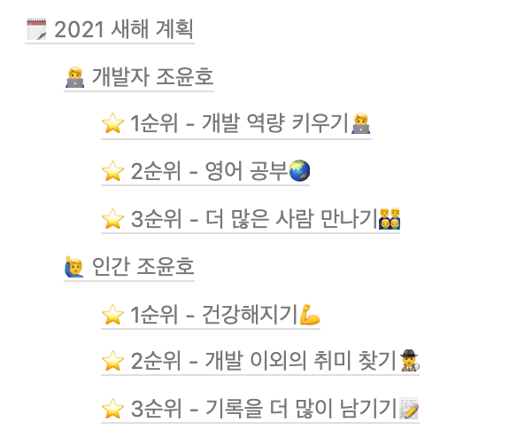

작년 연말에 작성했던 2021년 새해 계획이다.

2021년의 나는 2020년의 내가 바라던 목표들을 이뤘을까?

---

## 🧑‍💻 개발자 조윤호

### 1순위 - 개발 역량 키우기 🧑‍💻 ★★★★☆/★★★★★

개발이라는게 누군가 점수료 50점짜리 개발자, 100점짜리 개발자 이런 식으로 평가를 내리는게 아니다보니 현재 내 정확한 역량을 측정하는건 쉽지 않은 일이다. 하지만 1년 전의 나와 지금의 나를 비교해 본다면 개발 역량이 확실히 성장했다는게 느껴진다.

하나의 예로, 작년 말에 코어 자바스크립트를 읽었을 때는 책에 있는 내용의 절반도 제대로 이해하지 못 했다. 올해 다시 코어 자바스크립트를 읽으니 책에 나오는 내용들을 모두 이해할 수 있었다.

그러나 아쉬운 부분들도 분명히 존재한다. JavaScript를 이해하고 사용하는 역량은 좋아졌지만 기본적인 CS 지식들은 아직도 많이 부족하다는 생각이 든다. 작년의 나는 뭐를 모르는지도 모르는 상태였는데 지금은 내가 잘 할 수 있는 부분, 아직 부족한 부분을 구분할 수 있는 시야를 가지게 된거 같다.

내년에는 부족한 부분들을 보다 채울 수 있도록 공부하자.

### 2순위 - 영어 공부🌏 ★★★★☆/★★★★★

작년에 영어 문서를 읽는데 시간이 너무 많이 걸려 세운 목표였던 것으로 기억한다. 지금도 한글 문서와 비교했을 때 영어 문서를 읽는 속도가 느리지만, 영어 문서를 많이 접하게 되면서 작년과 비교했을 때는 읽고, 이해하는 속도가 빨라졌다.

꾸준히 @mdn/yari-content-ko 팀에서 MDN 콘텐츠 번역에 기여한 것도 큰 도움이 된거 같다. 최근에는 parcel-bundler를 사용하던 중 v2 한국어 문서가 없어 먼저 번역해서 기여하는게 가능한지 이슈를 남긴 적이 있다. 작년의 나였다면 상상도 하지 못 할 일이었을텐데 이런 사건들을 통해 성장했다는걸 느끼게 된다.

내년에는 더욱 성장해서 영어 문서도 한국어 문서를 읽는 속도로 읽고 싶다.

### 3순위 - 더 많은 사람 만나기👨‍👨‍👦‍👦 ★★★★★/★★★★★

작년의 나는 블랙커피 스터디를 통해 많은 사람들을 만나면서 빠른 성장을 경험했다. 2021년에도 서로의 성장을 도울 수 있는 많은 사람들을 만나고 싶었다. 그리고 이 목표는 우아한테크코스에 참여하면서 자연스럽게 이루게 됐다.

우아한테크코스라는 좋은 교육환경에서 좋은 동료들, 코치들과 함꼐 할 수 있어서 정말 즐거웠다. 내년부터는 또 새로운 환경에서 새로운 사람들을 만나게 될텐데 어떤 인연을 맺을지 설레는 마음이 가득하다.

---

## 🙋‍♂️ 인간 조윤호

### 1순위 - 건강해지기💪 ★☆☆☆☆/★★★★★

2020년 코로나로 인해 그동안 다니던 운동을 더 이상 다니지 못하게 됐다. "코로나가 잠잠해지면 다시 다녀야지"라고 생각했지만 코로나는 아직도

### 2순위 - 개발 이외의 취미 찾기🕵️‍♂️ ★★★☆☆/★★★★★

### 3순위 - 기록을 더 많이 남기기📝 ★★★☆☆/★★★★★
